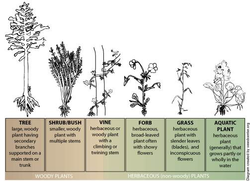
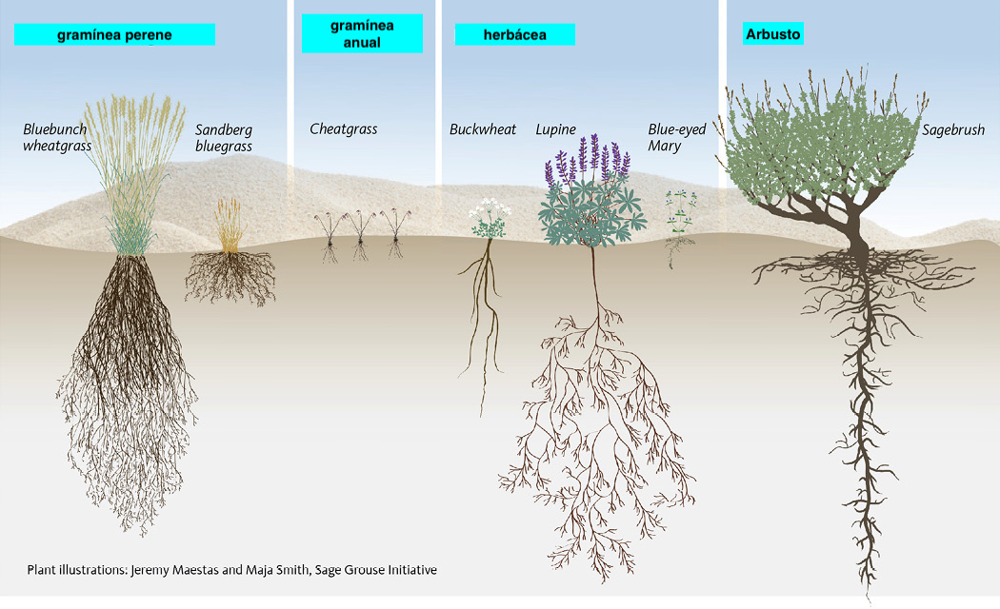
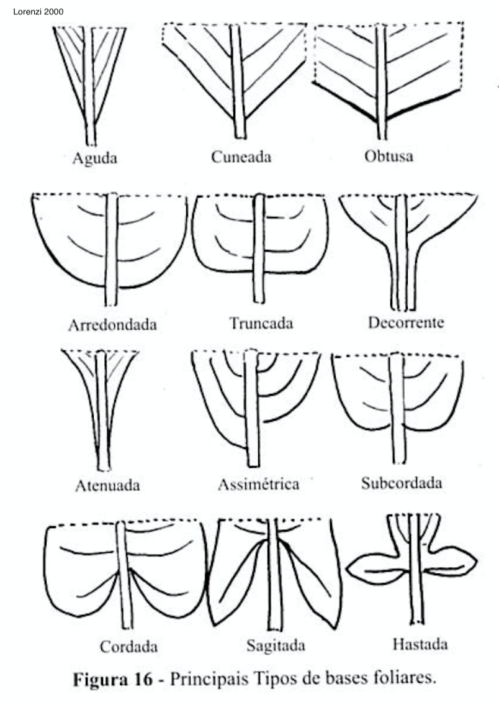
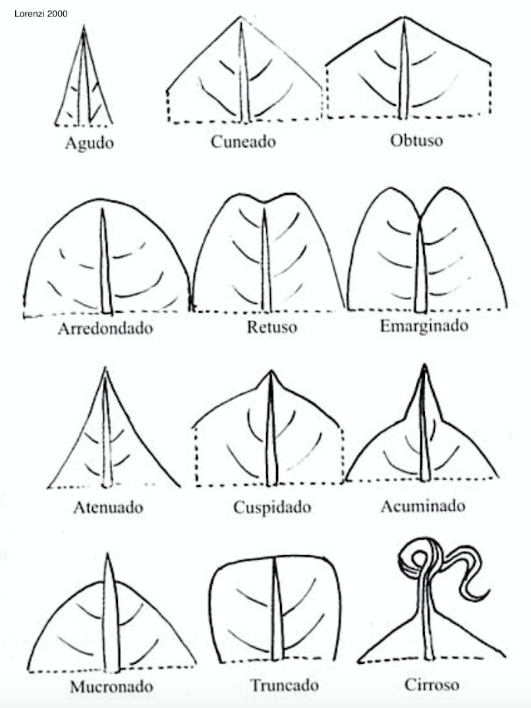
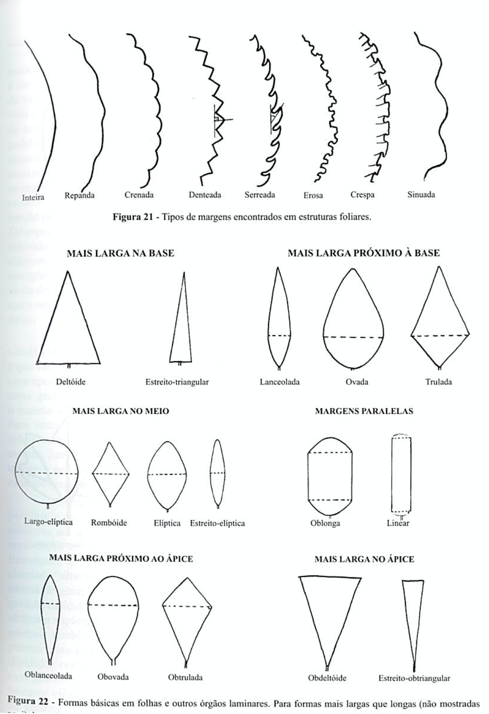

```{r setup, include=FALSE}
options(htmltools.dir.version = FALSE)
knitr::opts_chunk$set(
  echo = FALSE,
  fig.align = "center",
  message = FALSE,
  warning = FALSE,
  cache = TRUE
)

htmltools::tagList(rmarkdown::html_dependency_font_awesome()) #show twitter logo
```


## Características ideais de uma planta daninha

--


- Germinação muitos ambientes distintos
--


- Germinação descontínua e grande longevidade das sementes
--


- Crescimento rápido
--


- Produção contínua de sementes e capacidade de se reproduzir quando jovem
--


- Produzir grande número de sementes ou propágulos em ambientes favoráveis
--


- Autocompatível ou cruzando por visitantes não especializados ou vento
--


- Competitiva com plantas desejáveis
--


- Plasticidade genotípica (a base da resistência a herbicidas)
--


- Adaptado para dispersão a curta e longa distância

---

## Identificação de plantas daninhas

### Depois de concluir esses laboratórios, você poderá:

- Explicar o conceito de nomenclatura binomial e sua importância

- Use uma chave dicotômica para identificar plantas daninhas

- Definir terminologia morfológica fundamental da planta

- Descrever características de certas famílias de plantas

- Identificar aproximadamente 50 espécies importantes de plantas daninhas por seus nomes comuns e científicos


---

## Classificação de plantas daninhas

- **Botânica (taxonômica)** - com base em características comuns (ou seja, - reino, divisão, classe, ordem, família, gênero, espécie). Criador da nomenclatura científica Carolus Linnaeus, um botânico sueco, que viveu nos anos 1700.
--


- **História da vida** - ciclo de vida, estação do crescimento, época e método de reprodução (por exemplo: verão / inverno anual, bienal, perene)
--


- **Habitat** - onde a planta cresce (por exemplo, terrestre, aquática)
--


- **Via fisiológica** - fotossintética (C3, C4), resposta ao fotoperíodo da floração (dia curto, dia longo, dia neutro)
--


- **Indesejabilidade** - dificuldade de controle (nocivo, proibido), características venenosas
--


- **Classificação ecológica** - Introdução, colonização, naturalização.
--


- **Classificação por estratégia evolutiva** - tolerantes ao estresse, competitoras, ruderais


---


## Nomes comuns

### Vantagens

- Bem entendido em uma pequena localidade

- Fácil de pronunciar e usar por leigos sem treinamento botânico

- Muitas vezes descritivo (por exemplo, capim pé-de-galinha; botão-de-ouro)


---

## Nomes comuns

### Desvantagens

- Não aceito em todo o local

- Pode se referir a mais de uma espécie

- Johnsongrass é frequentemente usado para se referir tanto a sorghum halepense quanto a Agropyron repens

- "Buva" refere-se a muitas espécies do gênero **Conyza**.

- Uma única planta pode ter mais de um nome comum

- Bromus tectorum é freqüentemente chamado de downybrome, capim-bravo, junegrass e pingrass

- Abutilon theophrasti é chamado de folha de veludo e erva de botão em Nebraska


---

## Nome científico

### O nome científico sempre tem duas partes

-  gênero (em maiúsculas) 

- epíteto específico (em minúsculas)


---

## Nome científico

### Vantagens

- Apenas um nome reconhecido por espécie

- Fornece um meio de comunicação aceito em todo o mundo: reconhecido e documentado em todo o mundo

- Estabilidade - eles não mudam com a mesma frequência que os nomes comuns


---

## Nome científico

### Desvantagens


- Algumas mudanças ocorrem à medida que mais pesquisas taxonômicas são realizadas


- Não descritivo e pouco utilizado por leigos


---

## Classificação taxonômica

.pull-left[
### Monocotiledônea (folha estreita)

- Classe de angiospermas cujas sementes possuem um único cotilédone


### Dicotiledônea (folhas largas)

- Classe de angiospermas cujas sementes geralmente possuem dois cotilédones

]

.pull-right[
```{r echo=FALSE, out.width=500, fig.align='center'}
knitr::include_graphics("https://moodle.clsd.k12.pa.us/district_videos/Biology/ebook/products/0-13-115540-7/sb4652f1.png")
```
]


---

## Classificação quanto ao hábito de crescimento

### Morfologia


- **Herbácea:** plantas herbáceas plantas tenras e de baixo porte. Não abrangem as gramíneas.

- **Arbusto:** Uma planta lenhosa de baixo crescimento, arbusto com um a muitos galhos

- **Trepadeira:** Uma planta lenhosa ou herbácea que se arrasta no chão
ou sobe sobre outras plantas ou obstáculos por vários meios. O caule de uma cipó é freqüentemente tão fraco que não pode suportar a planta por si só

```{r echo=FALSE, out.width=350, fig.align='center'}

``` 
---

### Hábito de crescimento

```{r echo=FALSE, out.width=900, fig.align='center'}

``` 


---

class: middle, center


```{r echo=FALSE, out.width=900, fig.align='center'}
knitr::include_graphics("https://science.sciencemag.org/content/sci/356/6337/498.5/F1.large.jpg?width=800&height=600&carousel=1")
``` 


---

```{r echo=FALSE, out.width=900, fig.align='center'}
knitr::include_graphics("https://upload.wikimedia.org/wikipedia/commons/thumb/3/34/Ulistnienie.svg/640px-Ulistnienie.svg.png?1596221713557")
``` 

- a) alternadas 
--


- b) opostas cruzadas
--


- c) opostas dísticas 
--


- d) verticiladas


---


.pull-left[
```{r echo=FALSE, out.width=400, fig.align='center'}
knitr::include_graphics("https://i.pinimg.com/474x/63/a6/ed/63a6edc53fe6793942bbf2a26f5ab352--professor-vestibular.jpg")
``` 
]


.pull-right[
```{r echo=FALSE, out.width=450, fig.align='center'}
knitr::include_graphics("https://treeonline.files.wordpress.com/2010/08/a3glossary_leaf_shapes1.jpg")
``` 
]

---


.pull-left[
```{r echo=FALSE, out.width=700, fig.align='center'}

``` 
]

.pull-right[
```{r echo=FALSE, out.width=700, fig.align='center'}

``` 
]


---

.pull-left[
```{r echo=FALSE, out.width=450, fig.align='center'}

``` 
]

.pull-right[
```{r echo=FALSE, out.width=450, fig.align='center'}
knitr::include_graphics("images/nervuras.png")
``` 
]

---

.pull-left[
```{r echo=FALSE, out.width=700, fig.align='center'}
knitr::include_graphics("https://s3-sa-east-1.amazonaws.com/manual-do-enem-test/36a907faa14c45af82b62227b5ccda67-Folha_5.png")
``` 
]

.pull-right[
```{r echo=FALSE, out.width=700, fig.align='center'}
knitr::include_graphics("https://i1.wp.com/www.wildernessarena.com/wp-content/uploads/2013/05/image29.png")
``` 
]


---

.pull-left[
```{r echo=FALSE, out.width=425, fig.align='center'}
knitr::include_graphics("http://www.vplants.org/portal/images/vplants/plants/glossary/plate01.jpg")
``` 
]

.pull.right[
```{r echo=FALSE, out.width=500, fig.align='center'}
knitr::include_graphics("https://player.slideplayer.com.br/83/13620308/slides/slide_6.jpg")
``` 

```{r echo=FALSE, out.width=500, fig.align='center'}
knitr::include_graphics("http://2.bp.blogspot.com/_zPp3zxa3eTc/TDS0dIq7SfI/AAAAAAAAAOk/yQ1-vToaeyU/s1600/tub..jpg")
``` 
]


---

.pull-left[
```{r echo=FALSE, out.width=425, fig.align='center'}
knitr::include_graphics("images/flores.png")
``` 
]

.pull-right[
```{r echo=FALSE, out.width=600, fig.align='center'}
knitr::include_graphics("http://midia.atp.usp.br/imagens/redefor/EnsinoBiologia/Botanica/Top08_fig12w.jpg")
``` 
]


---

.pull-left[
```{r echo=FALSE, out.width=450, fig.align='center'}
knitr::include_graphics("http://www.vplants.org/portal/images/vplants/plants/glossary/plate09.jpg")
``` 
]

.pull-right[
```{r echo=FALSE, out.width=450, fig.align='center'}
knitr::include_graphics("http://www.vplants.org/portal/images/vplants/plants/glossary/plate10.jpg")
``` 
]

---

.pull-left[
```{r echo=FALSE, out.width=450, fig.align='center'}
knitr::include_graphics("http://www.vplants.org/portal/images/vplants/plants/glossary/plate07.jpg")
``` 
]

.pull-right[
```{r echo=FALSE, out.width=450, fig.align='center'}
knitr::include_graphics("http://www.vplants.org/portal/images/vplants/plants/glossary/plate11.jpg")
``` 
]


---

class: inverse, center, middle


# Identificação de Plantas Daninhas


```{r echo=FALSE, out.width=600, fig.align='center'}
knitr::include_graphics("https://media.giphy.com/media/Zv8VKJZMFm5NKxW9k5/giphy.gif")
``` 
