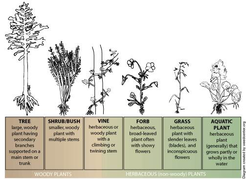
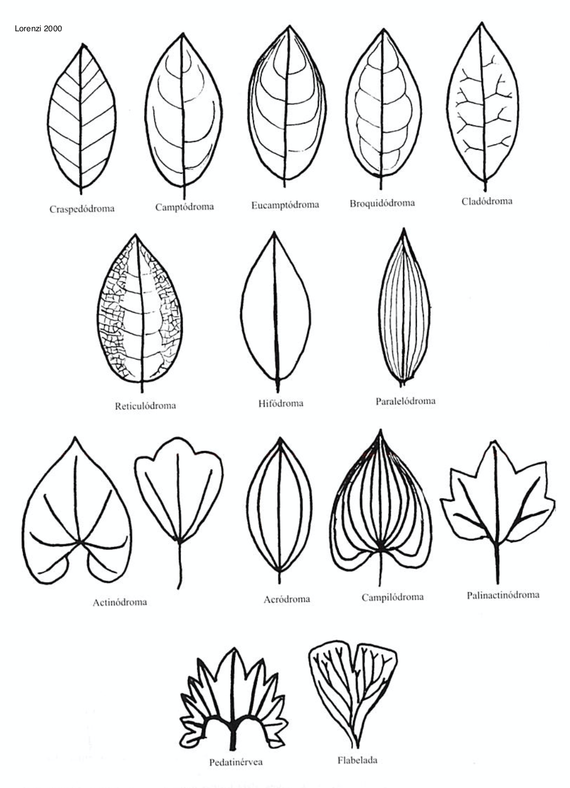
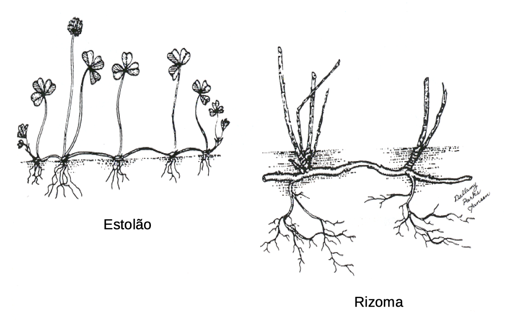
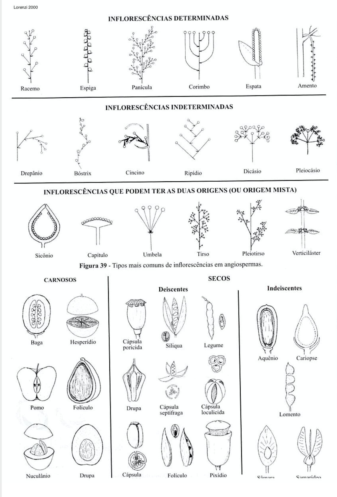
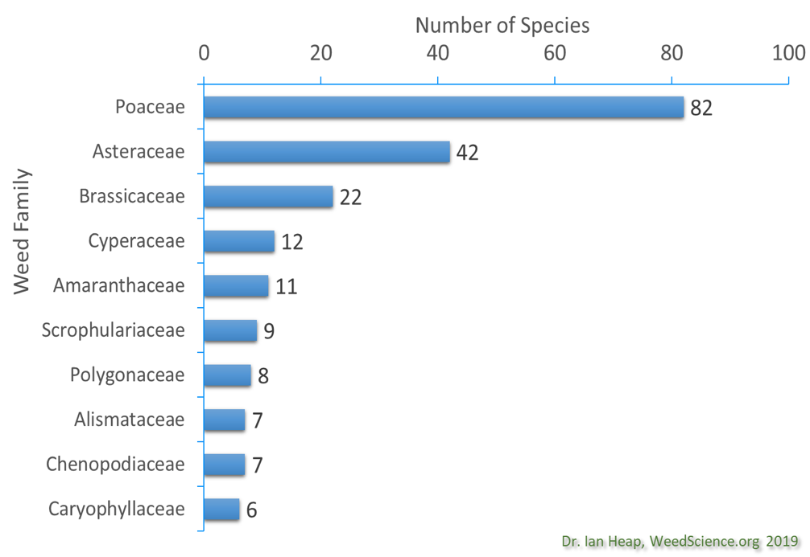
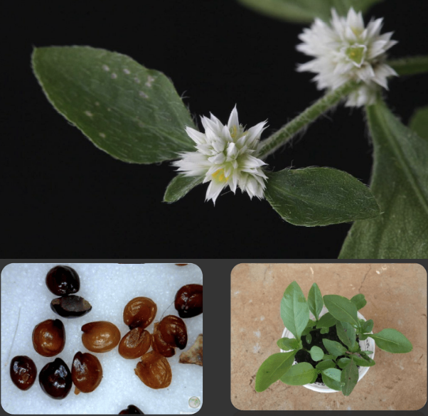
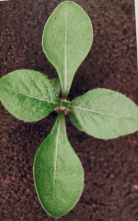
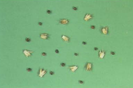
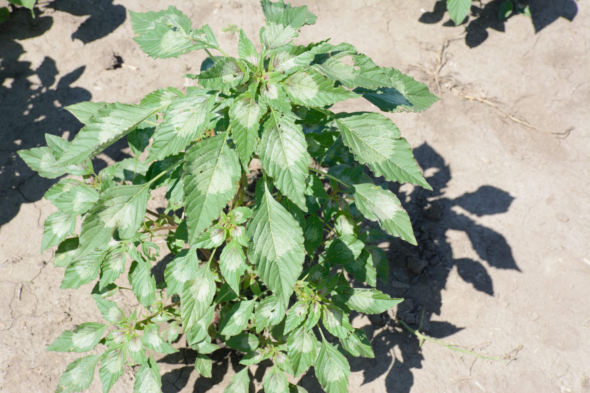

```{r setup, include=FALSE}
options(htmltools.dir.version = FALSE)
knitr::opts_chunk$set(
  echo = FALSE,
  fig.align = "center",
  message = FALSE,
  warning = FALSE,
  cache = TRUE
)

htmltools::tagList(rmarkdown::html_dependency_font_awesome()) #show twitter logo
```


## Características ideais

--


- Germinação muitos ambientes distintos
--


- Germinação descontínua e grande longevidade das sementes
--


- Crescimento rápido
--


- Produção contínua de sementes e capacidade de se reproduzir quando jovem
--


- Produzir grande número de sementes ou propágulos em ambientes favoráveis
--


- Autocompatível ou cruzando por visitantes não especializados ou vento
--


- Competitiva com plantas desejáveis
--


- Plasticidade genotípica (a base da resistência a herbicidas)
--


- Adaptado para dispersão a curta e longa distância

---


## Classificação de plantas daninhas

- **Botânica (taxonômica)** - com base em características comuns (ou seja, - reino, divisão, classe, ordem, família, gênero, espécie). Criador da nomenclatura científica Carolus Linnaeus, um botânico sueco, que viveu nos anos 1700.


.pull-left[
| Classificação| buva  |
|------------|---|
| *Reino*     | Vegetal  |
| *Divisão*    | Spermatophyta – sementes  |
| *Subdivisão* | Magnoliophyta – flores  |
| *Classe*     | Magnoliopsida – dicot  |
| *Subclasse*  | Asteridae  |
| *Ordem*      | Asterales  |
| *Família*    | Asteraceae ⁄ Compositae |
| *Gênero*    | *Conyza* Less. – buva  |
| *Espécie*    | *Conyza canadensis* (L.) Cronquist – buva canadense  |
]


.pull-right[
```{r echo=FALSE, out.width=200, fig.align='center'}
knitr::include_graphics("https://plants.usda.gov/gallery/standard/coca5_007_svp.jpg")
```
]


---

## Classificação de plantas daninhas

- **História da vida** - ciclo de vida, estação do crescimento, época e método de reprodução (por exemplo: verão / inverno anual, bianunal, perene)

    - **Anuais**: As espécies anuais são plantas que completam seu ciclo vegetativo e reprodutivo no período máximo de um ano

    - **Bianuais**: As bianuais, normalmente, ultrapassam um ano chegando a completar seu ciclo em até dois anos

    - **Perenes**: Uma planta perene ou simplesmente perene é uma planta que vive mais de dois anos


---


## Classificação de plantas daninhas


- **Habitat** - onde a planta cresce (por exemplo, terrestre, aquática)

.pull-left[
```{r echo=FALSE, out.width=350, fig.align='center'}
knitr::include_graphics("https://goldenpondwaterplants.com/site/wp-content/uploads/tropical-lily-1024x1024.jpg")
```
]


.pull-right[
```{r echo=FALSE, out.width=350, fig.align='center'}
knitr::include_graphics("https://www.remax-tripoli.com/wp-content/uploads/properties/94/e594ce0d769d094255bdd7993a173a97/9394.jpg")
```
]


---


## Classificação de plantas daninhas

- **Via fisiológica** - fotossintética (C3, C4), resposta ao fotoperíodo da floração (dia curto, dia longo, dia neutro)


.pull-left[
```{r echo=FALSE, out.width=350, fig.align='center'}
knitr::include_graphics("https://i.ytimg.com/vi/HbLg4lMpUa8/maxresdefault.jpg")
```
]


.pull-right[
```{r echo=FALSE, out.width=350, fig.align='center'}
knitr::include_graphics("https://image.slidesharecdn.com/factoresabiticos-111017101711-phpapp01/95/fatores-abiticos-78-728.jpg?cb=1318846725")
```
]

---

## Classificação de plantas daninhas

- **Indesejabilidade** - dificuldade de controle (nocivo, proibido), características venenosas


.pull-left[
```{r echo=FALSE, out.width=350, fig.align='center'}
knitr::include_graphics("https://pastoextraordinario.com.br/wp-content/uploads/2019/07/Pasto-Extraordinario-plantas-daninhas-leiteiro-leiteira-768x510.png")
```
]


.pull-right[
```{r echo=FALSE, out.width=350, fig.align='center'}
knitr::include_graphics("https://www.dtnpf.com/mydtn-public-core-portlet/servlet/GetStoredImage?category=CMS&symbolicName=originalX31174YsiteXDTNYcatalogXcatalog")
```
]

---

## Classificação de plantas daninhas

- **Classificação ecológica** - Introdução, colonização, naturalização.

```{r echo=FALSE, out.width=600, fig.align='center'}
knitr::include_graphics("https://livingnatureweb.files.wordpress.com/2017/10/image-24.jpg?w=736")
```


---

## Classificação de plantas daninhas


- **Classificação por estratégia evolutiva** - tolerantes ao estresse, competitoras, ruderais

    - **Tolerantes ao estresse**: São aquelas que existem em ambientes de alto estresse, incluindo habitats áridos, árticos-alpinos, sombreados e com baixo teor de nutrientes

    - **Competidoras**: São espécies de plantas que prosperam em áreas de estresse e perturbação de baixa intensidade e se destacam na competição biológica. Essas espécies são capazes de competir com outras plantas aproveitando com mais eficiência os recursos disponíveis
    
    - **Ruderal**: É uma espécie de planta que é a primeira a colonizar terras perturbadas. O distúrbio pode ser natural - por exemplo, incêndios florestais ou avalanches - ou uma consequência da atividade humana, como construção ou agricultura


---


## Nomes comuns

### Vantagens

- Bem entendido em uma pequena localidade

- Fácil de pronunciar e usar por leigos sem treinamento botânico

- Muitas vezes descritivo (por exemplo, capim pé-de-galinha; botão-de-ouro)


---

## Nomes comuns

### Desvantagens

- Não aceito em todo o local

- Pode se referir a mais de uma espécie

- Corda-de-viola é frequentemente usado para se referir a várias espécies de **Ipomoea** spp.

- "Buva" refere-se a muitas espécies do gênero *Conyza*

- Uma única planta pode ter mais de um nome comum

- *Euphorbia heterophylla* é freqüentemente chamado de leiteira e amendoim bravo


---

## Nome científico

### O nome científico sempre tem duas partes

-  gênero (em maiúsculas) 

- epíteto específico (em minúsculas)


```{r echo=FALSE, out.width=600, fig.align='center'}

```

---

## Nome científico

#### Vantagens

- Apenas um nome reconhecido por espécie

- Fornece um meio de comunicação aceito em todo o mundo: reconhecido e documentado em todo o mundo

- Estabilidade - eles não mudam com a mesma frequência que os nomes comuns


---

## Nome científico

#### Desvantagens


- Algumas mudanças ocorrem à medida que mais pesquisas taxonômicas são realizadas


- Não descritivo e pouco utilizado por leigos


---

## Taxonomia

.pull-left[
#### Monocotiledônea (folha estreita)

- Classe de angiospermas cujas sementes possuem um único cotilédone


#### Dicotiledônea (folhas largas)

- Classe de angiospermas cujas sementes geralmente possuem dois cotilédones

]

.pull-right[
```{r echo=FALSE, out.width=400, fig.align='center'}
knitr::include_graphics("https://moodle.clsd.k12.pa.us/district_videos/Biology/ebook/products/0-13-115540-7/sb4652f1.png")
```
]


---

## Hábito de crescimento

### Morfologia


- **Herbácea:** plantas herbáceas plantas tenras e de baixo porte. Não abrangem as gramíneas.

- **Arbusto:** Uma planta lenhosa de baixo crescimento, arbusto com um a muitos galhos

- **Trepadeira:** Uma planta lenhosa ou herbácea que se arrasta no chão
ou sobe sobre outras plantas ou obstáculos por vários meios. O caule de uma cipó é freqüentemente tão fraco que não pode suportar a planta por si só

```{r echo=FALSE, out.width=250, fig.align='center'}

``` 


---

### Hábito de crescimento

```{r echo=FALSE, out.width=900, fig.align='center'}
knitr::include_graphics("images/plant_morphology.jpg")
``` 


---

class: middle, center


```{r echo=FALSE, out.width=900, fig.align='center'}
knitr::include_graphics("https://science.sciencemag.org/content/sci/356/6337/498.5/F1.large.jpg?width=800&height=600&carousel=1")
``` 


---

```{r echo=FALSE, out.width=900, fig.align='center'}
knitr::include_graphics("https://upload.wikimedia.org/wikipedia/commons/thumb/3/34/Ulistnienie.svg/640px-Ulistnienie.svg.png?1596221713557")
``` 

- a) alternadas 
--


- b) opostas cruzadas
--


- c) opostas dísticas 
--


- d) verticiladas


---


.pull-left[
```{r echo=FALSE, out.width=400, fig.align='center'}
knitr::include_graphics("https://i.pinimg.com/474x/63/a6/ed/63a6edc53fe6793942bbf2a26f5ab352--professor-vestibular.jpg")
``` 
]


.pull-right[
```{r echo=FALSE, out.width=450, fig.align='center'}
knitr::include_graphics("https://treeonline.files.wordpress.com/2010/08/a3glossary_leaf_shapes1.jpg")
``` 
]

---


.pull-left[
```{r echo=FALSE, out.width=700, fig.align='center'}
knitr::include_graphics("images/base.png")
``` 
]

.pull-right[
```{r echo=FALSE, out.width=700, fig.align='center'}
knitr::include_graphics("images/topo.png")
``` 
]


---

.pull-left[
```{r echo=FALSE, out.width=450, fig.align='center'}
knitr::include_graphics("images/tipos_de_folhas_2.png")
``` 
]

.pull-right[
```{r echo=FALSE, out.width=450, fig.align='center'}

``` 
]

---

.pull-left[
```{r echo=FALSE, out.width=700, fig.align='center'}
knitr::include_graphics("https://s3-sa-east-1.amazonaws.com/manual-do-enem-test/36a907faa14c45af82b62227b5ccda67-Folha_5.png")
``` 
]

.pull-right[
```{r echo=FALSE, out.width=700, fig.align='center'}
knitr::include_graphics("https://i1.wp.com/www.wildernessarena.com/wp-content/uploads/2013/05/image29.png")
``` 
]


---

.pull-left[
```{r echo=FALSE, out.width=425, fig.align='center'}
knitr::include_graphics("http://www.vplants.org/portal/images/vplants/plants/glossary/plate01.jpg")
``` 
]

.pull.right[
```{r echo=FALSE, out.width=370, fig.align='center'}
knitr::include_graphics("https://player.slideplayer.com.br/83/13620308/slides/slide_6.jpg")
``` 

```{r echo=FALSE, out.width=350, fig.align='center'}
knitr::include_graphics("http://2.bp.blogspot.com/_zPp3zxa3eTc/TDS0dIq7SfI/AAAAAAAAAOk/yQ1-vToaeyU/s1600/tub..jpg")
``` 
]

---

class: center, middle

```{r echo=FALSE, out.width=650, fig.align='center'}

```


---

.pull-left[
```{r echo=FALSE, out.width=425, fig.align='center'}

``` 
]

.pull-right[
```{r echo=FALSE, out.width=600, fig.align='center'}
knitr::include_graphics("http://midia.atp.usp.br/imagens/redefor/EnsinoBiologia/Botanica/Top08_fig12w.jpg")
``` 

]


---

.pull-left[
```{r echo=FALSE, out.width=450, fig.align='center'}
knitr::include_graphics("http://www.vplants.org/portal/images/vplants/plants/glossary/plate09.jpg")
``` 
]

.pull-right[
```{r echo=FALSE, out.width=450, fig.align='center'}
knitr::include_graphics("http://www.vplants.org/portal/images/vplants/plants/glossary/plate10.jpg")
``` 
]

---

.pull-left[
```{r echo=FALSE, out.width=450, fig.align='center'}
knitr::include_graphics("http://www.vplants.org/portal/images/vplants/plants/glossary/plate07.jpg")
``` 
]

.pull-right[
```{r echo=FALSE, out.width=450, fig.align='center'}
knitr::include_graphics("http://www.vplants.org/portal/images/vplants/plants/glossary/plate11.jpg")
``` 
]


---

# Resistência a herbicidas

- Top 10 - Famílias

```{r echo=FALSE, out.width=600, fig.align='center'}

``` 


---


# Herbário online

- Identifique 20 plantas daninhas

- Escreva a família, nome comum e nome científico de cada planta daninha

- Descreva brevemente a característica da planta daninha

- Coloque 4 fotos de cada planta daninha (adicione seu nome na foto para direitos autorais)
    - Fotos podem ser de sementes, plântulas, plantas adultas (caule, folha, raiz)

- Monte o herbário em um formato de apresentação *PowerPoint*


---

class: inverse, center, middle


# Identificação de Plantas Daninhas


```{r echo=FALSE, out.width=600, fig.align='center'}
knitr::include_graphics("https://media.giphy.com/media/Zv8VKJZMFm5NKxW9k5/giphy.gif")
``` 


---

class: inverse

## Amaranthaceae

### Características


.pull-left[

Principalmente ervas e arbustos

- **Ciclos de vida**: Anual 

- **Raízes**: pivotante

- **Inflorescência**: cachos pontiagudos, geralmente espinhosos

- **Flores**: pequenas, actinomórficas (radialmente simétricas); pétalas ausentes

- **Folhas**: simples, principalmente inteiras

- **Caules**: frequentemente suculentos e / ou articulados

- **Variedades cultivadas**: 
]

.pull-right[
```{r echo=FALSE, out.width=200, fig.align='center'}
knitr::include_graphics("https://plants.sc.egov.usda.gov/gallery/standard/amre_003_shp.jpg")
``` 


```{r echo=FALSE, out.width=200, fig.align='center'}
knitr::include_graphics("https://upload.wikimedia.org/wikipedia/commons/2/26/Amaranthus_retroflexus_full1.jpg")
``` 
]


---

## *Alternanthera tenella*

#### **Nome comum**: apaga-fogo

.pull-left[
- **Ciclo de vida:** anual ou perene

- **Caule:** o caule  principal apresenta ramificação radial e esta se ramifica em dicotomia ou 3  ramos

- **Folhas:** simples desprovidas de pecíolo, filotaxia oposta, limbo  lanceolado com margem inteira e apículo terminal

- **Inflorescência:** glomérulos contendo tépalas brancas, secas e livres entre si


]


.pull-right[
```{r echo=FALSE, out.width=400, fig.align='center'}

``` 
]


---


## *Alternanthera tenella*

#### **Nome comum**: apaga-fogo

```{r echo=FALSE, out.width=350, fig.align='center'}
knitr::include_graphics("http://cncflora.jbrj.gov.br/arquivos/arquivos/mapas/Alternanthera%20tenella.jpg")
``` 


---


.pull-left[
```{r echo=FALSE, out.width=400, fig.align='center'}
knitr::include_graphics("https://www.agrolink.com.br/upload/problemas/Alternanthera%20tenella6.jpg")
``` 

```{r echo=FALSE, out.width=400, fig.align='center'}
knitr::include_graphics("https://upload.wikimedia.org/wikipedia/commons/e/e1/Alternanthera_tenella_Colla._%2815216261255%29.jpg")
``` 
]


.pull-right[
```{r echo=FALSE, out.width=200, fig.align='center'}

``` 

```{r echo=FALSE, out.width=200, fig.align='center'}
knitr::include_graphics("http://chaves.rcpol.org.br/resized/eco-0B0nUXAibCfVGT0R6ZTMtRlNGcmc.jpeg")
``` 
]

---

## *Amaranthus deflexus*

#### **Nome comum**: caruru-rasteiro


.pull-left[
**Ciclo de vida**: anual, geralmente prostrada

**Folhas:** glabro e levemente pubescente com nervuras impressas

**Caule:** glabro e levemente estriado

]


.pull-right[
```{r echo=FALSE, out.width=400, fig.align='center'}
knitr::include_graphics("https://www.agrolink.com.br/upload/problemas/Amaranthus_deflexus83.jpg")
``` 

]

---

.pull-left[
```{r echo=FALSE, out.width=350, fig.align='center'}
knitr::include_graphics("https://newfs.s3.amazonaws.com/taxon-images-1000s1000/Amaranthaceae/amaranthus-deflexus-le-mhassler.jpg")
``` 

```{r echo=FALSE, out.width=350, fig.align='center'}
knitr::include_graphics("https://newfs.s3.amazonaws.com/taxon-images-1000s1000/Amaranthaceae/amaranthus-deflexus-fr-atate.jpg")
``` 
]


.pull-right[
```{r echo=FALSE, out.width=300, fig.align='center'}
knitr::include_graphics("https://www.agrolink.com.br/upload/problemas/Amaranthus_deflexus88.jpg")
``` 

```{r echo=FALSE, out.width=300, fig.align='center'}
knitr::include_graphics("https://previews.agefotostock.com/previewimage/medibigoff/29e52cacc74326ee334a46f9ac8b02af/vd7-3177390.jpg")
``` 


]


---


## *Amaranthus hybridus*

#### **Nome comum**: caruru-roxo


.pull-left[
**Caules:** Ascendente para ereto, até 2 m, pubescente

**Folhas:** Alternadas, pecioladas. Pubescente (pelos finos muito pequenos)

**Inflorescência:** Verde opaco ou acinzentado, ocasionalmente tingido de vermelho, altamente ramificado

**Reprodução:** Monóica (M e F na mesma planta)
]


.pull-right[
```{r echo=FALSE, out.width=400, fig.align='center'}
knitr::include_graphics("https://d2seqvvyy3b8p2.cloudfront.net/e5fd2cf785e35944ac33013fa52deecf.jpg")
``` 
]


---

.pull-left[
```{r echo=FALSE, out.width=350, fig.align='center'}
knitr::include_graphics("https://bugwoodcloud.org/images/768x512/5374133.jpg")
``` 

```{r echo=FALSE, out.width=300, fig.align='center'}
knitr::include_graphics("http://missouriplants.com/images/Amaranthus_hybridus_stem.jpg")
``` 
]


.pull-right[
```{r echo=FALSE, out.width=300, fig.align='center'}
knitr::include_graphics("http://missouriplants.com/images/Amaranthus_hybridus_leaves.jpg")
``` 

```{r echo=FALSE, out.width=250, fig.align='center'}
knitr::include_graphics("https://maissoja.com.br/wp-content/uploads/2020/05/figura-4-5.png")
``` 
]

---

## *Amaranthus retroflexus*

#### **Nome comum**: caruru-gigante


.pull-left[
**Cotilédones**: lineares, sem pelos, peciolados

**Folhas:** simples, alternada, peciolada, pubescente, forma ovalada a lanceolada, inteira até as margens dentadas, aparecem "enrugadas", a superfície pode ser pubescente em ambos os lados, veias proeminentes

**Caule:** ereto, cor avermelhada, pubescente, pode apresentar linhas ou sulcos

**Raízes superiores:** cor rosa a vermelha
]


.pull-right[
```{r echo=FALSE, out.width=400, fig.align='center'}
knitr::include_graphics("https://ucanr.edu/blogs/SJVAgronomyWeedScienceBlog/blogfiles/53214_original.jpg")
``` 

]

---

.pull-left[
```{r echo=FALSE, out.width=350, fig.align='center'}
knitr::include_graphics("https://www.maine.gov/dacf/php/gotpests/weeds/images/pigweed/pigweed-root-big.jpg")
``` 

```{r echo=FALSE, out.width=350, fig.align='center'}
knitr::include_graphics("https://www.canr.msu.edu/uploads/images/6-15-11%20DAN%20pic%202.jpg")
``` 
]


.pull-right[
```{r echo=FALSE, out.width=300, fig.align='center'}
knitr::include_graphics("http://ucanr.edu/blogs/sjvagronomyweedscienceblog/blogfiles/53213.jpg")
``` 

```{r echo=FALSE, out.width=300, fig.align='center'}
knitr::include_graphics("https://www.canr.msu.edu/pestid/uploads/images/Redroot-pigweed-stem.jpg")
``` 


]


---


## *Amaranthus spinosus*

#### **Nome comum**: caruru-de-espinho

.pull-left[
**Sementes**: Quando as sementes são debulhadas, as sépalas são ligeiramente mais longas que as sementes

**Folhas**: membranáceas e com manchas arroxeadas - 2 espinhos na base de cada pecíolo

**Caules**: macios, or verde ou púrpura avermelhada e podem ser sem pelos (ou seja, glabros)

**Flor**: Flores femininas na parte do meio para baixo, flores masculinas na parte de cima da planta
]


.pull-right[
```{r echo=FALSE, out.width=400, fig.align='center'}
knitr::include_graphics("https://weeds.brisbane.qld.gov.au/sites/default/files/styles/large/public/images/amaranthus_spinosus27.jpg?itok=3NZNmyHG")
``` 

```{r echo=FALSE, out.width=250, fig.align='center'}

``` 

]

---

.pull-left[
```{r echo=FALSE, out.width=450, fig.align='center'}
knitr::include_graphics("https://weeds.brisbane.qld.gov.au/sites/default/files/styles/large/public/images/amaranthus_spinosus29.jpg?itok=1uI7hFfS")
``` 

```{r echo=FALSE, out.width=450, fig.align='center'}
knitr::include_graphics("http://uspest.org/weeds/id/Spiny_amaranth--Amaranthus_spinosus--s.i.jpg")
``` 
]

.pull-right[
```{r echo=FALSE, out.width=450, fig.align='center'}
knitr::include_graphics("https://weeds.brisbane.qld.gov.au/sites/default/files/styles/large/public/images/amaranthus_spinosus24.jpg?itok=10pUC74N")
``` 

```{r echo=FALSE, out.width=450, fig.align='center'}
knitr::include_graphics("https://weeds.brisbane.qld.gov.au/sites/default/files/styles/large/public/images/amaranthus_spinosus36.jpg?itok=NDSr0Ygi")
``` 
]


**Habitat:** Uma planta daninha de beira de estradas, locais perturbados, áreas devastadas, caminhos pedonais, jardins, pátios, pastagens, lavouras e pousios.

---

## *Amaranthus palmeri*

#### **Nome comum**: Palmer amaranth

.pull-left[
**Cotilédones**: lineares, sem pelos

**Folhas**: simples, alternadas, glabras, pecioladas longas, lanceoladas ou ovais, margens inteiras, primeiras folhas verdadeiras de forma ovalada e ligeiramente entalhadas na ponta da lâmina foliar

**Caules**: Eretos, ramificados

**Flor**: dióica (as flores são masculinas ou femininas; cada planta possui apenas um sexo)
]


.pull-right[
```{r echo=FALSE, out.width=400, fig.align='center'}

``` 

```{r echo=FALSE, out.width=400, fig.align='center'}
knitr::include_graphics("https://www.mda.state.mn.us/sites/default/files/inline-images/infestation2.jpg")
``` 
]

---

.pull-left[
```{r echo=FALSE, out.width=450, fig.align='center'}
knitr::include_graphics("images/palmer_02.jpg")
``` 

```{r echo=FALSE, out.width=450, fig.align='center'}
knitr::include_graphics("https://i1.wp.com/onvegetables.com/wp-content/uploads/2018/08/Palmer-seedling3.jpg?fit=2710%2C2000&ssl=1")
``` 
]

.pull-right[
```{r echo=FALSE, out.width=450, fig.align='center'}
knitr::include_graphics("https://3.bp.blogspot.com/-QCrrcfsGJKI/W8YfEunEEvI/AAAAAAAAFgs/5JNu3ZjOwN4krCZ2XVxiH0X3p2_2S3N4wCLcBGAs/s1600/Palmer%2Bamaranth%2Bclose%2Bup%2BPhoto%2BCredit%2BBruce%2BPotter%2BIPM%2BSpecialist%2BU%2Bof%2BMN%2BExtension.jpg")
``` 

```{r echo=FALSE, out.width=450, fig.align='center'}
knitr::include_graphics("https://bloximages.newyork1.vip.townnews.com/farmforum.net/content/tncms/assets/v3/editorial/2/0c/20cf90fa-c253-5f0c-a882-d192ef07e6fa/5e86790187fe4.image.jpg?resize=1200%2C900")
``` 
]

---

class: middle, center

```{r echo=FALSE, out.width=650, fig.align='center'}
knitr::include_graphics("images/palmer_adaptation.png")
``` 

---

## *Amaranthus viridis*

#### **Nome comum**: caruru-de-mancha

.pull-left[
- **Ciclo de vida:** anual 

- **Caules:** geralmente ereto, com pubescência curta esparsa na parte superior, glabro na parte inferior

- **Folhas** ovadas, alongadas rômbico-ovadas, 2-6 cm de comprimento, base amplamente curva, arredondada, ápice rombudo ou ligeiramente marginalizado, verde escuro. Frequentemente com uma mancha violácea no centro da lâmina

]


.pull-right[
```{r echo=FALSE, out.width=400, fig.align='center'}
knitr::include_graphics("https://www.researchgate.net/profile/Nafees_Mohammad/post/What_are_the_medicinal_uses_of_Amaranthus_viridis_Linn_What_alkaloids_are_present_in_this_plant/attachment/5b0989a2b53d2f63c3ce3d5b/AS%3A630572946833409%401527351714175/image/images+%2817%29.jpeg")
``` 
]


---

.pull-left[
```{r echo=FALSE, out.width=300, fig.align='center'}
knitr::include_graphics("https://weeds.brisbane.qld.gov.au/sites/default/files/styles/large/public/images/amaranthus_viridis15.jpg?itok=bX42w16R")
``` 

```{r echo=FALSE, out.width=300, fig.align='center'}
knitr::include_graphics("https://upload.wikimedia.org/wikipedia/commons/thumb/1/1f/Amaranthus_viridis_Inflorescens_Closeup_TorreLaMata.jpg/1200px-Amaranthus_viridis_Inflorescens_Closeup_TorreLaMata.jpg")
``` 
]


.pull-right[
```{r echo=FALSE, out.width=200, fig.align='center'}
knitr::include_graphics("https://newfs.s3.amazonaws.com/taxon-images-1000s1000/Amaranthaceae/amaranthus-viridis-st-jgwaltney.jpg")
``` 

```{r echo=FALSE, out.width=300, fig.align='center'}
knitr::include_graphics("https://jerrycolebywilliams.files.wordpress.com/2012/12/volunteer-green-amaranth-amaranthus-viridis.jpg?w=300")
``` 
]


