```{r setup, include=FALSE}
options(htmltools.dir.version = FALSE)
knitr::opts_chunk$set(
  echo = FALSE,
  fig.align = "center",
  message = FALSE,
  warning = FALSE,
  cache = TRUE
)

htmltools::tagList(rmarkdown::html_dependency_font_awesome()) #show twitter logo
```


class: inverse, center, middle


# Identificação de Plantas Daninhas


```{r echo=FALSE, out.width=600, fig.align='center'}
knitr::include_graphics("https://media.giphy.com/media/Zv8VKJZMFm5NKxW9k5/giphy.gif")
``` 


---

class: inverse

## Amaranthaceae

### Características


.pull-left[

Principalmente ervas e arbustos

- **Ciclos de vida**: Anual 

- **Raízes**: pivotante

- **Inflorescência**: cachos pontiagudos, geralmente espinhosos

- **Flores**: pequenas, actinomórficas (radialmente simétricas); pétalas ausentes

- **Folhas**: simples, principalmente inteiras

- **Caules**: frequentemente suculentos e / ou articulados

- **Variedades cultivadas**: 
]

.pull-right[
```{r echo=FALSE, out.width=200, fig.align='center'}
knitr::include_graphics("https://plants.sc.egov.usda.gov/gallery/standard/amre_003_shp.jpg")
``` 


```{r echo=FALSE, out.width=200, fig.align='center'}
knitr::include_graphics("https://upload.wikimedia.org/wikipedia/commons/2/26/Amaranthus_retroflexus_full1.jpg")
``` 
]


---

## *Alternanthera tenella*

#### **Nome comum**: apaga-fogo

.pull-left[
- **Ciclo de vida:** anual ou perene

- **Caule:** o caule  principal apresenta ramificação radial e esta se ramifica em dicotomia ou 3  ramos

- **Folhas:** simples desprovidas de pecíolo, filotaxia oposta, limbo  lanceolado com margem inteira e apículo terminal

- **Inflorescência:** glomérulos contendo tépalas brancas, secas e livres entre si


]


.pull-right[
```{r echo=FALSE, out.width=400, fig.align='center'}
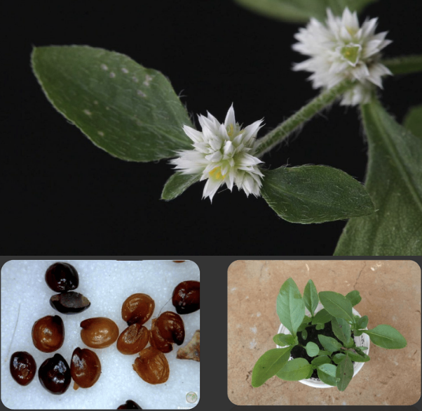
``` 
]


---


## *Alternanthera tenella*

#### **Nome comum**: apaga-fogo

```{r echo=FALSE, out.width=350, fig.align='center'}
knitr::include_graphics("http://cncflora.jbrj.gov.br/arquivos/arquivos/mapas/Alternanthera%20tenella.jpg")
``` 


---


.pull-left[
```{r echo=FALSE, out.width=400, fig.align='center'}
knitr::include_graphics("https://www.agrolink.com.br/upload/problemas/Alternanthera%20tenella6.jpg")
``` 

```{r echo=FALSE, out.width=400, fig.align='center'}
knitr::include_graphics("https://upload.wikimedia.org/wikipedia/commons/e/e1/Alternanthera_tenella_Colla._%2815216261255%29.jpg")
``` 
]


.pull-right[
```{r echo=FALSE, out.width=200, fig.align='center'}
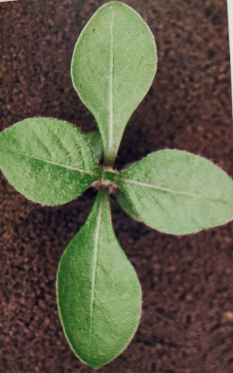
``` 

```{r echo=FALSE, out.width=200, fig.align='center'}
knitr::include_graphics("http://chaves.rcpol.org.br/resized/eco-0B0nUXAibCfVGT0R6ZTMtRlNGcmc.jpeg")
``` 
]

---

## *Amaranthus deflexus*

#### **Nome comum**: caruru-rasteiro


.pull-left[
**Ciclo de vida**: anual, geralmente prostrada

**Folhas:** glabro e levemente pubescente com nervuras impressas

**Caule:** glabro e levemente estriado

]


.pull-right[
```{r echo=FALSE, out.width=400, fig.align='center'}
knitr::include_graphics("https://www.agrolink.com.br/upload/problemas/Amaranthus_deflexus83.jpg")
``` 

]

---

.pull-left[
```{r echo=FALSE, out.width=350, fig.align='center'}
knitr::include_graphics("https://newfs.s3.amazonaws.com/taxon-images-1000s1000/Amaranthaceae/amaranthus-deflexus-le-mhassler.jpg")
``` 

```{r echo=FALSE, out.width=350, fig.align='center'}
knitr::include_graphics("https://newfs.s3.amazonaws.com/taxon-images-1000s1000/Amaranthaceae/amaranthus-deflexus-fr-atate.jpg")
``` 
]


.pull-right[
```{r echo=FALSE, out.width=300, fig.align='center'}
knitr::include_graphics("https://www.agrolink.com.br/upload/problemas/Amaranthus_deflexus88.jpg")
``` 

```{r echo=FALSE, out.width=300, fig.align='center'}
knitr::include_graphics("https://previews.agefotostock.com/previewimage/medibigoff/29e52cacc74326ee334a46f9ac8b02af/vd7-3177390.jpg")
``` 


]


---


## *Amaranthus hybridus*

#### **Nome comum**: caruru-roxo


.pull-left[
**Caules:** Ascendente para ereto, até 2 m, pubescente

**Folhas:** Alternadas, pecioladas. Pubescente (pelos finos muito pequenos)

**Inflorescência:** Verde opaco ou acinzentado, ocasionalmente tingido de vermelho, altamente ramificado

**Reprodução:** Monóica (M e F na mesma planta)
]


.pull-right[
```{r echo=FALSE, out.width=400, fig.align='center'}
knitr::include_graphics("https://d2seqvvyy3b8p2.cloudfront.net/e5fd2cf785e35944ac33013fa52deecf.jpg")
``` 
]


---

.pull-left[
```{r echo=FALSE, out.width=350, fig.align='center'}
knitr::include_graphics("https://bugwoodcloud.org/images/768x512/5374133.jpg")
``` 

```{r echo=FALSE, out.width=300, fig.align='center'}
knitr::include_graphics("http://missouriplants.com/images/Amaranthus_hybridus_stem.jpg")
``` 
]


.pull-right[
```{r echo=FALSE, out.width=300, fig.align='center'}
knitr::include_graphics("http://missouriplants.com/images/Amaranthus_hybridus_leaves.jpg")
``` 

```{r echo=FALSE, out.width=250, fig.align='center'}
knitr::include_graphics("https://maissoja.com.br/wp-content/uploads/2020/05/figura-4-5.png")
``` 
]

---

## *Amaranthus retroflexus*

#### **Nome comum**: caruru-gigante


.pull-left[
**Cotilédones**: lineares, sem pelos, peciolados

**Folhas:** simples, alternada, peciolada, pubescente, forma ovalada a lanceolada, inteira até as margens dentadas, aparecem "enrugadas", a superfície pode ser pubescente em ambos os lados, veias proeminentes

**Caule:** ereto, cor avermelhada, pubescente, pode apresentar linhas ou sulcos

**Raízes superiores:** cor rosa a vermelha
]


.pull-right[
```{r echo=FALSE, out.width=400, fig.align='center'}
knitr::include_graphics("https://ucanr.edu/blogs/SJVAgronomyWeedScienceBlog/blogfiles/53214_original.jpg")
``` 

]

---

.pull-left[
```{r echo=FALSE, out.width=350, fig.align='center'}
knitr::include_graphics("https://www.maine.gov/dacf/php/gotpests/weeds/images/pigweed/pigweed-root-big.jpg")
``` 

```{r echo=FALSE, out.width=350, fig.align='center'}
knitr::include_graphics("https://www.canr.msu.edu/uploads/images/6-15-11%20DAN%20pic%202.jpg")
``` 
]


.pull-right[
```{r echo=FALSE, out.width=300, fig.align='center'}
knitr::include_graphics("http://ucanr.edu/blogs/sjvagronomyweedscienceblog/blogfiles/53213.jpg")
``` 

```{r echo=FALSE, out.width=300, fig.align='center'}
knitr::include_graphics("https://www.canr.msu.edu/pestid/uploads/images/Redroot-pigweed-stem.jpg")
``` 


]


---


## *Amaranthus spinosus*

#### **Nome comum**: caruru-de-espinho

.pull-left[
**Sementes**: Quando as sementes são debulhadas, as sépalas são ligeiramente mais longas que as sementes

**Folhas**: membranáceas e com manchas arroxeadas - 2 espinhos na base de cada pecíolo

**Caules**: macios, or verde ou púrpura avermelhada e podem ser sem pelos (ou seja, glabros)

**Flor**: Flores femininas na parte do meio para baixo, flores masculinas na parte de cima da planta
]


.pull-right[
```{r echo=FALSE, out.width=400, fig.align='center'}
knitr::include_graphics("https://weeds.brisbane.qld.gov.au/sites/default/files/styles/large/public/images/amaranthus_spinosus27.jpg?itok=3NZNmyHG")
``` 

```{r echo=FALSE, out.width=250, fig.align='center'}
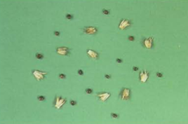
``` 

]

---

.pull-left[
```{r echo=FALSE, out.width=450, fig.align='center'}
knitr::include_graphics("https://weeds.brisbane.qld.gov.au/sites/default/files/styles/large/public/images/amaranthus_spinosus29.jpg?itok=1uI7hFfS")
``` 

```{r echo=FALSE, out.width=450, fig.align='center'}
knitr::include_graphics("http://uspest.org/weeds/id/Spiny_amaranth--Amaranthus_spinosus--s.i.jpg")
``` 
]

.pull-right[
```{r echo=FALSE, out.width=450, fig.align='center'}
knitr::include_graphics("https://weeds.brisbane.qld.gov.au/sites/default/files/styles/large/public/images/amaranthus_spinosus24.jpg?itok=10pUC74N")
``` 

```{r echo=FALSE, out.width=450, fig.align='center'}
knitr::include_graphics("https://weeds.brisbane.qld.gov.au/sites/default/files/styles/large/public/images/amaranthus_spinosus36.jpg?itok=NDSr0Ygi")
``` 
]


**Habitat:** Uma planta daninha de beira de estradas, locais perturbados, áreas devastadas, caminhos pedonais, jardins, pátios, pastagens, lavouras e pousios.

---

## *Amaranthus palmeri*

#### **Nome comum**: Palmer amaranth

.pull-left[
**Cotilédones**: lineares, sem pelos

**Folhas**: simples, alternadas, glabras, pecioladas longas, lanceoladas ou ovais, margens inteiras, primeiras folhas verdadeiras de forma ovalada e ligeiramente entalhadas na ponta da lâmina foliar

**Caules**: Eretos, ramificados

**Flor**: dióica (as flores são masculinas ou femininas; cada planta possui apenas um sexo)
]


.pull-right[
```{r echo=FALSE, out.width=400, fig.align='center'}
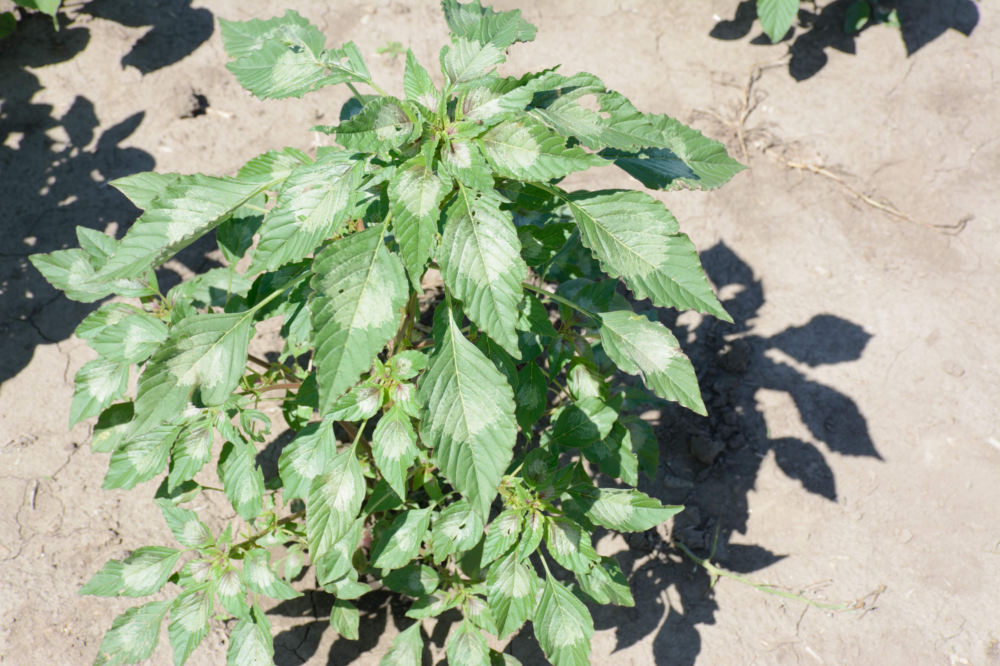
``` 

```{r echo=FALSE, out.width=400, fig.align='center'}
knitr::include_graphics("https://www.mda.state.mn.us/sites/default/files/inline-images/infestation2.jpg")
``` 
]

---

.pull-left[
```{r echo=FALSE, out.width=450, fig.align='center'}
knitr::include_graphics("images/palmer_02.jpg")
``` 

```{r echo=FALSE, out.width=450, fig.align='center'}
knitr::include_graphics("https://i1.wp.com/onvegetables.com/wp-content/uploads/2018/08/Palmer-seedling3.jpg?fit=2710%2C2000&ssl=1")
``` 
]

.pull-right[
```{r echo=FALSE, out.width=450, fig.align='center'}
knitr::include_graphics("https://3.bp.blogspot.com/-QCrrcfsGJKI/W8YfEunEEvI/AAAAAAAAFgs/5JNu3ZjOwN4krCZ2XVxiH0X3p2_2S3N4wCLcBGAs/s1600/Palmer%2Bamaranth%2Bclose%2Bup%2BPhoto%2BCredit%2BBruce%2BPotter%2BIPM%2BSpecialist%2BU%2Bof%2BMN%2BExtension.jpg")
``` 

```{r echo=FALSE, out.width=450, fig.align='center'}
knitr::include_graphics("https://bloximages.newyork1.vip.townnews.com/farmforum.net/content/tncms/assets/v3/editorial/2/0c/20cf90fa-c253-5f0c-a882-d192ef07e6fa/5e86790187fe4.image.jpg?resize=1200%2C900")
``` 
]

---

class: middle, center

```{r echo=FALSE, out.width=650, fig.align='center'}
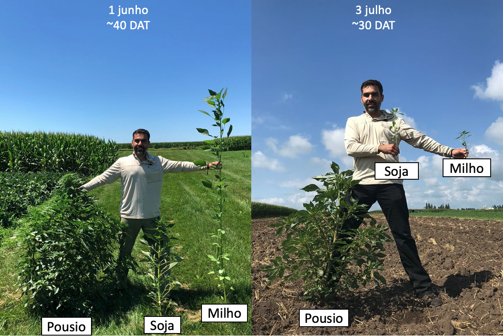
``` 

---

## *Amaranthus viridis*

#### **Nome comum**: caruru-de-mancha

.pull-left[
- **Ciclo de vida:** anual 

- **Caules:** geralmente ereto, com pubescência curta esparsa na parte superior, glabro na parte inferior

- **Folhas** ovadas, alongadas rômbico-ovadas, 2-6 cm de comprimento, base amplamente curva, arredondada, ápice rombudo ou ligeiramente marginalizado, verde escuro. Frequentemente com uma mancha violácea no centro da lâmina

]


.pull-right[
```{r echo=FALSE, out.width=400, fig.align='center'}
knitr::include_graphics("https://www.researchgate.net/profile/Nafees_Mohammad/post/What_are_the_medicinal_uses_of_Amaranthus_viridis_Linn_What_alkaloids_are_present_in_this_plant/attachment/5b0989a2b53d2f63c3ce3d5b/AS%3A630572946833409%401527351714175/image/images+%2817%29.jpeg")
``` 
]


---

.pull-left[
```{r echo=FALSE, out.width=300, fig.align='center'}
knitr::include_graphics("https://weeds.brisbane.qld.gov.au/sites/default/files/styles/large/public/images/amaranthus_viridis15.jpg?itok=bX42w16R")
``` 

```{r echo=FALSE, out.width=300, fig.align='center'}
knitr::include_graphics("https://upload.wikimedia.org/wikipedia/commons/thumb/1/1f/Amaranthus_viridis_Inflorescens_Closeup_TorreLaMata.jpg/1200px-Amaranthus_viridis_Inflorescens_Closeup_TorreLaMata.jpg")
``` 
]


.pull-right[
```{r echo=FALSE, out.width=200, fig.align='center'}
knitr::include_graphics("https://newfs.s3.amazonaws.com/taxon-images-1000s1000/Amaranthaceae/amaranthus-viridis-st-jgwaltney.jpg")
``` 

```{r echo=FALSE, out.width=300, fig.align='center'}
knitr::include_graphics("https://jerrycolebywilliams.files.wordpress.com/2012/12/volunteer-green-amaranth-amaranthus-viridis.jpg?w=300")
``` 
]

---


class: inverse

## Asteraceae

### Características

.pull-left[
- **Ciclos de vida**: anual, bianual e perenes

- **Caules**: geralmente pilosa e ásperas

- **Folhas**: na maioria das vezes alternadas, ocasionalmente opostas, ásperas, peludas, às vezes espinhosas, geralmente simples, inteiras ou lobadas, sem estípulas

- **Flores**: geralmente agrupadas em cabeças

- **Frutos**:  aquênios

- **Variedades cultivadas**: girassol, alface, alcachofra, chicória, açafrão, crisântemos, ásteres
]

Principalmente herbáceas, mas também arbustos. Cerca de 20.000 espécies

.pull-right[


```{r echo=FALSE, out.width=250, fig.align='center'}
knitr::include_graphics("https://upload.wikimedia.org/wikipedia/commons/thumb/c/c1/Asteracea_poster_3.jpg/1200px-Asteracea_poster_3.jpg")
``` 
]

---

## Asteraceae

```{r echo=FALSE, out.width=500, fig.align='center'}
knitr::include_graphics("https://media.giphy.com/media/pJSKQUb0ytPKo/giphy.gif")
``` 


---

## *Acanthospermum australe*

#### Nome comum: carrapicho rasteiro

.pull-left[
- **Ciclo de vida**: anual, herbácea - prostrada e ramificada

- **Caule**: pubescente, pigmentado

- **Folhas**: cartáceas, de lâmina pubescente e margens muito variáveis - 1 a 4 cm de comprimento

- **Reprodução**: Sementes
]

.pull-right[

```{r echo=FALSE, out.width=300, fig.align='center'}
knitr::include_graphics("https://http2.mlstatic.com/carrapicho-rasteiro-acanthospermum-australe-20-sementes-D_NQ_NP_621905-MLB25084514538_102016-F.jpg")
``` 
]

---

.pull-left[
```{r echo=FALSE, out.width=300, fig.align='center'}
knitr::include_graphics("https://newfs.s3.amazonaws.com/taxon-images-1000s1000/Asteraceae/acanthospermum-australe-st-jkunzer.jpg")
``` 

```{r echo=FALSE, out.width=300, fig.align='center'}
knitr::include_graphics("https://live.staticflickr.com/1475/25358857861_a2b0f905b8_b.jpg")
``` 
]


.pull-right[
```{r echo=FALSE, out.width=300, fig.align='center'}
knitr::include_graphics("https://www.agrolink.com.br/upload/problemas/Acanthospermum%20australe1.jpg")
``` 

```{r echo=FALSE, out.width=250, fig.align='center'}
knitr::include_graphics("https://curapelasplantas.com.br/wp-content/uploads/2018/05/Carrapicho-rasteiro-3.jpg")
``` 

]


---

## *Acanthospermum hispidum*

#### Nome comum: carrapicho-de-carneiro

.pull-left[
- **Ciclo de vida**: anual, herbácea - espinhenta, ereta, ramificada - 30-100 cm de altura

- **Caule**: denso-pubescente, nós curtos

- **Folhas**: pubescentes, de 4-12 cm de comprimento

- **Reprodução**: Sementes
]


.pull-right[
```{r echo=FALSE, out.width=300, fig.align='center'}
knitr::include_graphics("https://www.agrolink.com.br/upload/problemas/Acanthospermum_hispidum85.jpg")
``` 

]

---

.pull-left[
```{r echo=FALSE, out.width=300, fig.align='center'}
knitr::include_graphics("https://4.bp.blogspot.com/-ivnPMzSkKdo/W-Z8Trp35BI/AAAAAAAAA6E/OzOxqwLVg8Av0f2tq-UEC4QLfHM9JT-kgCLcBGAs/s1600/acanthospermumhispidum22.jpg")
``` 

```{r echo=FALSE, out.width=300, fig.align='center'}
knitr::include_graphics("https://http2.mlstatic.com/sementes-de-carrapicho-de-carneiro-acanthospermum-hispidum-D_NQ_NP_819367-MLB27081841004_032018-F.jpg")
``` 
]

.pull-right[

```{r echo=FALSE, out.width=300, fig.align='center'}
knitr::include_graphics("images/hispidum_10.png")
``` 

```{r echo=FALSE, out.width=300, fig.align='center'}
knitr::include_graphics("https://upload.wikimedia.org/wikipedia/commons/c/c7/Acanthospermum_hispidum_W2_IMG_2208.jpg")
``` 
]

---

class: center, middle

.pull-left[
```{r echo=FALSE, out.width=300, fig.align='center'}
knitr::include_graphics("images/australe_10.jpg")
``` 
*Acanthospermum australe*
]

.pull-right[
```{r echo=FALSE, out.width=300, fig.align='center'}
knitr::include_graphics("images/hispidum.jpg")
``` 
*Acanthospermum hispidum*
]


---

## *Ageratum conyzoides*

#### Nome comum:  mentrasto

.pull-left[
- **Ciclo de vida**: anual, herbácea - aromática, ereta, pouco ramificada, de 30-80 cm de altura

- **Caule**: pubescente, arroxeado

- **Folhas**: membranáceas, denso-pubescentes, de 4-9 cm comprimento

- **Reprodução**: Sementes
]

.pull-right[
```{r echo=FALSE, out.width=300, fig.align='center'}
knitr::include_graphics("images/ageratum.png")
``` 

```{r echo=FALSE, out.width=300, fig.align='center'}
knitr::include_graphics("images/ageratum_11.png")
``` 

]
---

.pull-left[
```{r echo=FALSE, out.width=200, fig.align='center'}
knitr::include_graphics("https://newfs.s3.amazonaws.com/taxon-images-1000s1000/Asteraceae/ageratum-conyzoides-ha-kstarr2.jpg")
``` 

```{r echo=FALSE, out.width=200, fig.align='center'}
knitr::include_graphics("https://d2seqvvyy3b8p2.cloudfront.net/89a6526cc7b73191ae4bd38892a1ec6e.jpg")
``` 
]


.pull-right[
```{r echo=FALSE, out.width=300, fig.align='center'}
knitr::include_graphics("https://keys.lucidcentral.org/keys/v3/daisy_fruit/key/daisy_fruit/Media/Html/assets/image/Ageratum_conyzoides/Ageratum_conyzoides_CANB466587_fourseeds.jpg")
``` 

```{r echo=FALSE, out.width=300, fig.align='center'}
knitr::include_graphics("https://keys.lucidcentral.org/keys/v3/eafrinet/weeds/key/weeds/Media/Html/images/Ageratum_conyzoides_(Billygoat_Weed)/ageratum_conyzoides_conyzoides22.jpg")
``` 

]


---

## *Bidens pilosa*

#### Nome comum: picão preto

.pull-left[
- **Ciclo de vida**: anual, herbácea - aromática, ereta, pouco ramificada, de 40-120 cm de altura

- **Caule**: pubescente, arroxeado

- **Folhas**: folhas inteiras ou 3-5 lobadas, membranáceas

- **Reprodução**: Sementes
]

.pull-right[
```{r echo=FALSE, out.width=300, fig.align='center'}
knitr::include_graphics("https://http2.mlstatic.com/muda-de-pico-preto-carrapicho-bidens-pilosa-D_NQ_NP_708580-MLB40720885350_022020-F.jpg")
``` 
]


---
.pull-left[
```{r echo=FALSE, out.width=300, fig.align='center'}
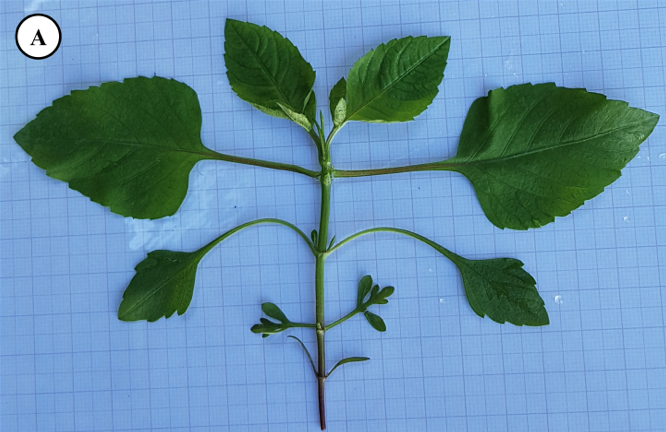
``` 

```{r echo=FALSE, out.width=300, fig.align='center'}
knitr::include_graphics("https://phytus.s3.amazonaws.com/apps/clubephytus-api/ckeditor_upload/2019-10-17-14-01_1.png")
```

]


.pull-right[
```{r echo=FALSE, out.width=300, fig.align='center'}
knitr::include_graphics("images/pilosa_02.png")
``` 

```{r echo=FALSE, out.width=300, fig.align='center'}
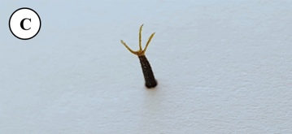
``` 

```{r echo=FALSE, out.width=300, fig.align='center'}
knitr::include_graphics("https://live.staticflickr.com/5175/5448535490_f52504f807_b.jpg")
```

]

---

## *Bidens subalternans*

#### Nome comum: picão 


.pull-left[
- **Ciclo de vida**: anual, herbácea - aromática, ereta, pouco ramificada, de 30-120 cm de altura

- **Caule**: caule levemente quadrático

- **Folhas**: folhas inteiras ou 3-5 lobadas, membranáceas

- **Reprodução**: Sementes

- 4 aristas no aquênio
]

.pull-right[
```{r echo=FALSE, out.width=300, fig.align='center'}
knitr::include_graphics("images/subalternans_05.png")
``` 
]


---
.pull-left[
```{r echo=FALSE, out.width=300, fig.align='center'}
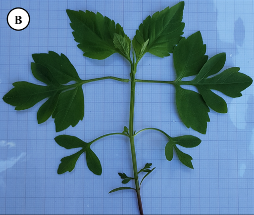
``` 

```{r echo=FALSE, out.width=300, fig.align='center'}
knitr::include_graphics("https://apps.lucidcentral.org/plants_se_nsw/images/entities/bidens_subalternans/bidens_subalternans_cc_oxley_wild_rs_np2_john_tann.jpg")
``` 
]


.pull-right[
```{r echo=FALSE, out.width=300, fig.align='center'}
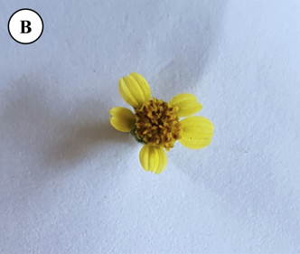
``` 

```{r echo=FALSE, out.width=300, fig.align='center'}
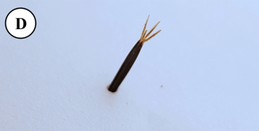
``` 

```{r echo=FALSE, out.width=300, fig.align='center'}
knitr::include_graphics("images/subalternans_10.png")
```
]

---

## Diferença entre *Bidens* spp.

```{r echo=FALSE, out.width=700, fig.align='center'}
knitr::include_graphics("https://maissoja.com.br/wp-content/uploads/2019/09/Texto-1.png")
```


---

## *Blainvillea dichotoma*

#### Nome comum: erva-palha

.pull-left[
- **Ciclo de vida**: anual, herbácea, ereta, pouco ramificada, de 80-160 cm de altura

- **Caule**: pubescente, pigmentado

- **Folhas**: pubescente, discolores, membranácea

- **Reprodução**: Sementes

]

.pull-right[
```{r echo=FALSE, out.width=300, fig.align='center'}
knitr::include_graphics("https://www.agrolink.com.br/upload/problemas/Blainvillea%20latifolia3.jpg")
``` 
]

---
.pull-left[
```{r echo=FALSE, out.width=300, fig.align='center'}
knitr::include_graphics("https://www.agrolink.com.br/upload/problemas/Blainvillea%20latifolia5.JPG")
``` 

```{r echo=FALSE, out.width=300, fig.align='center'}
knitr::include_graphics("https://www.agrolink.com.br/upload/problemas/Blainvillea%20latifolia2.jpg")
``` 
]


.pull-right[
```{r echo=FALSE, out.width=300, fig.align='center'}
knitr::include_graphics("https://www.agrolink.com.br/upload/problemas/Blainvillea%20latifolia.jpg")
``` 

```{r echo=FALSE, out.width=230, fig.align='center'}
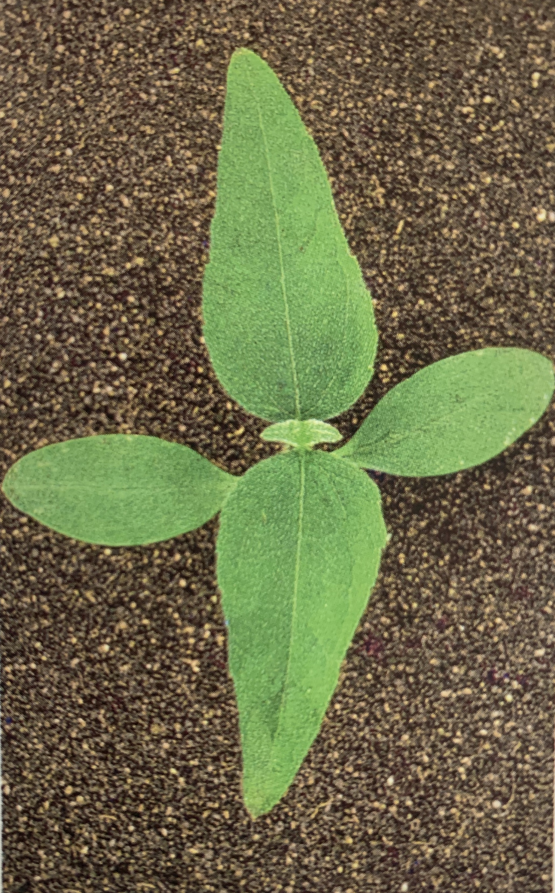
``` 

]

---

## *Conyza canadensis*

#### Nome comum: buva

.pull-left[
- **Ciclo de vida**: anual, herbácea - quase sem ramificação, podendo chegar até 120 cm de altura

- **Caule**: pubescente, caule muito enfolhado

- **Folhas**: pubescente, margem denticulata

- **Inflorescência**: grande em comparação a outras *Conyza* ssp.

]


.pull-right[
```{r echo=FALSE, out.width=300, fig.align='center'}
knitr::include_graphics("https://plants.sc.egov.usda.gov/gallery/large/coca5_007_lvp.jpg")
```
]

---

.pull-left[
```{r echo=FALSE, out.width=400, fig.align='center'}
knitr::include_graphics("https://blogs.cornell.edu/weedid/files/2019/07/conyzadetails.jpg")
```

```{r echo=FALSE, out.width=400, fig.align='center'}
knitr::include_graphics("https://s3.amazonaws.com/eit-planttoolbox-prod/media/images/Conyza_rosette.jpg")
```
]


.pull-right[

```{r echo=FALSE, out.width=400, fig.align='center'}
knitr::include_graphics("https://extension.umass.edu/landscape/sites/landscape/files/weeds/stems/erica6962w.jpg")
```

```{r echo=FALSE, out.width=400, fig.align='center'}
knitr::include_graphics("https://img.plantsam.com/wp-content/uploads/2016/07/Conyza-canadensis.jpg")
```
]

---

## *Conyza bonariensis*

#### Nome comum: buva

.pull-left[
- **Ciclo de vida**: anual, herbácea - ereta, pode atingir até 180 cm

- **Caule**: pubescente, caule muito enfolhado

- **Folhas**: pubescente, margem denticulata

- **Inflorescência**: grande em comparação a outras *Conyza* ssp.

]


.pull-right[
```{r echo=FALSE, out.width=300, fig.align='center'}
knitr::include_graphics("https://upload.wikimedia.org/wikipedia/commons/thumb/d/d3/Conyza_bonariensis_2.jpg/1200px-Conyza_bonariensis_2.jpg")
```
]

---

.pull-left[
```{r echo=FALSE, out.width=300, fig.align='center'}
knitr::include_graphics("https://keys.lucidcentral.org/keys/v3/daisy_fruit/key/daisy_fruit/Media/Html/assets/image/Conyza_bonariensis/Conyza_bonariensis_Crisp_3969_single_seed_16x_small.jpg")
```

```{r echo=FALSE, out.width=400, fig.align='center'}
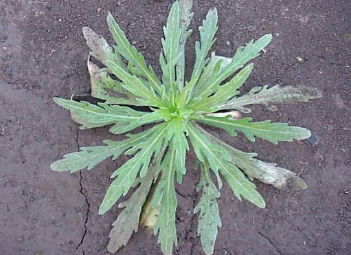
```
]


.pull-right[

```{r echo=FALSE, out.width=400, fig.align='center'}
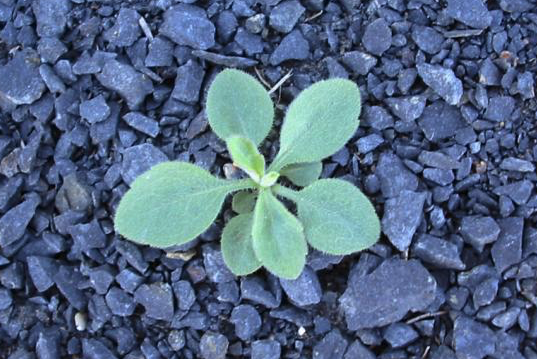
```

```{r echo=FALSE, out.width=400, fig.align='center'}
knitr::include_graphics("images/bonariensis_01.png")
```
]

---

## *Conyza sumatrensis*

#### Nome comum: buva

.pull-left[

- **Ciclo de vida**: anual, herbácea - relativamente grande e chega a atingir 2 m de altura

- **Caule**: 

- **Folhas**: pubescente, folhas dentadas

- **Inflorescência**: relativamente pequenas (5-10 mm de diâmetro e 4-6 mm de comprimento) e esbranquiçadas quando maduras (ou seja, muitas vezes têm uma leve coloração amarelada ou acastanhada


]


.pull-right[
```{r echo=FALSE, out.width=300, fig.align='center'}
knitr::include_graphics("https://www.agrolink.com.br/upload/problemas/conyza%20sumatrensis7.jpg")
```
]

---

.pull-left[
```{r echo=FALSE, out.width=300, fig.align='center'}
knitr::include_graphics("https://www.agrolink.com.br/upload/problemas/conyza%20sumatrensis3.jpg")
```

```{r echo=FALSE, out.width=250, fig.align='center'}
knitr::include_graphics("https://www.agrolink.com.br/upload/problemas/conyza%20sumatrensis1.jpg")
```
]


.pull-right[

```{r echo=FALSE, out.width=300, fig.align='center'}
knitr::include_graphics("https://www.agrolink.com.br/upload/problemas/conyza%20sumatrensis5.jpg")
```

```{r echo=FALSE, out.width=400, fig.align='center'}
knitr::include_graphics("https://www.agrolink.com.br/upload/problemas/conyza%20sumatrensis6.jpg")
```
]


---

.pull-left[
*C. canadensis*
```{r echo=FALSE, out.width=400, fig.align='center'}
knitr::include_graphics("https://plants.sc.egov.usda.gov/gallery/pubs/coca5_002_pvp.jpg")
```
]


.pull-right[
*C. bonariensis*
```{r echo=FALSE, out.width=400, fig.align='center'}
knitr::include_graphics("images/bonariensis_10.jpg")
```
]

---

## *Emilia sonchifolia*

#### Nome comum: falsa-serralha

.pull-left[
- **Ciclo de vida**: anual, herbácea - 15-60 cm de altura

- **Caule**: esverdeados e redondos em seção transversal e glabros ou esparsamente pubescentes

- **Folhas**: as folhas inferiores estão dispostas em uma roseta - as folhas que são produzidas ao longo do caules são dispostas alternadamente, têm bases que prendem a haste e muitas vezes não têm talos (isto é, sésseis) - pubescentes
]


.pull-right[
```{r echo=FALSE, out.width=400, fig.align='center'}
knitr::include_graphics("https://www.agrolink.com.br/upload/problemas/Emilia_sonchifolia85.jpg")
```
]


---

.pull-left[
```{r echo=FALSE, out.width=400, fig.align='center'}
knitr::include_graphics("https://www.agrolink.com.br/upload/problemas/Emilia_sonchifolia81.jpg")
```

```{r echo=FALSE, out.width=400, fig.align='center'}
knitr::include_graphics("https://upload.wikimedia.org/wikipedia/commons/f/f3/Emilia_sonchifolia_leaf_on_stem1_%2814043760732%29.jpg
")
```
]


.pull-right[
```{r echo=FALSE, out.width=200, fig.align='center'}
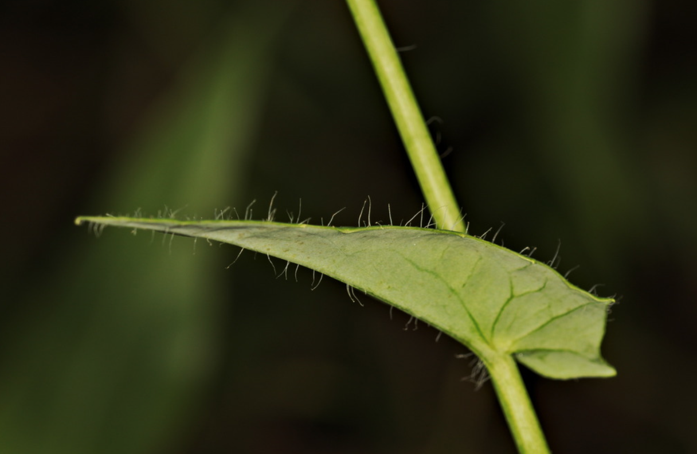
```

```{r echo=FALSE, out.width=400, fig.align='center'}
knitr::include_graphics("https://weeds.brisbane.qld.gov.au/sites/default/files/styles/large/public/images/emilia_sonchifolia_javanica21.jpg?itok=pPbyWUb5")
```

]


---

## *Sonchus oleraceus*

#### Nome comum: serralha

.pull-left[
- **Ciclo de vida**: anual - bianual, herbácea -  40-150 cm de altura - látex branco em todas as partes da planta

- **Caule**: produz látex

- **Folhas**: as margens das folhas apresentam pequenos dentes pontiagudos moles
]


.pull-right[
```{r echo=FALSE, out.width=250, fig.align='center'}
knitr::include_graphics("https://www.panteek.com/CurtisFlora/images/cfl53-261.jpg")
```
]

---

.pull-left[
```{r echo=FALSE, out.width=400, fig.align='center'}
knitr::include_graphics("https://plants.sc.egov.usda.gov/gallery/large/sool_003_lhp.jpg")
```

```{r echo=FALSE, out.width=400, fig.align='center'}
knitr::include_graphics("https://upload.wikimedia.org/wikipedia/commons/5/5f/Sonchus_oleraceus_2018-05-01_9904.jpg")
```

]


.pull-right[
```{r echo=FALSE, out.width=350, fig.align='center'}
knitr::include_graphics("https://keyserver.lucidcentral.org/weeds/data/media/Images/sonchus_oleraceus/sonchusoleraceus39.jpg")
```

```{r echo=FALSE, out.width=400, fig.align='center'}
knitr::include_graphics("https://candidegardening.com/img/623a76ff-c64a-4d63-afa2-8249b909f3be/cropped/648x520")
```
]

---

.pull-left[
```{r echo=FALSE, out.width=350, fig.align='center'}
knitr::include_graphics("images/falsa_serralha.jpg")
```
falsa-serralha
]


.pull-right[
```{r echo=FALSE, out.width=350, fig.align='center'}
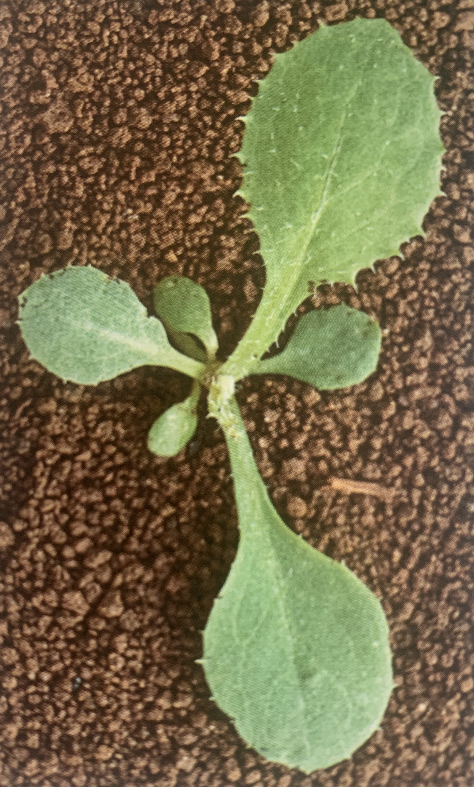
```
serralha
]


---

## *Galinsoga quadriradiata*

#### Nome comum: botão-de-ouro

.pull-left[
- **Ciclo de vida**: anual, herbácea - ereta, muito ramificada

- **Caule**: pubescente

- **Folhas**: opostas, em forma de ovo a triangulares, com margens grosseiramente dentadas, pontas afiadas e superfície superior da folha densamente pubescente

- **Inflorescência**: numerosas pequenas flores são formadas em cachos terminais e axilares

- **Reprodução**: Sementes
]


.pull-right[
```{r echo=FALSE, out.width=400, fig.align='center'}
knitr::include_graphics("https://appi.be/uploads/files/5437283-galinsoga.jpg")
```
]

---

.pull-left[
```{r echo=FALSE, out.width=400, fig.align='center'}
knitr::include_graphics("https://i.pinimg.com/originals/39/e0/5c/39e05c674df705de88b4da1956e00a65.jpg")
```
]


.pull-right[
```{r echo=FALSE, out.width=250, fig.align='center'}
knitr::include_graphics("https://newfs.s3.amazonaws.com/taxon-images-1000s1000/Asteraceae/galinsoga-quadriradiata-fr-atal.jpg")
```

```{r echo=FALSE, out.width=250, fig.align='center'}
knitr::include_graphics("https://newfs.s3.amazonaws.com/taxon-images-1000s1000/Asteraceae/galinsoga-quadriradiata-st-atal.jpg")
```
]


---


## *Parthenium hysterophorus*

#### Nome comum: losna-branca

.pull-left[
- **Ciclo de vida**: anual, ereta, herbácea, pubescente, com 50-90 cm de altura

- **Caule**: pouco ramificado na parte inferior e muito ramificado na superior

- **Folhas**: alternadas, simples e de limbo com margens recortadas

- **Dispersão**: aquênio
]


.pull-right[
```{r echo=FALSE, out.width=250, fig.align='center'}
knitr::include_graphics("images/losna_branca.jpg")
```
]


---

.pull-left[
```{r echo=FALSE, out.width=400, fig.align='center'}
knitr::include_graphics("https://static.inaturalist.org/photos/16908937/large.jpeg?1525048232")
```

```{r echo=FALSE, out.width=400, fig.align='center'}
knitr::include_graphics("https://nt.gov.au/__data/assets/image/0016/230209/parthenium-fruit-and-seeds.jpg")
```

]


.pull-right[
```{r echo=FALSE, out.width=350, fig.align='center'}
knitr::include_graphics("https://keys.lucidcentral.org/keys/v3/eafrinet/weeds/key/weeds/Media/Html/images/Parthenium_hysterophorus_(Parthenium_Weed)/parthenium_hysterophorus51.jpg")
```

```{r echo=FALSE, out.width=400, fig.align='center'}
knitr::include_graphics("https://keys.lucidcentral.org/keys/v3/eafrinet/weeds/key/weeds/Media/Html/images/Parthenium_hysterophorus_(Parthenium_Weed)/parthenium_hysterophorus31.jpg")
```
]


