```{r setup, include=FALSE}
options(htmltools.dir.version = FALSE)
knitr::opts_chunk$set(
  echo = FALSE,
  fig.align = "center",
  message = FALSE,
  warning = FALSE,
  cache = TRUE
)

htmltools::tagList(rmarkdown::html_dependency_font_awesome()) #show twitter logo
```


class: inverse

## Asteraceae

### Características

.pull-left[
- **Ciclos de vida**: anual, bianual e perenes

- **Caules**: geralmente pilosa e ásperas

- **Folhas**: na maioria das vezes alternadas, ocasionalmente opostas, ásperas, peludas, às vezes espinhosas, geralmente simples, inteiras ou lobadas, sem estípulas

- **Flores**: geralmente agrupadas em cabeças

- **Frutos**:  aquênios

- **Variedades cultivadas**: girassol, alface, alcachofra, chicória, açafrão, crisântemos, ásteres
]

Principalmente herbáceas, mas também arbustos. Cerca de 20.000 espécies

.pull-right[


```{r echo=FALSE, out.width=250, fig.align='center'}
knitr::include_graphics("https://upload.wikimedia.org/wikipedia/commons/thumb/c/c1/Asteracea_poster_3.jpg/1200px-Asteracea_poster_3.jpg")
``` 
]

---

## Asteraceae

```{r echo=FALSE, out.width=500, fig.align='center'}
knitr::include_graphics("https://media.giphy.com/media/pJSKQUb0ytPKo/giphy.gif")
``` 


---

## *Acanthospermum australe*

#### Nome comum: carrapicho rasteiro

.pull-left[
- **Ciclo de vida**: anual, herbácea - prostrada e ramificada

- **Caule**: pubescente, pigmentado

- **Folhas**: cartáceas, de lâmina pubescente e margens muito variáveis - 1 a 4 cm de comprimento

- **Reprodução**: Sementes
]

.pull-right[

```{r echo=FALSE, out.width=300, fig.align='center'}
knitr::include_graphics("https://http2.mlstatic.com/carrapicho-rasteiro-acanthospermum-australe-20-sementes-D_NQ_NP_621905-MLB25084514538_102016-F.jpg")
``` 
]

---

.pull-left[
```{r echo=FALSE, out.width=300, fig.align='center'}
knitr::include_graphics("https://newfs.s3.amazonaws.com/taxon-images-1000s1000/Asteraceae/acanthospermum-australe-st-jkunzer.jpg")
``` 

```{r echo=FALSE, out.width=300, fig.align='center'}
knitr::include_graphics("https://live.staticflickr.com/1475/25358857861_a2b0f905b8_b.jpg")
``` 
]


.pull-right[
```{r echo=FALSE, out.width=300, fig.align='center'}
knitr::include_graphics("https://www.agrolink.com.br/upload/problemas/Acanthospermum%20australe1.jpg")
``` 

```{r echo=FALSE, out.width=250, fig.align='center'}
knitr::include_graphics("https://curapelasplantas.com.br/wp-content/uploads/2018/05/Carrapicho-rasteiro-3.jpg")
``` 

]


---

## *Acanthospermum hispidum*

#### Nome comum: carrapicho-de-carneiro

.pull-left[
- **Ciclo de vida**: anual, herbácea - espinhenta, ereta, ramificada - 30-100 cm de altura

- **Caule**: denso-pubescente, nós curtos

- **Folhas**: pubescentes, de 4-12 cm de comprimento

- **Reprodução**: Sementes
]


.pull-right[
```{r echo=FALSE, out.width=300, fig.align='center'}
knitr::include_graphics("https://www.agrolink.com.br/upload/problemas/Acanthospermum_hispidum85.jpg")
``` 

]

---

.pull-left[
```{r echo=FALSE, out.width=300, fig.align='center'}
knitr::include_graphics("https://4.bp.blogspot.com/-ivnPMzSkKdo/W-Z8Trp35BI/AAAAAAAAA6E/OzOxqwLVg8Av0f2tq-UEC4QLfHM9JT-kgCLcBGAs/s1600/acanthospermumhispidum22.jpg")
``` 

```{r echo=FALSE, out.width=300, fig.align='center'}
knitr::include_graphics("https://http2.mlstatic.com/sementes-de-carrapicho-de-carneiro-acanthospermum-hispidum-D_NQ_NP_819367-MLB27081841004_032018-F.jpg")
``` 
]

.pull-right[

```{r echo=FALSE, out.width=300, fig.align='center'}
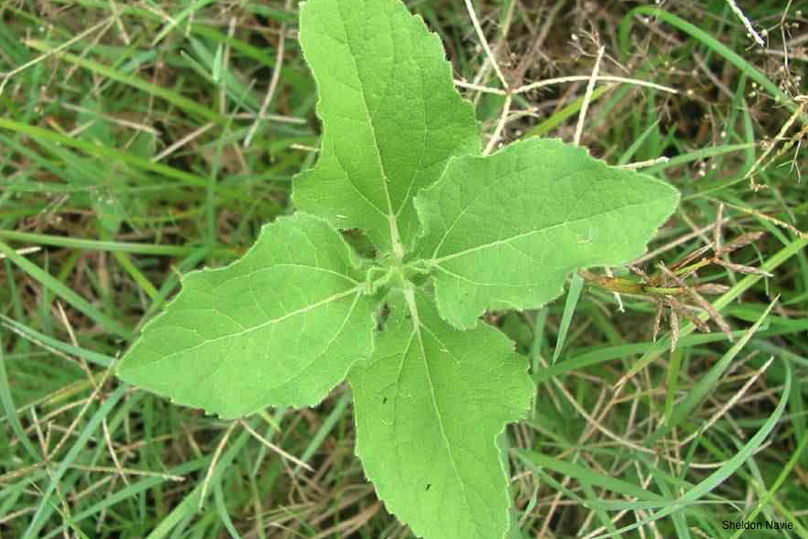
``` 

```{r echo=FALSE, out.width=300, fig.align='center'}
knitr::include_graphics("https://upload.wikimedia.org/wikipedia/commons/c/c7/Acanthospermum_hispidum_W2_IMG_2208.jpg")
``` 
]

---

class: center, middle

.pull-left[
```{r echo=FALSE, out.width=300, fig.align='center'}
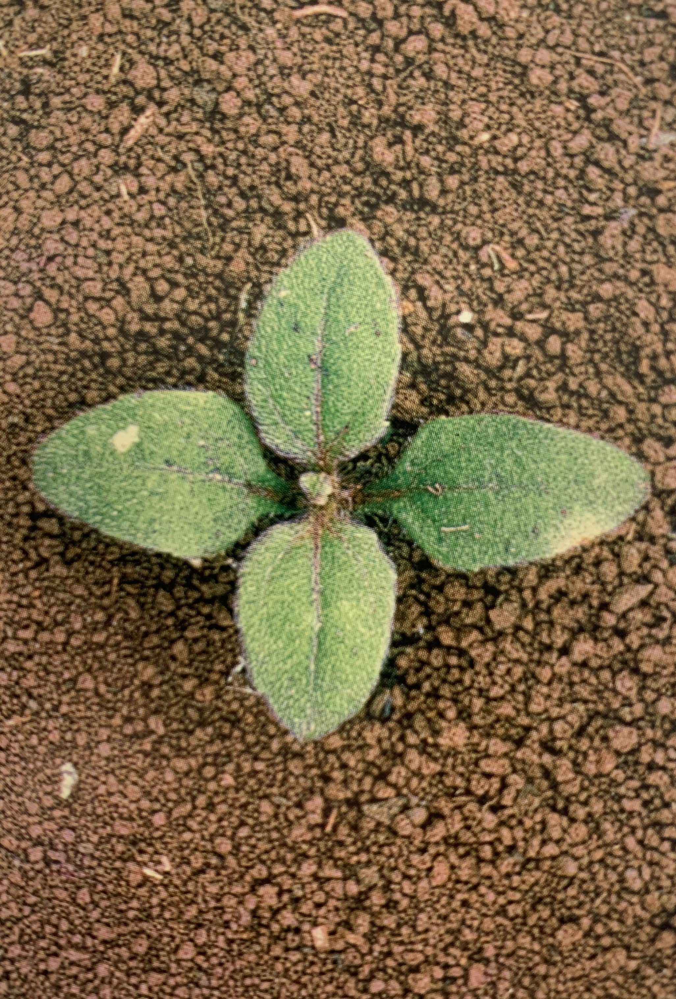
``` 
*Acanthospermum australe*
]

.pull-right[
```{r echo=FALSE, out.width=300, fig.align='center'}
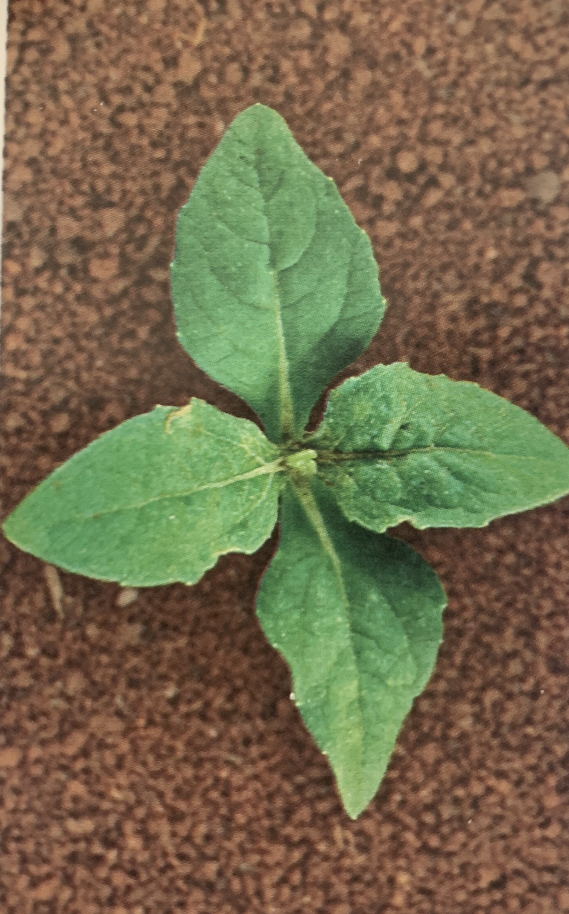
``` 
*Acanthospermum hispidum*
]


---

## *Ageratum conyzoides*

#### Nome comum:  mentrasto

.pull-left[
- **Ciclo de vida**: anual, herbácea - aromática, ereta, pouco ramificada, de 30-80 cm de altura

- **Caule**: pubescente, arroxeado

- **Folhas**: membranáceas, denso-pubescentes, de 4-9 cm comprimento

- **Reprodução**: Sementes
]

.pull-right[
```{r echo=FALSE, out.width=300, fig.align='center'}
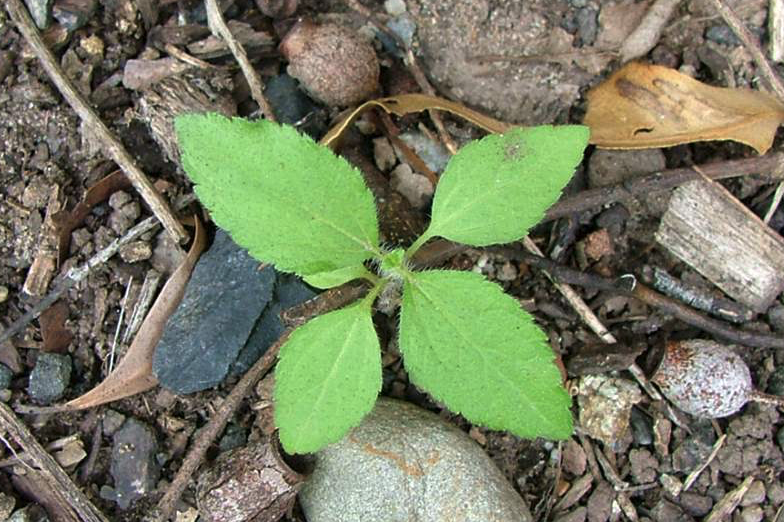
``` 

```{r echo=FALSE, out.width=300, fig.align='center'}
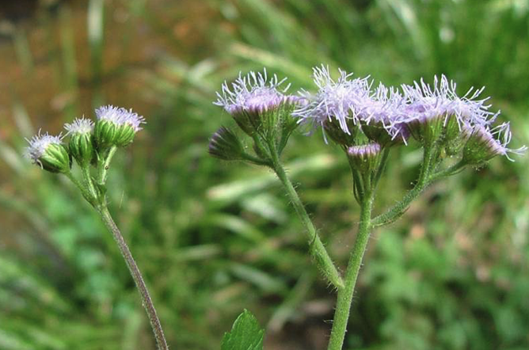
``` 

]
---

.pull-left[
```{r echo=FALSE, out.width=200, fig.align='center'}
knitr::include_graphics("https://newfs.s3.amazonaws.com/taxon-images-1000s1000/Asteraceae/ageratum-conyzoides-ha-kstarr2.jpg")
``` 

```{r echo=FALSE, out.width=200, fig.align='center'}
knitr::include_graphics("https://d2seqvvyy3b8p2.cloudfront.net/89a6526cc7b73191ae4bd38892a1ec6e.jpg")
``` 
]


.pull-right[
```{r echo=FALSE, out.width=300, fig.align='center'}
knitr::include_graphics("https://keys.lucidcentral.org/keys/v3/daisy_fruit/key/daisy_fruit/Media/Html/assets/image/Ageratum_conyzoides/Ageratum_conyzoides_CANB466587_fourseeds.jpg")
``` 

```{r echo=FALSE, out.width=300, fig.align='center'}
knitr::include_graphics("https://keys.lucidcentral.org/keys/v3/eafrinet/weeds/key/weeds/Media/Html/images/Ageratum_conyzoides_(Billygoat_Weed)/ageratum_conyzoides_conyzoides22.jpg")
``` 

]


---

## *Bidens pilosa*

#### Nome comum: picão preto

.pull-left[
- **Ciclo de vida**: anual, herbácea - aromática, ereta, pouco ramificada, de 40-120 cm de altura

- **Caule**: pubescente, arroxeado

- **Folhas**: folhas inteiras ou 3-5 lobadas, membranáceas

- **Reprodução**: Sementes
]

.pull-right[
```{r echo=FALSE, out.width=300, fig.align='center'}
knitr::include_graphics("https://http2.mlstatic.com/muda-de-pico-preto-carrapicho-bidens-pilosa-D_NQ_NP_708580-MLB40720885350_022020-F.jpg")
``` 
]


---
.pull-left[
```{r echo=FALSE, out.width=300, fig.align='center'}
knitr::include_graphics("images/pilosa_01.png")
``` 

```{r echo=FALSE, out.width=300, fig.align='center'}
knitr::include_graphics("https://phytus.s3.amazonaws.com/apps/clubephytus-api/ckeditor_upload/2019-10-17-14-01_1.png")
```

]


.pull-right[
```{r echo=FALSE, out.width=300, fig.align='center'}
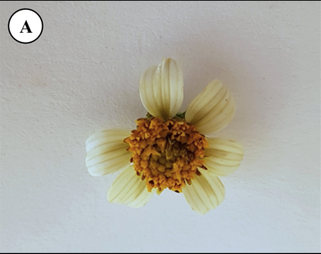
``` 

```{r echo=FALSE, out.width=300, fig.align='center'}
knitr::include_graphics("images/pilosa_03.png")
``` 

```{r echo=FALSE, out.width=300, fig.align='center'}
knitr::include_graphics("https://live.staticflickr.com/5175/5448535490_f52504f807_b.jpg")
```

]

---

## *Bidens subalternans*

#### Nome comum: picão 


.pull-left[
- **Ciclo de vida**: anual, herbácea - aromática, ereta, pouco ramificada, de 30-120 cm de altura

- **Caule**: caule levemente quadrático

- **Folhas**: folhas inteiras ou 3-5 lobadas, membranáceas

- **Reprodução**: Sementes

- 4 aristas no aquênio
]

.pull-right[
```{r echo=FALSE, out.width=300, fig.align='center'}
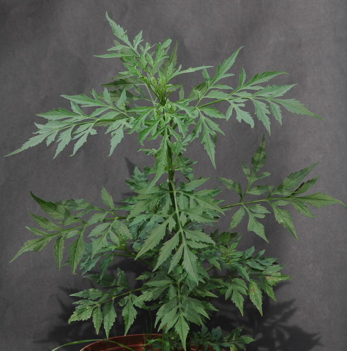
``` 
]


---
.pull-left[
```{r echo=FALSE, out.width=300, fig.align='center'}
knitr::include_graphics("images/subalternans_01.png")
``` 

```{r echo=FALSE, out.width=300, fig.align='center'}
knitr::include_graphics("https://apps.lucidcentral.org/plants_se_nsw/images/entities/bidens_subalternans/bidens_subalternans_cc_oxley_wild_rs_np2_john_tann.jpg")
``` 
]


.pull-right[
```{r echo=FALSE, out.width=300, fig.align='center'}
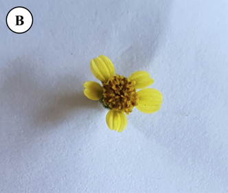
``` 

```{r echo=FALSE, out.width=300, fig.align='center'}
knitr::include_graphics("images/subalternans_03.png")
``` 

```{r echo=FALSE, out.width=300, fig.align='center'}
knitr::include_graphics("images/subalternans_10.png")
```
]

---

## Diferença entre *Bidens* spp.

```{r echo=FALSE, out.width=700, fig.align='center'}
knitr::include_graphics("https://maissoja.com.br/wp-content/uploads/2019/09/Texto-1.png")
```


---

## *Blainvillea dichotoma*

#### Nome comum: erva-palha

.pull-left[
- **Ciclo de vida**: anual, herbácea, ereta, pouco ramificada, de 80-160 cm de altura

- **Caule**: pubescente, pigmentado

- **Folhas**: pubescente, discolores, membranácea

- **Reprodução**: Sementes

]

.pull-right[
```{r echo=FALSE, out.width=300, fig.align='center'}
knitr::include_graphics("https://www.agrolink.com.br/upload/problemas/Blainvillea%20latifolia3.jpg")
``` 
]

---
.pull-left[
```{r echo=FALSE, out.width=300, fig.align='center'}
knitr::include_graphics("https://www.agrolink.com.br/upload/problemas/Blainvillea%20latifolia5.JPG")
``` 

```{r echo=FALSE, out.width=300, fig.align='center'}
knitr::include_graphics("https://www.agrolink.com.br/upload/problemas/Blainvillea%20latifolia2.jpg")
``` 
]


.pull-right[
```{r echo=FALSE, out.width=300, fig.align='center'}
knitr::include_graphics("https://www.agrolink.com.br/upload/problemas/Blainvillea%20latifolia.jpg")
``` 

```{r echo=FALSE, out.width=230, fig.align='center'}
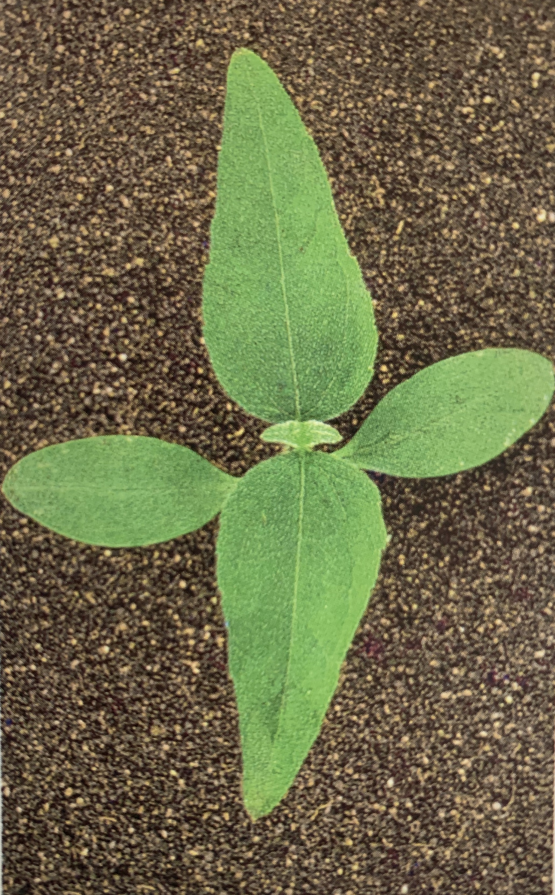
``` 

]

---

## *Conyza canadensis*

#### Nome comum: buva

.pull-left[
- **Ciclo de vida**: anual, herbácea - quase sem ramificação, podendo chegar até 120 cm de altura

- **Caule**: pubescente, caule muito enfolhado

- **Folhas**: pubescente, margem denticulata

- **Inflorescência**: grande em comparação a outras *Conyza* ssp.

]


.pull-right[
```{r echo=FALSE, out.width=300, fig.align='center'}
knitr::include_graphics("https://plants.sc.egov.usda.gov/gallery/large/coca5_007_lvp.jpg")
```
]

---

.pull-left[
```{r echo=FALSE, out.width=400, fig.align='center'}
knitr::include_graphics("https://blogs.cornell.edu/weedid/files/2019/07/conyzadetails.jpg")
```

```{r echo=FALSE, out.width=400, fig.align='center'}
knitr::include_graphics("https://s3.amazonaws.com/eit-planttoolbox-prod/media/images/Conyza_rosette.jpg")
```
]


.pull-right[

```{r echo=FALSE, out.width=400, fig.align='center'}
knitr::include_graphics("https://extension.umass.edu/landscape/sites/landscape/files/weeds/stems/erica6962w.jpg")
```

```{r echo=FALSE, out.width=400, fig.align='center'}
knitr::include_graphics("https://img.plantsam.com/wp-content/uploads/2016/07/Conyza-canadensis.jpg")
```
]

---

## *Conyza bonariensis*

#### Nome comum: buva

.pull-left[
- **Ciclo de vida**: anual, herbácea - ereta, pode atingir até 180 cm

- **Caule**: pubescente, caule muito enfolhado

- **Folhas**: pubescente, margem denticulata

- **Inflorescência**: grande em comparação a outras *Conyza* ssp.

]


.pull-right[
```{r echo=FALSE, out.width=300, fig.align='center'}
knitr::include_graphics("https://upload.wikimedia.org/wikipedia/commons/thumb/d/d3/Conyza_bonariensis_2.jpg/1200px-Conyza_bonariensis_2.jpg")
```
]

---

.pull-left[
```{r echo=FALSE, out.width=300, fig.align='center'}
knitr::include_graphics("https://keys.lucidcentral.org/keys/v3/daisy_fruit/key/daisy_fruit/Media/Html/assets/image/Conyza_bonariensis/Conyza_bonariensis_Crisp_3969_single_seed_16x_small.jpg")
```

```{r echo=FALSE, out.width=400, fig.align='center'}
knitr::include_graphics("images/bonariensis_03.png")
```
]


.pull-right[

```{r echo=FALSE, out.width=400, fig.align='center'}
knitr::include_graphics("images/bonariensis.png")
```

```{r echo=FALSE, out.width=400, fig.align='center'}
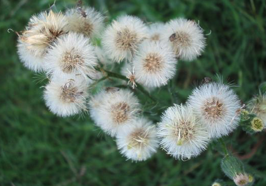
```
]

---

## *Conyza sumatrensis*

#### Nome comum: buva

.pull-left[

- **Ciclo de vida**: anual, herbácea - relativamente grande e chega a atingir 2 m de altura

- **Caule**: 

- **Folhas**: pubescente, folhas dentadas

- **Inflorescência**: relativamente pequenas (5-10 mm de diâmetro e 4-6 mm de comprimento) e esbranquiçadas quando maduras (ou seja, muitas vezes têm uma leve coloração amarelada ou acastanhada


]


.pull-right[
```{r echo=FALSE, out.width=300, fig.align='center'}
knitr::include_graphics("https://www.agrolink.com.br/upload/problemas/conyza%20sumatrensis7.jpg")
```
]

---

.pull-left[
```{r echo=FALSE, out.width=300, fig.align='center'}
knitr::include_graphics("https://www.agrolink.com.br/upload/problemas/conyza%20sumatrensis3.jpg")
```

```{r echo=FALSE, out.width=250, fig.align='center'}
knitr::include_graphics("https://www.agrolink.com.br/upload/problemas/conyza%20sumatrensis1.jpg")
```
]


.pull-right[

```{r echo=FALSE, out.width=300, fig.align='center'}
knitr::include_graphics("https://www.agrolink.com.br/upload/problemas/conyza%20sumatrensis5.jpg")
```

```{r echo=FALSE, out.width=400, fig.align='center'}
knitr::include_graphics("https://www.agrolink.com.br/upload/problemas/conyza%20sumatrensis6.jpg")
```
]


---

.pull-left[
*C. canadensis*
```{r echo=FALSE, out.width=400, fig.align='center'}
knitr::include_graphics("https://plants.sc.egov.usda.gov/gallery/pubs/coca5_002_pvp.jpg")
```
]


.pull-right[
*C. bonariensis*
```{r echo=FALSE, out.width=400, fig.align='center'}
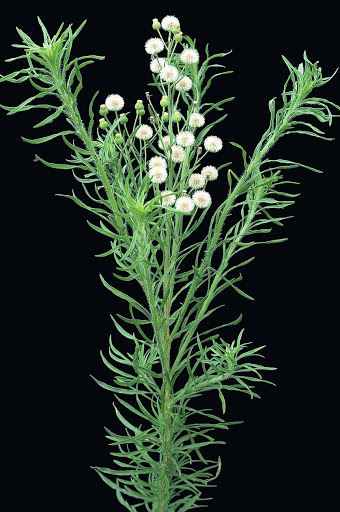
```
]

---

## *Emilia sonchifolia*

#### Nome comum: falsa-serralha

.pull-left[
- **Ciclo de vida**: anual, herbácea - 15-60 cm de altura

- **Caule**: esverdeados e redondos em seção transversal e glabros ou esparsamente pubescentes

- **Folhas**: as folhas inferiores estão dispostas em uma roseta - as folhas que são produzidas ao longo do caules são dispostas alternadamente, têm bases que prendem a haste e muitas vezes não têm talos (isto é, sésseis) - pubescentes
]


.pull-right[
```{r echo=FALSE, out.width=400, fig.align='center'}
knitr::include_graphics("https://www.agrolink.com.br/upload/problemas/Emilia_sonchifolia85.jpg")
```
]


---

.pull-left[
```{r echo=FALSE, out.width=400, fig.align='center'}
knitr::include_graphics("https://www.agrolink.com.br/upload/problemas/Emilia_sonchifolia81.jpg")
```

```{r echo=FALSE, out.width=400, fig.align='center'}
knitr::include_graphics("https://upload.wikimedia.org/wikipedia/commons/f/f3/Emilia_sonchifolia_leaf_on_stem1_%2814043760732%29.jpg
")
```
]


.pull-right[
```{r echo=FALSE, out.width=200, fig.align='center'}
knitr::include_graphics("images/tasselflower.png")
```

```{r echo=FALSE, out.width=400, fig.align='center'}
knitr::include_graphics("https://weeds.brisbane.qld.gov.au/sites/default/files/styles/large/public/images/emilia_sonchifolia_javanica21.jpg?itok=pPbyWUb5")
```

]


---

## *Sonchus oleraceus*

#### Nome comum: serralha

.pull-left[
- **Ciclo de vida**: anual - bianual, herbácea -  40-150 cm de altura - látex branco em todas as partes da planta

- **Caule**: produz látex

- **Folhas**: as margens das folhas apresentam pequenos dentes pontiagudos moles
]


.pull-right[
```{r echo=FALSE, out.width=250, fig.align='center'}
knitr::include_graphics("https://www.panteek.com/CurtisFlora/images/cfl53-261.jpg")
```
]

---

.pull-left[
```{r echo=FALSE, out.width=400, fig.align='center'}
knitr::include_graphics("https://plants.sc.egov.usda.gov/gallery/large/sool_003_lhp.jpg")
```

```{r echo=FALSE, out.width=400, fig.align='center'}
knitr::include_graphics("https://upload.wikimedia.org/wikipedia/commons/5/5f/Sonchus_oleraceus_2018-05-01_9904.jpg")
```

]


.pull-right[
```{r echo=FALSE, out.width=350, fig.align='center'}
knitr::include_graphics("https://keyserver.lucidcentral.org/weeds/data/media/Images/sonchus_oleraceus/sonchusoleraceus39.jpg")
```

```{r echo=FALSE, out.width=400, fig.align='center'}
knitr::include_graphics("https://candidegardening.com/img/623a76ff-c64a-4d63-afa2-8249b909f3be/cropped/648x520")
```
]

---

.pull-left[
```{r echo=FALSE, out.width=350, fig.align='center'}
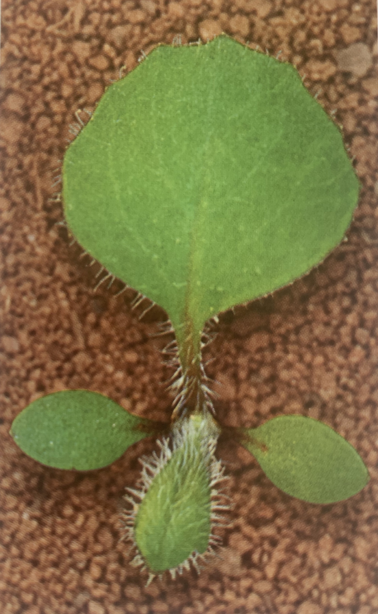
```
falsa-serralha
]


.pull-right[
```{r echo=FALSE, out.width=350, fig.align='center'}
knitr::include_graphics("images/serralha.jpg")
```
serralha
]


---

## *Galinsoga quadriradiata*

#### Nome comum: botão-de-ouro

.pull-left[
- **Ciclo de vida**: anual, herbácea - ereta, muito ramificada

- **Caule**: pubescente

- **Folhas**: opostas, em forma de ovo a triangulares, com margens grosseiramente dentadas, pontas afiadas e superfície superior da folha densamente pubescente

- **Inflorescência**: numerosas pequenas flores são formadas em cachos terminais e axilares

- **Reprodução**: Sementes
]


.pull-right[
```{r echo=FALSE, out.width=400, fig.align='center'}
knitr::include_graphics("https://appi.be/uploads/files/5437283-galinsoga.jpg")
```
]

---

.pull-left[
```{r echo=FALSE, out.width=400, fig.align='center'}
knitr::include_graphics("https://i.pinimg.com/originals/39/e0/5c/39e05c674df705de88b4da1956e00a65.jpg")
```
]


.pull-right[
```{r echo=FALSE, out.width=250, fig.align='center'}
knitr::include_graphics("https://newfs.s3.amazonaws.com/taxon-images-1000s1000/Asteraceae/galinsoga-quadriradiata-fr-atal.jpg")
```

```{r echo=FALSE, out.width=250, fig.align='center'}
knitr::include_graphics("https://newfs.s3.amazonaws.com/taxon-images-1000s1000/Asteraceae/galinsoga-quadriradiata-st-atal.jpg")
```
]


---


## *Parthenium hysterophorus*

#### Nome comum: losna-branca

.pull-left[
- **Ciclo de vida**: anual, ereta, herbácea, pubescente, com 50-90 cm de altura

- **Caule**: pouco ramificado na parte inferior e muito ramificado na superior

- **Folhas**: alternadas, simples e de limbo com margens recortadas

- **Dispersão**: aquênio
]


.pull-right[
```{r echo=FALSE, out.width=250, fig.align='center'}
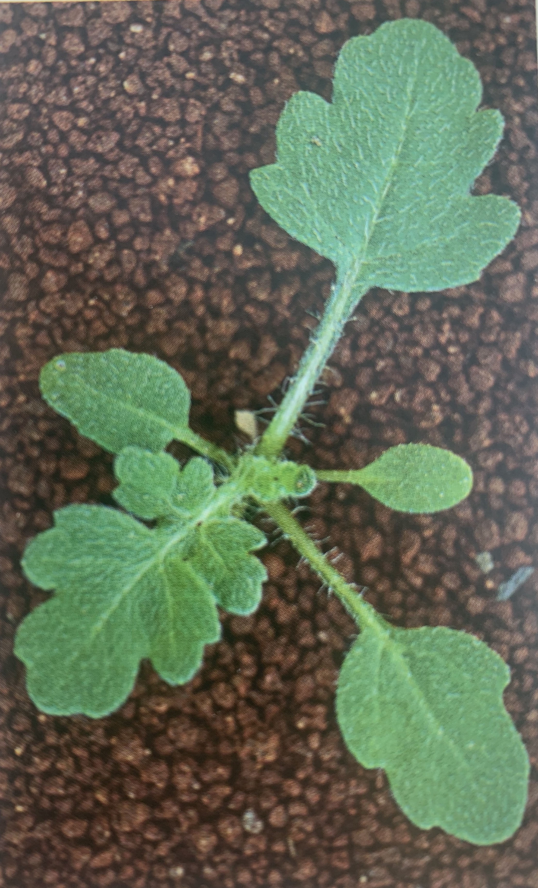
```
]


---

.pull-left[
```{r echo=FALSE, out.width=400, fig.align='center'}
knitr::include_graphics("https://static.inaturalist.org/photos/16908937/large.jpeg?1525048232")
```

```{r echo=FALSE, out.width=400, fig.align='center'}
knitr::include_graphics("https://nt.gov.au/__data/assets/image/0016/230209/parthenium-fruit-and-seeds.jpg")
```

]


.pull-right[
```{r echo=FALSE, out.width=350, fig.align='center'}
knitr::include_graphics("https://keys.lucidcentral.org/keys/v3/eafrinet/weeds/key/weeds/Media/Html/images/Parthenium_hysterophorus_(Parthenium_Weed)/parthenium_hysterophorus51.jpg")
```

```{r echo=FALSE, out.width=400, fig.align='center'}
knitr::include_graphics("https://keys.lucidcentral.org/keys/v3/eafrinet/weeds/key/weeds/Media/Html/images/Parthenium_hysterophorus_(Parthenium_Weed)/parthenium_hysterophorus31.jpg")
```
]


---

## Malvaceae

### Características

.pull-left[
- **Ciclo de Vida**: Anual, Perene

- **Folhas**: seiva viscosa, alternada, geralmente com veios palmatosos, imples, pubescente

- **Flores**: variam de pequenas a grandes, perfeitas, em forma de funil, 5 pétalas separadas

- **Frutos**: Cápsulas

- **Plantas**: cultivadas da família Malvaceae: algodão, quiabo, malva-rosa (usado para fazer marshmallow).
 
- **Classe**: dicotiledôneas
]


.pull-right[
```{r echo=FALSE, out.width=250, fig.align='center'}
knitr::include_graphics("https://upload.wikimedia.org/wikipedia/commons/thumb/1/1e/Hibiscus2324hibiscus_.jpg/220px-Hibiscus2324hibiscus_.jpg")
``` 
]


---

## Convolvulaceae

### Características


.pull-left[
- **Ciclos de vida**: Anual, Perene

- **Hastes**: Entrelaçamento, escalada, trepadeiras

- **Folhas**: na maioria simples, alternadas, com lóbulos pinçados

- **Inflorescência**: auxiliar, solitária

- **Flores**: perfeitas, pequenas e discretas a grandes e vistosas

- **Classe**: dicotiledôneas
]

.pull-right[
```{r echo=FALSE, out.width=250, fig.align='center'}
knitr::include_graphics("https://cdn.britannica.com/42/137442-050-46DDCACD/Field-bindwind.jpg")
``` 
]

---

class: inverse

## Brassicaceae

### Características

.pull-left[

- **Ciclos de vida**: Anual (verão e inverno)

- **Raízes**: pivotante

- **Inflorescência**: racemos indeterminados com muitas flores

- **Flores**: azul, vermelho, branco ou amarelo. Pequeno com 4 pétalas e 4 sépalas dispostas como uma cruz.

- **Frutos**: silique ou silicle

- **Reprodução**: semente, estoque de raízes

- **Variedades cultivadas**: repolho, nabo, rabanete, crambe, canola
]

.pull-right[
```{r echo=FALSE, out.width=250, fig.align='center'}
knitr::include_graphics("https://upload.wikimedia.org/wikipedia/commons/b/b8/Barbarea_vulgaris_002.JPG")
``` 
]


---

## *Raphanus raphanistrum*

#### Nome comum: nabo ou nabiça

.pull-left[

]

.pull-right[
```{r echo=FALSE, out.width=300, fig.align='center'}
knitr::include_graphics("https://content.eol.org/data/media/00/1e/9b/8.6029390022.jpg")
``` 
]
---

.pull-left[
```{r echo=FALSE, out.width=400, fig.align='center'}
knitr::include_graphics("https://plantevaernonline.dlbr.dk/cp/graphics/ImageDatabase/RAPRA-COT-700.jpg")
``` 

```{r echo=FALSE, out.width=400, fig.align='center'}
knitr::include_graphics("https://alchetron.com/cdn/raphanus-raphanistrum-0be31d0b-37f4-40f0-8a2e-1587d9a5516-resize-750.jpg")
``` 
]

.pull-right[
```{r echo=FALSE, out.width=400, fig.align='center'}
knitr::include_graphics("https://plantevaernonline.dlbr.dk/cp/graphics/ImageDatabase/RAPRA-SEE-700.JPG")
``` 

```{r echo=FALSE, out.width=400, fig.align='center'}
knitr::include_graphics("https://plantevaernonline.dlbr.dk/cp/graphics/ImageDatabase/RAPRA-MAT-700.jpg")
``` 
]


---


## Cucurbitaceae

### Características

.pull-left[

750-1000 espécies em todo o mundo - Principalmente regiões tropicais

- **Ciclos de vida**: 

- **Raízes**: 

- **Inflorescência**: 

- **Flores**: Principalmente trepadeiras

- **Frutos**: 

- **Reprodução**: 

- **Variedades cultivadas**: pepinos, abóboras, melões, cabaças
]

.pull-right[
```{r echo=FALSE, out.width=250, fig.align='center'}
knitr::include_graphics("https://upload.wikimedia.org/wikipedia/commons/thumb/2/2e/Luffa_operculata_01.JPG/253px-Luffa_operculata_01.JPG")
``` 
]


---

## Fabaceae

### Características

.pull-left[

- Principalmente herbáceas, mas existem muitos arbustos e árvores

- As **folhas** são estipuladas e quase sempre se alternam. Pode ser composto de forma pontual ou palmatosa ou simples.

- A **fruta** é geralmente uma leguminosa

- As **flores** geralmente estão em racemos, pontas ou cabeças

- As **variedades cultivadas** incluem soja, amendoim, alfafa e ervilha
]


.pull-right[


```{r echo=FALSE, out.width=350, fig.align='center'}
knitr::include_graphics("https://upload.wikimedia.org/wikipedia/commons/5/58/Vicia_villosa_schote.jpeg")
``` 
]

---

## *Glycine max*

#### Nome comum: soja voluntária

.pull-left[

- A primeira folha verdadeira é trifoliada e é alternada para a segunda folha verdadeira

- **Cotilédones:** oblongo, oposto

- **Caule:** ereto ou ascendente, pubescente, alternadamente ramificado

- **Raiz:** pivotante
]

.pull-right[
```{r echo=FALSE, out.width=250, fig.align='center'}
knitr::include_graphics("images/soy_03.png")
``` 
]

---

.pull-left[
```{r echo=FALSE, out.width=400, fig.align='center'}
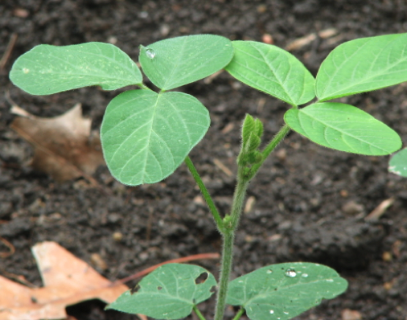
``` 

```{r echo=FALSE, out.width=400, fig.align='center'}
knitr::include_graphics("images/soy_02.png")
``` 
]

.pull-right[
```{r echo=FALSE, out.width=400, fig.align='center'}
knitr::include_graphics("https://dam.farmjournal.com/m/73beddb90231e1a/webimage-5712E6A3-2732-4AA7-AEBEE4FC1963E803.jpg")
``` 

```{r echo=FALSE, out.width=400, fig.align='center'}
knitr::include_graphics("https://cropwatch.unl.edu/image/image_gallery/uuid%3D733c81c2-308e-45c8-a0bb-07ee75545b70%26groupId%3D1841%26t%3D1372797454178")
``` 
]


---

## Lamiaceae

### Características

.pull-left[

- Caule quadrado

- Folhas opostas ou enroladas

- Muitas espécies aromáticas

- Herbáceas
]


.pull-right[


```{r echo=FALSE, out.width=350, fig.align='center'}
knitr::include_graphics("https://upload.wikimedia.org/wikipedia/commons/5/58/Vicia_villosa_schote.jpeg")
``` 
]


---

## Chenopodiaceae

### Características

.pull-left[
- Herbácea e arbôreas

- **Ciclo**: Anuais e perenes

- **Folhas**: simples, geralmente alternadas, inteiras a lobadas, glabras ou pubescentes

- **Inflorescência**: racemo ou espiga

- **Flores**: pequenas, geralmente de cor esverdeada

- **Frutas**: algumas espécies têm massas vistosas de frutas

- **Cultivado**: espinafre e beterraba


]


.pull-right[

- 1300 espécies em todo o mundo

```{r echo=FALSE, out.width=250, fig.align='center'}
knitr::include_graphics("https://alchetron.com/cdn/chenopodiaceae-28ed2041-a3aa-4f61-b08a-d7f3b86849f-resize-750.jpg")
``` 
]


---


## Apiaceae

### Características

.pull-left[

- **Ciclo de vida**: principalmente bianual ou perene

- **Aparência**: arbustos - geralmente aromáticos com hastes ocas; folhas de samambaia

- **Folhas**: alternadamente, pinnately divididas

- **Flores**: dispostas em umbelas; as flores são pequenas e geralmente radiais

- **Frutos**: divididos ao meio, cada metade com uma semente

- **Cultivado**: cenoura, salsa
]

.pull-right[
```{r echo=FALSE, out.width=250, fig.align='center'}
knitr::include_graphics("https://upload.wikimedia.org/wikipedia/commons/8/86/AngelicaSylvestrisInflorescence.jpg")
``` 

```{r echo=FALSE, out.width=250, fig.align='center'}
knitr::include_graphics("https://www.uwgb.edu/biodiversity/herbarium/invasive_species/conmac_leaf03gf600.jpg")
``` 
]


---


## Asclepiadaceae

### Características

.pull-left[

Herbáceas, trepadeiras e arbustos principalmente perenes com seiva leitosa

- **Sementes**: tufo de pelos sedosos

- **Fruta**: folículos

- **Flores**: pétalas perfeitas, muitas vezes carnudas

- **Inflorescências**: geralmente umbelas

- **Folhas**: simples, opostas ou voltas, inteiras

- **Caules**: cheios de seiva leitosa


]

.pull-right[
```{r echo=FALSE, out.width=250, fig.align='center'}
knitr::include_graphics("https://cdn.shopify.com/s/files/1/1351/6403/products/Calotropis_SQ_693_1024x1024.jpg?v=1469314555")
``` 
]


---

## Polygonaceae

### Características

.pull-left[

- Herbáceas e trepadeiras herbáceas

- **Ciclo de vida**: Anuais, bianuais e perenes

- **Folhas**: alternativa, simples, inteira, basal ou caulina

- **Flores**: perfeitas, imperfeitas ou funcionalmente unissexuais

- **Frutas**: aquênio

- Às vezes, estípulas das folhas embainham o caule, formando uma estrutura chamada "ocreia"
]

.pull-right[
```{r echo=FALSE, out.width=250, fig.align='center'}
knitr::include_graphics("https://upload.wikimedia.org/wikipedia/commons/8/8f/Polygonum_persicaria_bgiu.jpg")
``` 
]

---

class: middle

.pull-left[
```{r echo=FALSE, out.width=500, fig.align='center'}
knitr::include_graphics("https://upload.wikimedia.org/wikipedia/commons/9/99/Ocreae_of_a_Persicaria_maculosa_2006-aug-10_Gothenburg_Sweden.jpg")
``` 
]

.pull-right[
**OCHREA**
Bainhas de encontradas onde o pecíolo se liga ao caule
]

---

## Plantaginaceae

### Características


.pull-left[
- Herbáceas

- **Ciclo de vida**: Anuários e perenes

- **Folhas**: costelas geralmente basais, simples, longitudinais, sem estípulas

- **Inflorescência**: denso, pontas de vários comprimentos

- **Flores**: radiais, pequenas, carregadas em um caule sem folhas
]


.pull-right[
```{r echo=FALSE, out.width=350, fig.align='center'}
knitr::include_graphics("https://www.weedalogue.com/virginiaplantain/vp_02.jpg")
``` 
]


---

## Portulacaceae

### Características


.pull-left[
- Herbáceas ou raramente arbustos

- **Ciclo de vida**: Anual ou perene

- **Folhas**: inteiras, opostas, alternadas ou em espiral, geralmente carnudas

- **Flores**: 2 sépalas, 3-18 pétalas, perfeitas

- **Frutos**: cápsula, sementes de um a maio, geralmente pretas e brilhantes
]

.pull-right[
```{r echo=FALSE, out.width=500, fig.align='center'}
knitr::include_graphics("https://www.fireflyforest.com/images/wildflowers/plants/Portulaca_olera_400.jpg")
``` 
]

---

## Solanaceae

### Características

Nenhuma característica única comum nessa família

.pull-left[
- **Folhas**: geralmente alternadas, simples, peludas, com odor característico, pecíolo, ovo ou formato triangular

- **Inflorescência**: racemos ou umbels

- **Flores**: perfeitas, em pequenos grupos, tipicamente branco ou rosa

- **Frutas**: baga ou cápsula

- **Cultivado**: tomate, batata, pimentão, berinjela, tabaco, pimentão, petúnias
]

.pull-right[
```{r echo=FALSE, out.width=450, fig.align='center'}
knitr::include_graphics("https://cdn.britannica.com/80/138780-050-63F55DC9/Nightshade.jpg")
``` 
]

