```{r setup, include=FALSE}
options(htmltools.dir.version = FALSE)
knitr::opts_chunk$set(
  echo = FALSE,
  fig.align = "center",
  message = FALSE,
  warning = FALSE,
  cache = TRUE
)

htmltools::tagList(rmarkdown::html_dependency_font_awesome()) #show twitter logo
```


## Euphorbiaceae

### Características

.pull-left[
- **Ciclo de Vida**: anuais, perenes, arbustos ou árvores - compreende cerca de 7500 espécies e 275 gêneros de plantas com flores distribuídas principalmente nos trópicos

- Muitas espécies contêm látex leitoso e algumas são úteis como fonte de óleo ou cera.

- **Folhas**: são alternadas, raramente opostas, com estípulas.


- **Plantas cultivadas**: mamona, mandioca, seringueira
 

]


.pull-right[
```{r echo=FALSE, out.width=250, fig.align='center'}
knitr::include_graphics("https://upload.wikimedia.org/wikipedia/commons/2/2c/Mamona_%28Victor_Hugo_Almeida%29.jpg")
``` 
]

---


- **Flores**: unissexuais e nascem em um aglomerado característico conhecido como cíatia

- **Fruto**: geralmente é um esquizocarpo, mas às vezes uma drupa

.pull-left[
```{r echo=FALSE, out.width=500, fig.align='center'}
knitr::include_graphics("https://upload.wikimedia.org/wikipedia/commons/7/7c/E_baylissii_ies.jpg")
``` 
]

.pull-right[
```{r echo=FALSE, out.width=500, fig.align='center'}
knitr::include_graphics("https://upload.wikimedia.org/wikipedia/commons/thumb/5/5b/Euphorbia_characias_flowers.jpg/1280px-Euphorbia_characias_flowers.jpg")
``` 
]

---


## *Euphorbia heterophylla*

#### **Nome comum**: amendoim bravo, leiteira

.pull-left[

**Ciclo de vida**: anual

**Folhas**: inferiores: alternadas - superiores: opostas e geralmente têm uma base esbranquiçada ou vermelha brilhante - glabras ou levemente pubescente

**Caules**: exala um látex branco leitoso e tóxico

**Reprodução**: sementes
]


.pull-right[
```{r echo=FALSE, out.width=250, fig.align='center'}
knitr::include_graphics("images/leiteira_10.png")
``` 

```{r echo=FALSE, out.width=250, fig.align='center'}
knitr::include_graphics("https://cnas-re.uog.edu/wp-content/uploads/2015/10/euph-heterophylla-seed1.jpg")
``` 
]

---

.pull-left[
```{r echo=FALSE, out.width=400, fig.align='center'}
knitr::include_graphics("http://www.sites.encode.com.br/eou-mrm/rrplus/wp-content/uploads/2017/06/2014092612522488986-600x470.jpg")
``` 

```{r echo=FALSE, out.width=350, fig.align='center'}
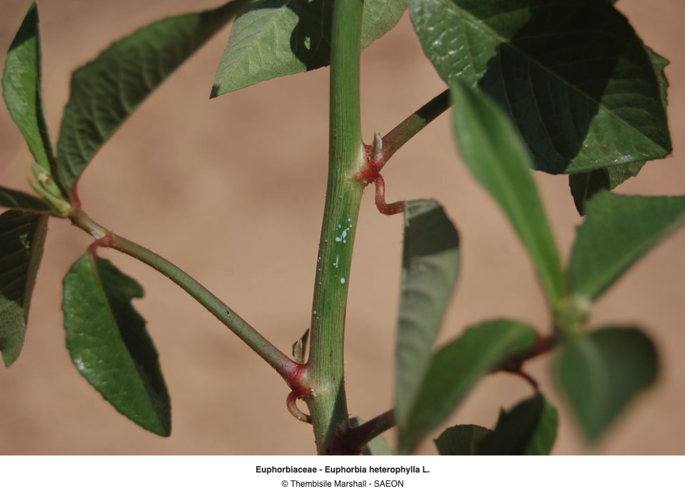
``` 
]

.pull-right[
```{r echo=FALSE, out.width=150, fig.align='center'}
knitr::include_graphics("https://www.agrolink.com.br/upload/problemas/Euphorbia_heterophylla95.jpg")
``` 

```{r echo=FALSE, out.width=250, fig.align='center'}
knitr::include_graphics("https://www.agrolink.com.br/upload/problemas/Euphorbia_heterophylla81.jpg")
``` 

```{r echo=FALSE, out.width=250, fig.align='center'}
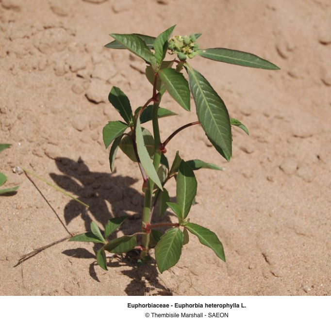
``` 
]


---

## *Euphorbia hirta*

#### **Nome comum**: erva de santa luzia

.pull-left[

**Ciclo de vida**: anual, prostrada a ascendente, com ramos de 50 cm de comprimento; planta pilosa inteira, incluindo inflorescência e cápsulas

**Folhas**:  ovais, margem finamente dentada, superfície superior às vezes quase glabra, manchada púrpura especialmente na região da nervura central


**Flores**: *Flores masculinas:* bracteoles lineares, fimbriadas; estames 1 mm. longo. *Flor feminina:* ovário pouco pedicelado; estilos 0,4 mm. longo, espalhando-se, bífido quase até a base, com ápices espessados.
]


.pull-right[
```{r echo=FALSE, out.width=300, fig.align='center'}
knitr::include_graphics("https://storage.googleapis.com/powop-assets/PPA/0551_0600/h0577c_fullsize.jpg")
``` 
]

---

.pull-left[
```{r echo=FALSE, out.width=400, fig.align='center'}
knitr::include_graphics("http://d2seqvvyy3b8p2.cloudfront.net/d93ba081bef91606929195c1a1164727.jpg")
``` 

```{r echo=FALSE, out.width=250, fig.align='center'}
knitr::include_graphics("https://storage.googleapis.com/powop-assets/PPA/0551_0600/h0577l_fullsize.jpg")
``` 

```{r echo=FALSE, out.width=250, fig.align='center'}
knitr::include_graphics("https://storage.googleapis.com/powop-assets/PPA/0551_0600/h0577b_fullsize.jpg")
``` 

]

.pull-right[
```{r echo=FALSE, out.width=350, fig.align='center'}
knitr::include_graphics("http://d2seqvvyy3b8p2.cloudfront.net/6b6dc062f9ea8db75c3661167168565b.jpg")
``` 

```{r echo=FALSE, out.width=200, fig.align='center'}
knitr::include_graphics("https://storage.googleapis.com/powop-assets/PPA/0551_0600/h0577d_fullsize.jpg")
``` 
]


---

## *Ricinus communis*

#### **Nome comum**: mamona

.pull-left[

**Ciclo de vida**: perene, arbustiva - 2 a 4 m de altura

**Folhas**: alternadas, membranáceas - glabra

**Caules**: branco-cerosoe fistulado - glabra

**Reprodução**: sementes
]


.pull-right[
```{r echo=FALSE, out.width=300, fig.align='center'}
knitr::include_graphics("https://upload.wikimedia.org/wikipedia/commons/thumb/7/73/Illustration_Ricinus_communis0.jpg/1200px-Illustration_Ricinus_communis0.jpg")
``` 
]

---

.pull-left[
```{r echo=FALSE, out.width=400, fig.align='center'}
knitr::include_graphics("https://weeds.brisbane.qld.gov.au/sites/default/files/styles/large/public/images/ricinus_communis2.jpg?itok=maDb34_0")
``` 

```{r echo=FALSE, out.width=400, fig.align='center'}
knitr::include_graphics("https://weeds.brisbane.qld.gov.au/sites/default/files/styles/large/public/images/ricinus_communis14_-_fks.jpg?itok=Uy_AJqlC")
``` 


]

.pull-right[
```{r echo=FALSE, out.width=400, fig.align='center'}
knitr::include_graphics("https://weeds.brisbane.qld.gov.au/sites/default/files/styles/large/public/images/ricinus_communis6.jpg?itok=uCEcX6qH")
``` 

```{r echo=FALSE, out.width=400, fig.align='center'}
knitr::include_graphics("https://weeds.brisbane.qld.gov.au/sites/default/files/styles/large/public/images/ricinus_communis3.jpg?itok=ipdUunRV")
``` 
]


---


## Malvaceae

### Características

.pull-left[
- **Ciclo de Vida**: anual, perene

- **Folhas**: seiva viscosa, alternada, geralmente com veios palmatosos, simples, pubescente

- **Flores**: variam de pequenas a grandes, perfeitas, em forma de funil, 5 pétalas separadas

- **Frutos**: Cápsulas

- **Plantas**: cultivadas da família Malvaceae: algodão, cacau, quiabo, malva-rosa (usado para fazer marshmallow).
 

]


.pull-right[
```{r echo=FALSE, out.width=200, fig.align='center'}
knitr::include_graphics("https://cdn.britannica.com/s:700x500/10/37910-050-9485A816/Okra.jpg")
``` 

```{r echo=FALSE, out.width=200, fig.align='center'}
knitr::include_graphics("https://upload.wikimedia.org/wikipedia/commons/4/49/Hibiscus_x_archeri_%28Malvaceae%29_flower.jpg")
``` 

]

---

## *Sida glaziovii*

#### **Nome comum**: guanxuma branca

.pull-left[

**Ciclo de vida**: ereta ou subprostrada, ramificada

**Folhas**: branco-lanuginosas em ambas faces

**Caules**: fibroso, revestido por densa pubescência esbranquiçada

**Reprodução**: Sementes
]


.pull-right[
```{r echo=FALSE, out.width=250, fig.align='center'}
knitr::include_graphics("https://c1.staticflickr.com/8/7313/16562190165_13cd375484_n.jpg")
``` 

```{r echo=FALSE, out.width=250, fig.align='center'}
knitr::include_graphics("https://static.wixstatic.com/media/3f0fe7_3321566df4f54c2eb8fd8882aabd8352.jpg/v1/fill/w_354,h_235,al_c,q_80,usm_0.66_1.00_0.01/3f0fe7_3321566df4f54c2eb8fd8882aabd8352.jpg")
``` 
]

---

.pull-left[
```{r echo=FALSE, out.width=250, fig.align='center'}
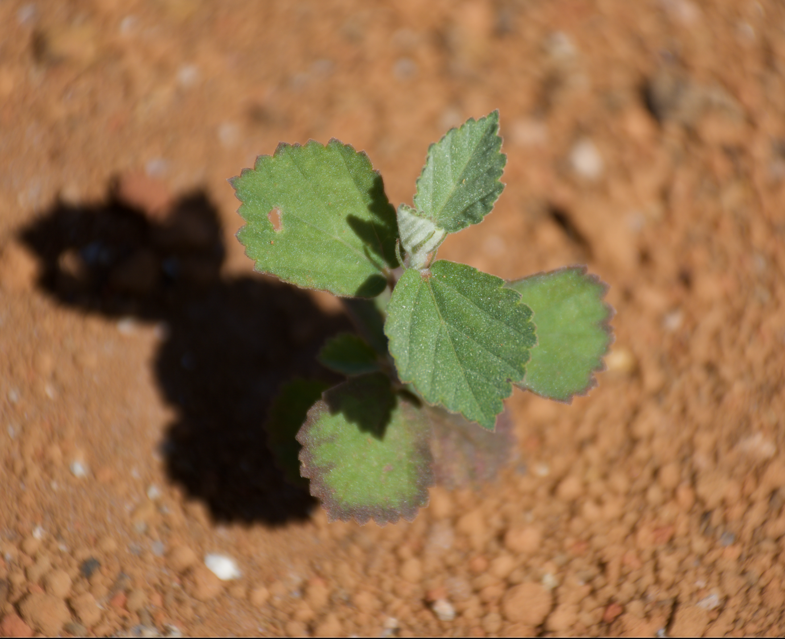
``` 

```{r echo=FALSE, out.width=250, fig.align='center'}
knitr::include_graphics("http://farm9.static.flickr.com/8603/16064020794_8acf313338.jpg")
``` 
]

.pull-right[
```{r echo=FALSE, out.width=150, fig.align='center'}
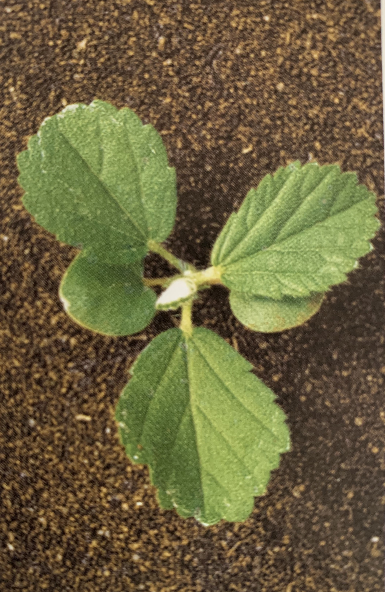
``` 

```{r echo=FALSE, out.width=250, fig.align='center'}
knitr::include_graphics("http://farm9.static.flickr.com/8576/16498764468_8421fcf2b0.jpg")
``` 
]

---

## *Sida glaziovii*

#### **Nome comum**: guanxuma branca

```{r echo=FALSE, out.width=500, fig.align='center'}
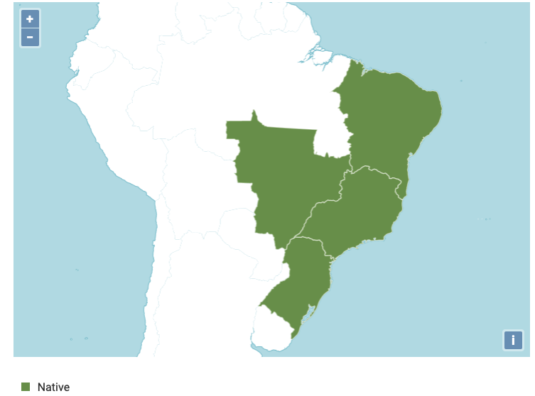
``` 

---

## *Sida rhombifolia*

#### **Nome comum**: guanxuma 

.pull-left[

**Ciclo de vida**: anual ou bianual, herbácea

**Sementes**: 

**Folhas**: oblonga a lanceolada- glabro na parte superior e pubescente na parte inferior

**Caules**: geralmente eretos ou ascendentes, pubescente

**Flor**: Flores de amarelo claro a creme, axilares, solitárias
]


.pull-right[
```{r echo=FALSE, out.width=250, fig.align='center'}
knitr::include_graphics("https://live.staticflickr.com/7184/6858277693_7b7a4826c8_b.jpg")
``` 
]


---

## *Sida rhombifolia*

#### **Nome comum**: guanxuma 

```{r echo=FALSE, out.width=500, fig.align='center'}
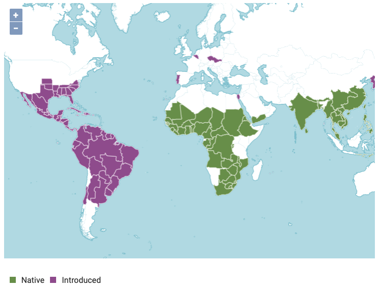
``` 


---

.pull-left[
```{r echo=FALSE, out.width=250, fig.align='center'}
knitr::include_graphics("http://d2seqvvyy3b8p2.cloudfront.net/927cf0d0c1f8c87ba8820ef2aa6f1309.jpg")
``` 

```{r echo=FALSE, out.width=250, fig.align='center'}
knitr::include_graphics("https://keyserver.lucidcentral.org/weeds/data/media/Images/sida_rhombifolia/sidarhombifolia32.jpg")
``` 
]

.pull-right[
```{r echo=FALSE, out.width=300, fig.align='center'}
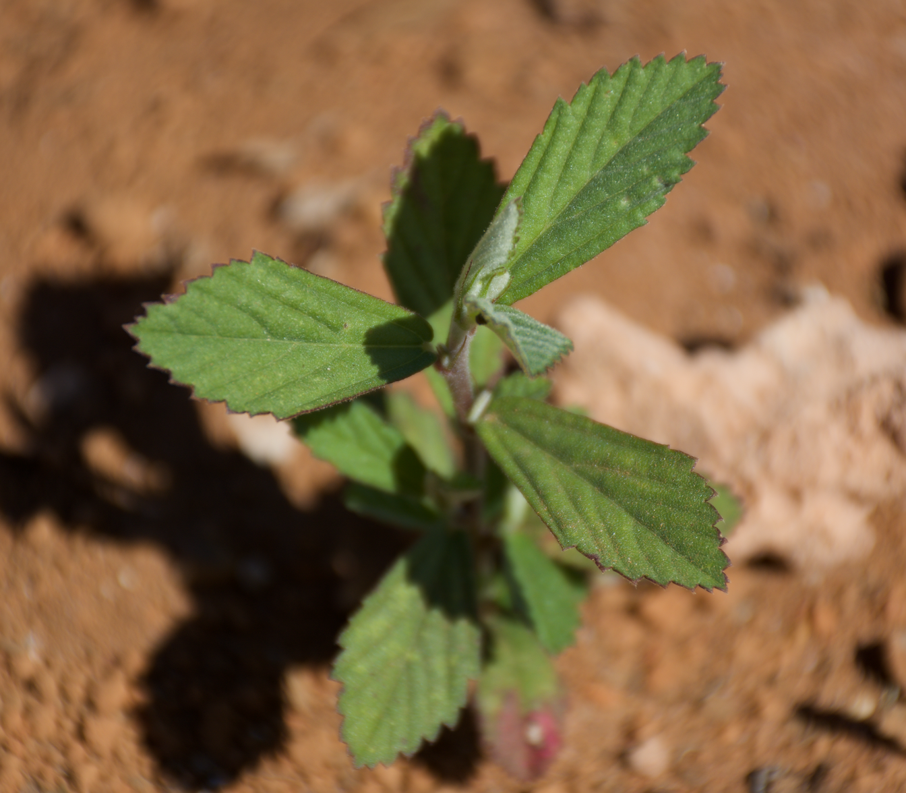
``` 

```{r echo=FALSE, out.width=250, fig.align='center'}
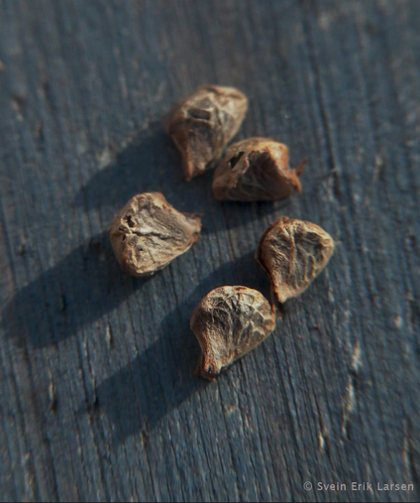
```
]


---

class: inverse


## Convolvulaceae

### Características


.pull-left[
- **Ciclos de vida**: Anual, Perene

- **Hastes**: Entrelaçamento, escalada, trepadeiras

- **Folhas**: na maioria simples, alternadas, com lóbulos pinçados

- **Inflorescência**: auxiliar, solitária

- **Flores**: perfeitas, pequenas e discretas a grandes e vistosas

- **Classe**: dicotiledôneas
]

.pull-right[
```{r echo=FALSE, out.width=250, fig.align='center'}
knitr::include_graphics("https://cdn.britannica.com/42/137442-050-46DDCACD/Field-bindwind.jpg")
``` 
]

---

    
## *Ipomoea hederifolia*

#### **Nome comum**: jetirana, corriola, corda-de-viola

.pull-left[

**Ciclo de vida**: anual, trepadeira

**Folhas**: irregular (inteira e trilobada)

**Cotilédone**: formato de boborleta

**Caules**: glabro ou esparçamente pubescente - vários metros de comprimento

**Flor**: forma de funil - vermelho escarlate

**Reprodução**: Sementes 
]


.pull-right[
```{r echo=FALSE, out.width=250, fig.align='center'}
knitr::include_graphics("https://www.agrolink.com.br/upload/problemas/Ipomoea_hederifolia73.jpg")
``` 
]


---

.pull-left[
```{r echo=FALSE, out.width=250, fig.align='center'}
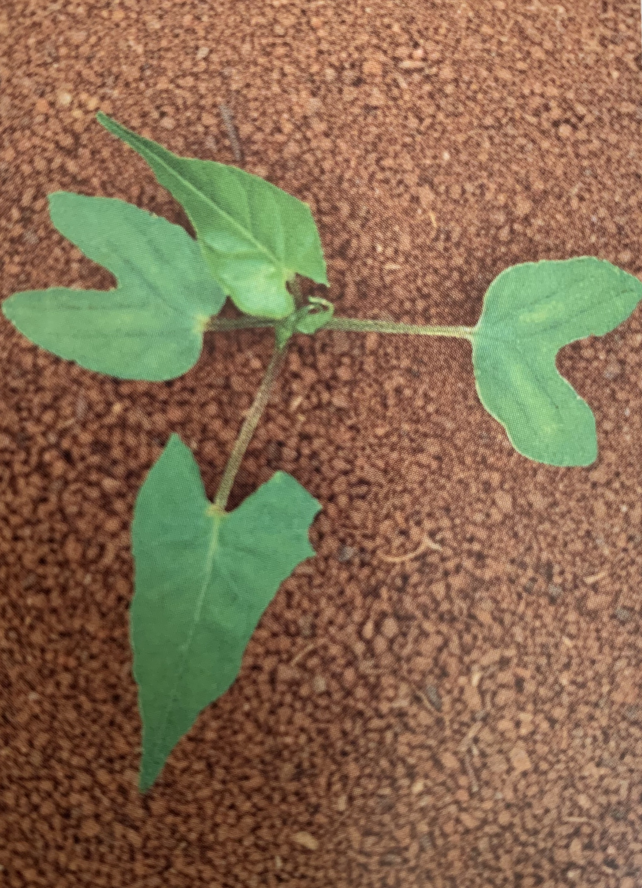
``` 

```{r echo=FALSE, out.width=250, fig.align='center'}
knitr::include_graphics("https://www.agrolink.com.br/upload/problemas/Ipomoea_hederifolia72.jpg")
``` 
]

.pull-right[
```{r echo=FALSE, out.width=300, fig.align='center'}
knitr::include_graphics("https://www.agrolink.com.br/upload/problemas/Ipomoea_hederifolia87.jpg")
``` 

```{r echo=FALSE, out.width=250, fig.align='center'}
knitr::include_graphics("https://www.agrolink.com.br/upload/problemas/Ipomoea_hederifolia88.jpg")
```
]


---

    
## *Ipomoea nil*

#### **Nome comum**: campainha, corda-de-viola

.pull-left[

**Ciclo de vida**: anual, trepadeira

**Folhas**: de forma irregular - trilobadas

**Cotilédone**: formato de borboleta

**Caules**: caules entrelaçados de até 5 m de comprimento e é densamente espalhada com tricomas longos e pubescentes

**Flor**: flores coloridas em forma de funil (azul a roxo avermelhado, com tubo esbranquiçado)

**Reprodução**: sementes
]


.pull-right[
```{r echo=FALSE, out.width=250, fig.align='center'}
knitr::include_graphics("https://upload.wikimedia.org/wikipedia/commons/thumb/9/98/Ipomoea_nil_Akatsukinoumi1.jpg/800px-Ipomoea_nil_Akatsukinoumi1.jpg")
``` 
]


---

.pull-left[
```{r echo=FALSE, out.width=250, fig.align='center'}
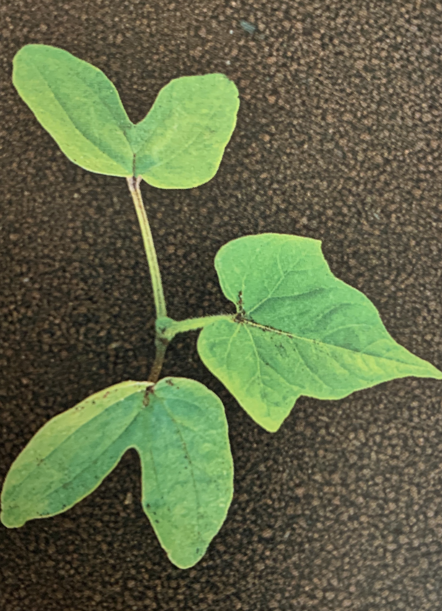
``` 

```{r echo=FALSE, out.width=400, fig.align='center'}
knitr::include_graphics("https://upload.wikimedia.org/wikipedia/commons/7/72/Ipomoea_indica_in_Hyderabad%2C_AP_W_IMG_0328.jpg")
``` 
]

.pull-right[
```{r echo=FALSE, out.width=400, fig.align='center'}
knitr::include_graphics("https://elizr.files.wordpress.com/2011/03/dscf4306.jpg")
``` 

```{r echo=FALSE, out.width=400, fig.align='center'}
knitr::include_graphics("https://plants.sc.egov.usda.gov/gallery/large/ipni_001_lhp.jpg")
```
]

---

## *Ipomoea purpurea*

#### **Nome comum**: corda-de-viola-roxa

.pull-left[

**Ciclo de vida**: anual, herbácea, trepadeira

**Folhas**: alternada, margem inteira, glabro, formato de coração

**Cotilédone**: formato de borboleta

**Caules**: entrelaçados, trepadeira, pubescente

**Flor**: forma de funil: roxo, azul, branco

**Reprodução**: Sementes
]


.pull-right[
```{r echo=FALSE, out.width=250, fig.align='center'}
knitr::include_graphics("https://plants.sc.egov.usda.gov/gallery/large/ippu2_006_lvp.jpg")
``` 
]


---

.pull-left[
```{r echo=FALSE, out.width=220, fig.align='center'}
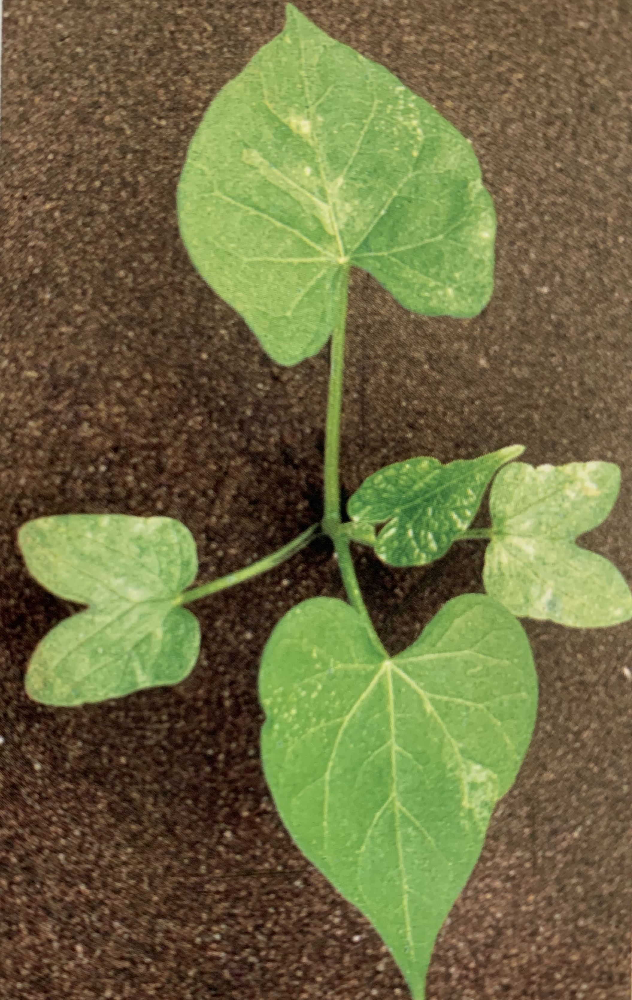
``` 

```{r echo=FALSE, out.width=400, fig.align='center'}
knitr::include_graphics("https://www.cabi.org/isc/portfolio/compendia/normal/29220.img")
``` 
]

.pull-right[
```{r echo=FALSE, out.width=800, fig.align='center'}
knitr::include_graphics("https://plants.sc.egov.usda.gov/gallery/large/ippu2_008_lhp.jpg")
``` 

```{r echo=FALSE, out.width=500, fig.align='center'}
knitr::include_graphics("https://plants.sc.egov.usda.gov/gallery/large/ippu2_007_lhp.jpg")
```
]

---

## *Ipomoea triloba*

#### **Nome comum**: corda-de-viola-miúda

.pull-left[

**Ciclo de vida**: anual, herbácea, trepadeira

**Folhas**: ovais, inteiras a profundamente trilobadas

**Cotilédone**: lóbulos profundamente perfurados

**Caules**: pubescentes, pigmentados, vários metros de comprimento

**Flor**: forma de funil: rosa, roxa

**Reprodução**: sementes
]


.pull-right[
```{r echo=FALSE, out.width=250, fig.align='center'}
knitr::include_graphics("https://www.agrolink.com.br/upload/problemas/Ipomoea%20triloba8.jpg")
``` 

```{r echo=FALSE, out.width=250, fig.align='center'}
knitr::include_graphics("https://08511630493324166816.googlegroups.com/attach/b172b390a1206ca/Ipomoea%20triloba%20(11).JPG?part=0.3&view=1&vt=ANaJVrHLhHlqzGvt67tZAj_oHroTkm7k4lUAxdhNrIgFtXknYPoqTufIas5f6m-gNOTeZy6nQFk3YvUY6id14shOl2mtuunSTdh9bPmpmqnNM6wnk4RtAMA")
``` 
]


---

.pull-left[
```{r echo=FALSE, out.width=220, fig.align='center'}
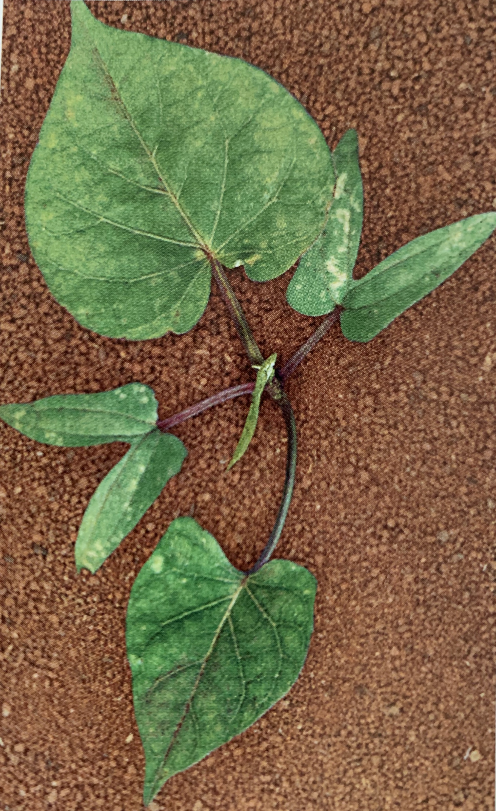
``` 

```{r echo=FALSE, out.width=300, fig.align='center'}
knitr::include_graphics("https://www.agrolink.com.br/upload/problemas/Ipomoea%20triloba10.jpg")
``` 
]

.pull-right[
```{r echo=FALSE, out.width=250, fig.align='center'}
knitr::include_graphics("https://plants.sc.egov.usda.gov/gallery/large/iptr2_004_lvp.jpg")
``` 


```{r echo=FALSE, out.width=300, fig.align='center'}
knitr::include_graphics("https://plants.sc.egov.usda.gov/gallery/large/iptr2_001_lhp.jpg")
```
]


---

class: inverse

## Brassicaceae

### Características

.pull-left[

- **Ciclos de vida**: anual (verão e inverno)

- **Inflorescência**: racemos indeterminados com muitas flores

- **Flores**: azul, vermelho, branco ou amarelo. Pequeno com 4 pétalas e 4 sépalas dispostas como uma cruz.

- **Frutos**: silique ou silicle

- **Reprodução**: semente

- **Variedades cultivadas**: repolho, nabo, rabanete, crambe, canola
]

.pull-right[
```{r echo=FALSE, out.width=250, fig.align='center'}
knitr::include_graphics("https://upload.wikimedia.org/wikipedia/commons/b/b8/Barbarea_vulgaris_002.JPG")
``` 
]


---

## *Raphanus raphanistrum*

#### Nome comum: nabiça

.pull-left[
**Ciclo de vida**: anual, bianual

**Sementes**: 

**Folhas**: 

**Caules**: pubescentes

**Flor**: 
]

.pull-right[
```{r echo=FALSE, out.width=250, fig.align='center'}
knitr::include_graphics("https://content.eol.org/data/media/00/1e/9b/8.6029390022.jpg")
``` 

]
---

.pull-left[
```{r echo=FALSE, out.width=400, fig.align='center'}
knitr::include_graphics("https://plantevaernonline.dlbr.dk/cp/graphics/ImageDatabase/RAPRA-COT-700.jpg")
``` 

```{r echo=FALSE, out.width=400, fig.align='center'}
knitr::include_graphics("https://alchetron.com/cdn/raphanus-raphanistrum-0be31d0b-37f4-40f0-8a2e-1587d9a5516-resize-750.jpg")
``` 
]

.pull-right[
```{r echo=FALSE, out.width=400, fig.align='center'}
knitr::include_graphics("https://plantevaernonline.dlbr.dk/cp/graphics/ImageDatabase/RAPRA-SEE-700.JPG")
``` 

```{r echo=FALSE, out.width=400, fig.align='center'}
knitr::include_graphics("https://plantevaernonline.dlbr.dk/cp/graphics/ImageDatabase/RAPRA-MAT-700.jpg")
``` 
]

---

```{r echo=FALSE, out.width=400, fig.align='center'}
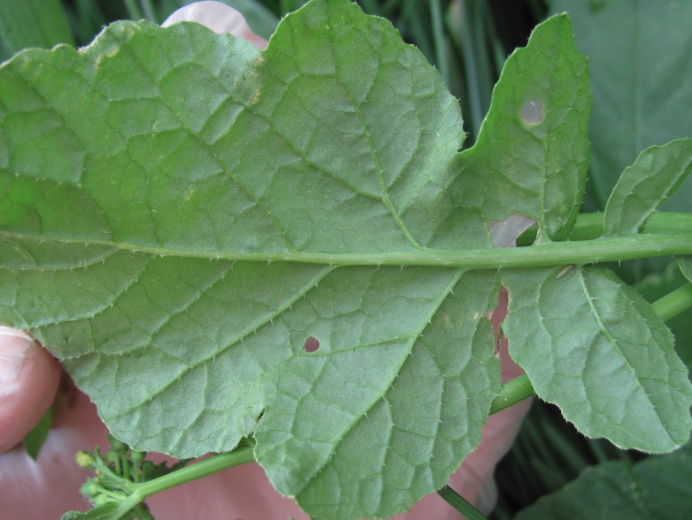
``` 

```{r echo=FALSE, out.width=400, fig.align='center'}
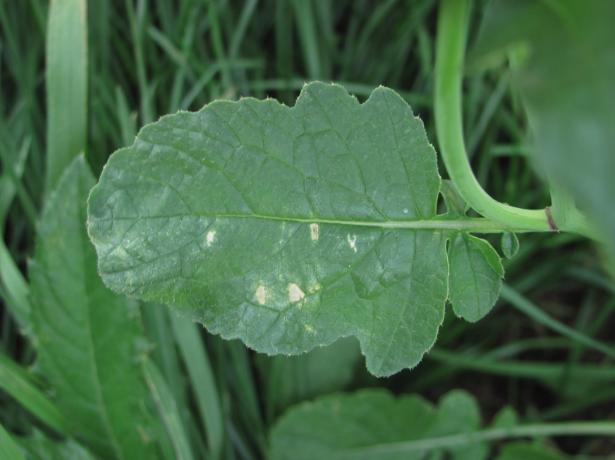
``` 
---

## *Raphanus sativus*

#### Nome comum: nabo silvestre

.pull-left[
**Ciclo de vida**: anual, bianual

**Sementes**: 

**Folhas**: 

**Caules**: pubescentes

**Flor**: 
]

.pull-right[
```{r echo=FALSE, out.width=400, fig.align='center'}
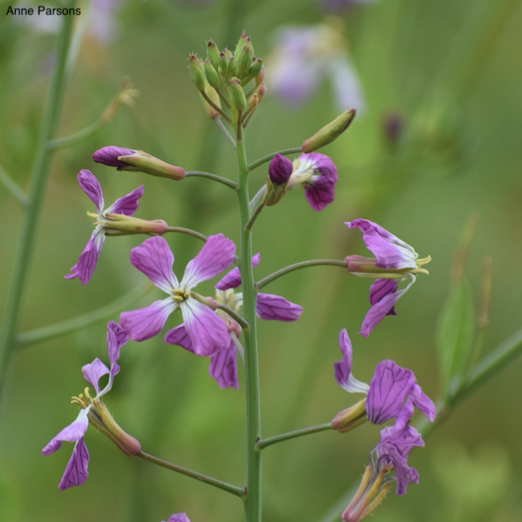
``` 


]
---

.pull-left[
```{r echo=FALSE, out.width=200, fig.align='center'}
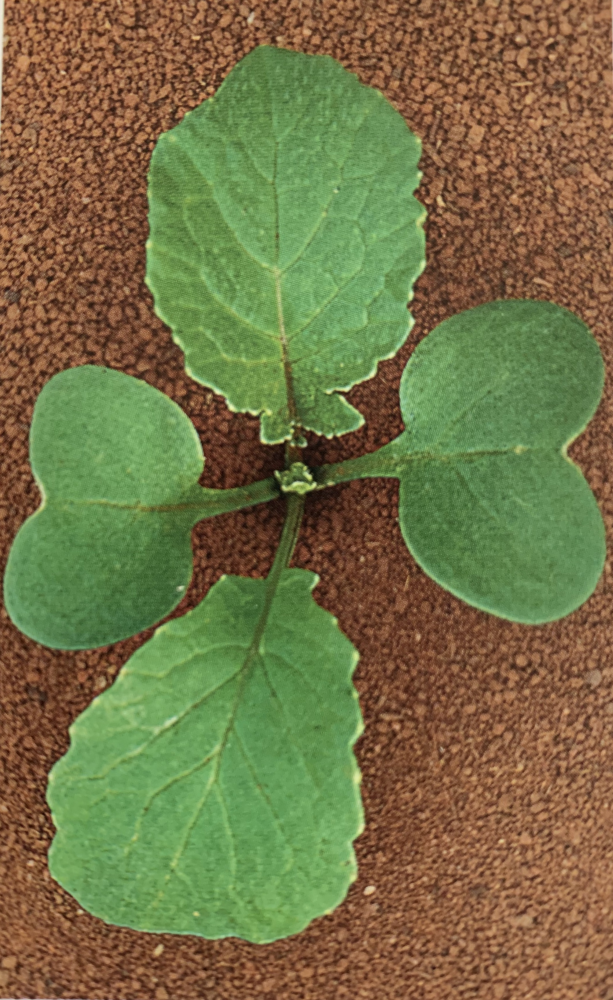
``` 

```{r echo=FALSE, out.width=400, fig.align='center'}
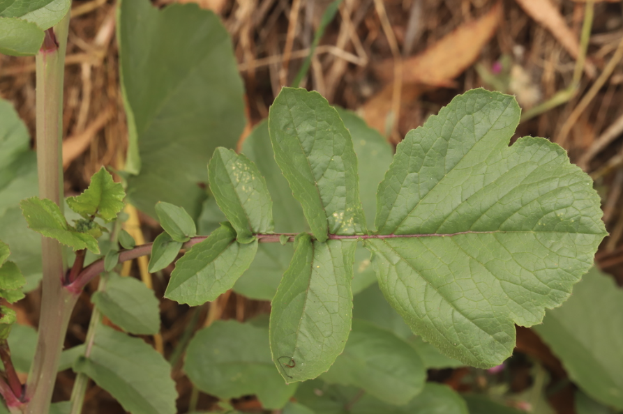
``` 
]

.pull-right[
```{r echo=FALSE, out.width=300, fig.align='center'}
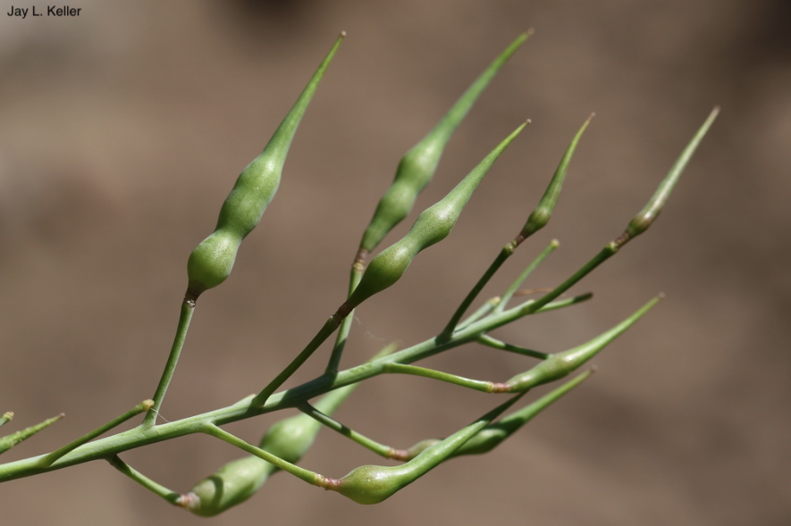
``` 

```{r echo=FALSE, out.width=300, fig.align='center'}
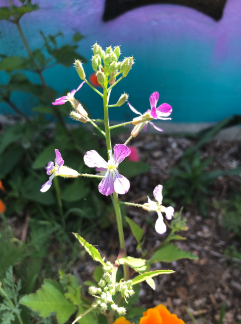
``` 
]


---

## Fabaceae

### Características

.pull-left[

- Principalmente herbáceas, mas existem muitos arbustos e árvores

- As **folhas** são estipuladas e quase sempre se alternam. Pode ser composto de forma pontual ou palmatosa ou simples.

- A **fruta** é geralmente uma leguminosa

- As **flores** geralmente estão em racemos, pontas ou cabeças

- As **variedades cultivadas** incluem soja, amendoim, alfafa e ervilha
]


.pull-right[


```{r echo=FALSE, out.width=350, fig.align='center'}
knitr::include_graphics("https://upload.wikimedia.org/wikipedia/commons/5/58/Vicia_villosa_schote.jpeg")
``` 
]

---

## *Glycine max*

#### Nome comum: soja voluntária

.pull-left[

- **Folha:** A primeira folha verdadeira é unifoliada e as demais são trifólios

- **Cotilédones:** oblongo, oposto

- **Caule:** ereto ou ascendente, pubescente, alternadamente ramificado

- **Raiz:** pivotante
]

.pull-right[
```{r echo=FALSE, out.width=250, fig.align='center'}
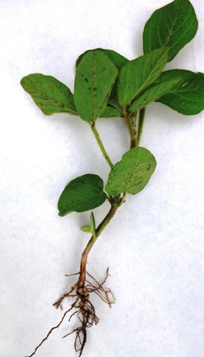
``` 
]

---

.pull-left[
```{r echo=FALSE, out.width=400, fig.align='center'}
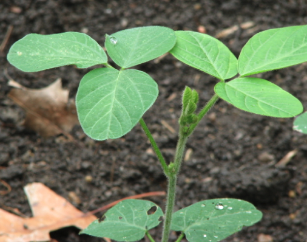
``` 

```{r echo=FALSE, out.width=400, fig.align='center'}
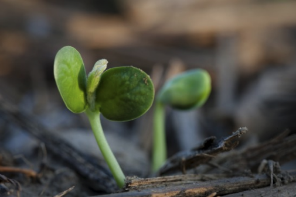
``` 
]

.pull-right[
```{r echo=FALSE, out.width=400, fig.align='center'}
knitr::include_graphics("https://dam.farmjournal.com/m/73beddb90231e1a/webimage-5712E6A3-2732-4AA7-AEBEE4FC1963E803.jpg")
``` 

```{r echo=FALSE, out.width=400, fig.align='center'}
knitr::include_graphics("https://cropwatch.unl.edu/image/image_gallery/uuid%3D733c81c2-308e-45c8-a0bb-07ee75545b70%26groupId%3D1841%26t%3D1372797454178")
```


---

## Chenopodiaceae

### Características

.pull-left[
- Herbácea e arbôreas

- **Ciclo**: Anuais e perenes

- **Folhas**: simples, geralmente alternadas, inteiras a lobadas, glabras ou pubescentes

- **Inflorescência**: racemo ou espiga

- **Flores**: pequenas, geralmente de cor esverdeada

- **Frutas**: algumas espécies têm massas vistosas de frutas

- **Cultivado**: espinafre e beterraba


]


.pull-right[

- 1300 espécies em todo o mundo

```{r echo=FALSE, out.width=250, fig.align='center'}
knitr::include_graphics("https://alchetron.com/cdn/chenopodiaceae-28ed2041-a3aa-4f61-b08a-d7f3b86849f-resize-750.jpg")
``` 
]

---

## *Chenopodium album*

#### **Nome comum**: ançarinha-branca

.pull-left[

**Ciclo de vida**: anual ou bianual, herbácea

**Sementes**: 

**Folhas**: oblonga a lanceolada- glabro na parte superior e pubescente na parte inferior

**Caules**: geralmente eretos ou ascendentes, pubescente

**Flor**: Flores de amarelo claro a creme, axilares, solitárias
]


.pull-right[
```{r echo=FALSE, out.width=500, fig.align='center'}
knitr::include_graphics("https://www.canr.msu.edu/pestid/uploads/images/Common-lambsquarters-plant.jpg")
``` 
]

---

.pull-left[
```{r echo=FALSE, out.width=400, fig.align='center'}
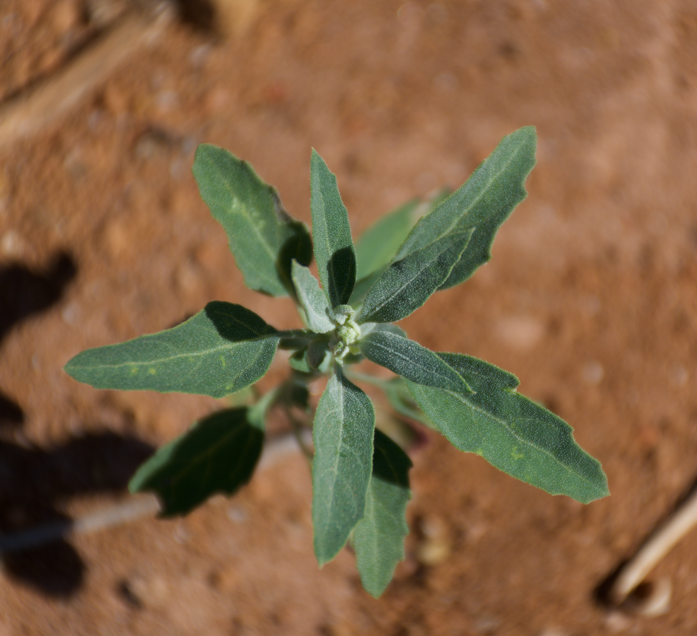
``` 

```{r echo=FALSE, out.width=400, fig.align='center'}
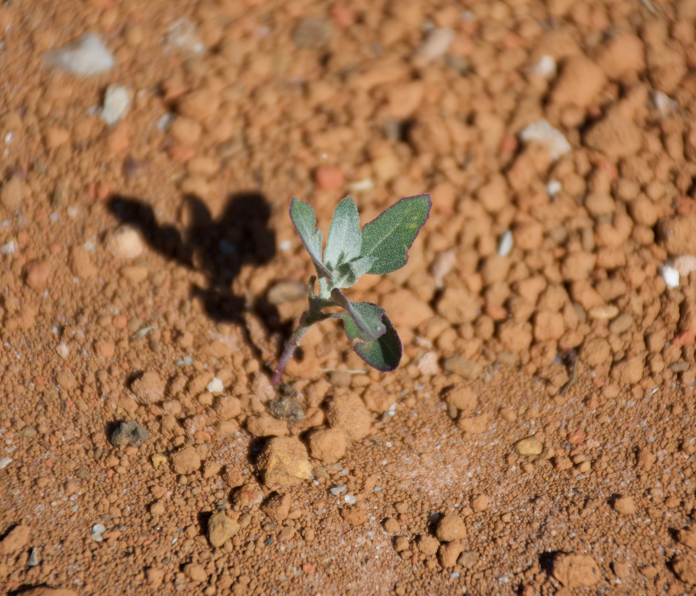
``` 
]


.pull-right[
```{r echo=FALSE, out.width=400, fig.align='center'}
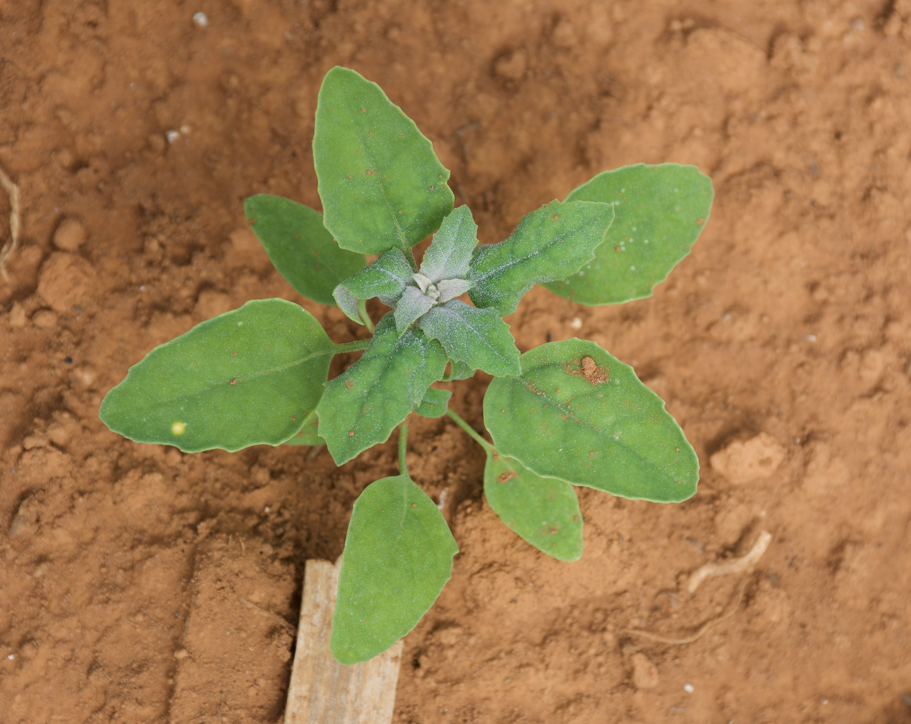
``` 

```{r echo=FALSE, out.width=400, fig.align='center'}
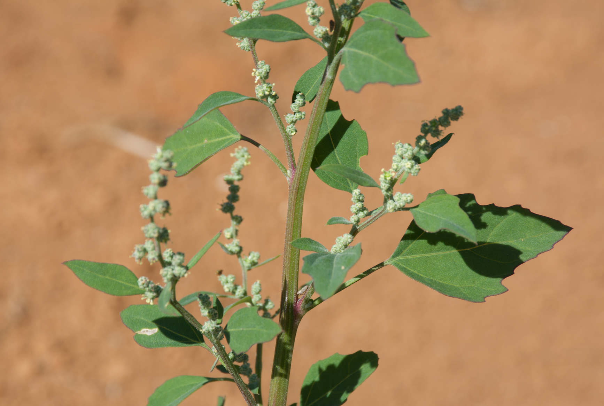
``` 
]


