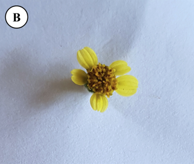
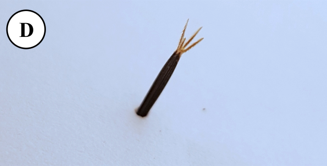
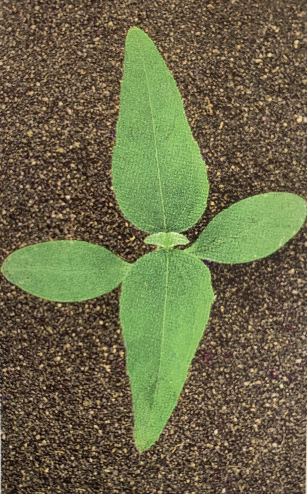

```{r setup, include=FALSE}
options(htmltools.dir.version = FALSE)
knitr::opts_chunk$set(
  echo = FALSE,
  fig.align = "center",
  message = FALSE,
  warning = FALSE,
  cache = TRUE
)

htmltools::tagList(rmarkdown::html_dependency_font_awesome()) #show twitter logo
```


class: inverse

## Asteraceae

### Características

.pull-left[
- **Ciclos de vida**: anual, bianual e perenes

- **Caules**: geralmente pilosa e ásperas

- **Folhas**: na maioria das vezes alternadas, ocasionalmente opostas, ásperas, peludas, às vezes espinhosas, geralmente simples, inteiras ou lobadas, sem estípulas

- **Flores**: geralmente agrupadas em cabeças

- **Frutos**:  aquênios

- **Variedades cultivadas**: girassol, alface, alcachofra, chicória, açafrão, crisântemos, ásteres
]

Principalmente herbáceas, mas também arbustos. Cerca de 20.000 espécies

.pull-right[


```{r echo=FALSE, out.width=250, fig.align='center'}
knitr::include_graphics("https://upload.wikimedia.org/wikipedia/commons/thumb/c/c1/Asteracea_poster_3.jpg/1200px-Asteracea_poster_3.jpg")
``` 
]

---

## Asteraceae

```{r echo=FALSE, out.width=500, fig.align='center'}
knitr::include_graphics("https://media.giphy.com/media/pJSKQUb0ytPKo/giphy.gif")
``` 


---

## *Acanthospermum australe*

#### Nome comum: carrapicho rasteiro

.pull-left[
- **Ciclo de vida**: anual, herbácea - prostrada e ramificada

- **Caule**: pubescente, pigmentado

- **Folhas**: cartáceas, de lâmina pubescente e margens muito variáveis - 1 a 4 cm de comprimento

- **Reprodução**: Sementes
]

.pull-right[

```{r echo=FALSE, out.width=300, fig.align='center'}
knitr::include_graphics("https://http2.mlstatic.com/carrapicho-rasteiro-acanthospermum-australe-20-sementes-D_NQ_NP_621905-MLB25084514538_102016-F.jpg")
``` 
]

---

.pull-left[
```{r echo=FALSE, out.width=300, fig.align='center'}
knitr::include_graphics("https://newfs.s3.amazonaws.com/taxon-images-1000s1000/Asteraceae/acanthospermum-australe-st-jkunzer.jpg")
``` 

```{r echo=FALSE, out.width=300, fig.align='center'}
knitr::include_graphics("https://live.staticflickr.com/1475/25358857861_a2b0f905b8_b.jpg")
``` 
]


.pull-right[
```{r echo=FALSE, out.width=300, fig.align='center'}
knitr::include_graphics("https://www.agrolink.com.br/upload/problemas/Acanthospermum%20australe1.jpg")
``` 

```{r echo=FALSE, out.width=250, fig.align='center'}
knitr::include_graphics("https://curapelasplantas.com.br/wp-content/uploads/2018/05/Carrapicho-rasteiro-3.jpg")
``` 

]


---

## *Acanthospermum hispidum*

#### Nome comum: carrapicho-de-carneiro

.pull-left[
- **Ciclo de vida**: anual, herbácea - espinhenta, ereta, ramificada - 30-100 cm de altura

- **Caule**: denso-pubescente, nós curtos

- **Folhas**: pubescentes, de 4-12 cm de comprimento

- **Reprodução**: Sementes
]


.pull-right[
```{r echo=FALSE, out.width=300, fig.align='center'}
knitr::include_graphics("https://www.agrolink.com.br/upload/problemas/Acanthospermum_hispidum85.jpg")
``` 

]

---

.pull-left[
```{r echo=FALSE, out.width=300, fig.align='center'}
knitr::include_graphics("https://4.bp.blogspot.com/-ivnPMzSkKdo/W-Z8Trp35BI/AAAAAAAAA6E/OzOxqwLVg8Av0f2tq-UEC4QLfHM9JT-kgCLcBGAs/s1600/acanthospermumhispidum22.jpg")
``` 

```{r echo=FALSE, out.width=300, fig.align='center'}
knitr::include_graphics("https://http2.mlstatic.com/sementes-de-carrapicho-de-carneiro-acanthospermum-hispidum-D_NQ_NP_819367-MLB27081841004_032018-F.jpg")
``` 
]

.pull-right[

```{r echo=FALSE, out.width=300, fig.align='center'}

``` 

```{r echo=FALSE, out.width=300, fig.align='center'}
knitr::include_graphics("https://upload.wikimedia.org/wikipedia/commons/c/c7/Acanthospermum_hispidum_W2_IMG_2208.jpg")
``` 
]

---

class: center, middle

.pull-left[
```{r echo=FALSE, out.width=300, fig.align='center'}
knitr::include_graphics("images/australe_10.jpg")
``` 
*Acanthospermum australe*
]

.pull-right[
```{r echo=FALSE, out.width=300, fig.align='center'}
knitr::include_graphics("images/hispidum.jpg")
``` 
*Acanthospermum hispidum*
]


---

## *Ageratum conyzoides*

#### Nome comum:  mentrasto

.pull-left[
- **Ciclo de vida**: anual, herbácea - aromática, ereta, pouco ramificada, de 30-80 cm de altura

- **Caule**: pubescente, arroxeado

- **Folhas**: membranáceas, denso-pubescentes, de 4-9 cm comprimento

- **Reprodução**: Sementes
]

.pull-right[
```{r echo=FALSE, out.width=300, fig.align='center'}

``` 

```{r echo=FALSE, out.width=300, fig.align='center'}

``` 

]
---

.pull-left[
```{r echo=FALSE, out.width=200, fig.align='center'}
knitr::include_graphics("https://newfs.s3.amazonaws.com/taxon-images-1000s1000/Asteraceae/ageratum-conyzoides-ha-kstarr2.jpg")
``` 

```{r echo=FALSE, out.width=200, fig.align='center'}
knitr::include_graphics("https://d2seqvvyy3b8p2.cloudfront.net/89a6526cc7b73191ae4bd38892a1ec6e.jpg")
``` 
]


.pull-right[
```{r echo=FALSE, out.width=300, fig.align='center'}
knitr::include_graphics("https://keys.lucidcentral.org/keys/v3/daisy_fruit/key/daisy_fruit/Media/Html/assets/image/Ageratum_conyzoides/Ageratum_conyzoides_CANB466587_fourseeds.jpg")
``` 

```{r echo=FALSE, out.width=300, fig.align='center'}
knitr::include_graphics("https://keys.lucidcentral.org/keys/v3/eafrinet/weeds/key/weeds/Media/Html/images/Ageratum_conyzoides_(Billygoat_Weed)/ageratum_conyzoides_conyzoides22.jpg")
``` 

]


---

## *Bidens pilosa*

#### Nome comum: picão preto

.pull-left[
- **Ciclo de vida**: anual, herbácea - aromática, ereta, pouco ramificada, de 40-120 cm de altura

- **Caule**: pubescente, arroxeado

- **Folhas**: folhas inteiras ou 3-5 lobadas, membranáceas

- **Reprodução**: Sementes
]

.pull-right[
```{r echo=FALSE, out.width=300, fig.align='center'}
knitr::include_graphics("https://http2.mlstatic.com/muda-de-pico-preto-carrapicho-bidens-pilosa-D_NQ_NP_708580-MLB40720885350_022020-F.jpg")
``` 
]


---
.pull-left[
```{r echo=FALSE, out.width=300, fig.align='center'}
knitr::include_graphics("images/pilosa_01.png")
``` 

```{r echo=FALSE, out.width=300, fig.align='center'}
knitr::include_graphics("https://phytus.s3.amazonaws.com/apps/clubephytus-api/ckeditor_upload/2019-10-17-14-01_1.png")
```

]


.pull-right[
```{r echo=FALSE, out.width=300, fig.align='center'}
knitr::include_graphics("images/pilosa_02.png")
``` 

```{r echo=FALSE, out.width=300, fig.align='center'}
knitr::include_graphics("images/pilosa_03.png")
``` 

```{r echo=FALSE, out.width=300, fig.align='center'}
knitr::include_graphics("https://live.staticflickr.com/5175/5448535490_f52504f807_b.jpg")
```

]

---

## *Bidens subalternans*

#### Nome comum: picão 


.pull-left[
- **Ciclo de vida**: anual, herbácea - aromática, ereta, pouco ramificada, de 30-120 cm de altura

- **Caule**: caule levemente quadrático

- **Folhas**: folhas inteiras ou 3-5 lobadas, membranáceas

- **Reprodução**: Sementes

- 4 aristas no aquênio
]

.pull-right[
```{r echo=FALSE, out.width=300, fig.align='center'}

``` 
]


---
.pull-left[
```{r echo=FALSE, out.width=300, fig.align='center'}

``` 

```{r echo=FALSE, out.width=300, fig.align='center'}
knitr::include_graphics("https://apps.lucidcentral.org/plants_se_nsw/images/entities/bidens_subalternans/bidens_subalternans_cc_oxley_wild_rs_np2_john_tann.jpg")
``` 
]


.pull-right[
```{r echo=FALSE, out.width=300, fig.align='center'}

``` 

```{r echo=FALSE, out.width=300, fig.align='center'}

``` 

```{r echo=FALSE, out.width=300, fig.align='center'}
knitr::include_graphics("images/subalternans_10.png")
```
]

---

## Diferença entre *Bidens* spp.

```{r echo=FALSE, out.width=700, fig.align='center'}
knitr::include_graphics("https://maissoja.com.br/wp-content/uploads/2019/09/Texto-1.png")
```


---

## *Blainvillea dichotoma*

#### Nome comum: erva-palha

.pull-left[
- **Ciclo de vida**: anual, herbácea, ereta, pouco ramificada, de 80-160 cm de altura

- **Caule**: pubescente, pigmentado

- **Folhas**: pubescente, discolores, membranácea

- **Reprodução**: Sementes

]

.pull-right[
```{r echo=FALSE, out.width=300, fig.align='center'}
knitr::include_graphics("https://www.agrolink.com.br/upload/problemas/Blainvillea%20latifolia3.jpg")
``` 
]

---
.pull-left[
```{r echo=FALSE, out.width=300, fig.align='center'}
knitr::include_graphics("https://www.agrolink.com.br/upload/problemas/Blainvillea%20latifolia5.JPG")
``` 

```{r echo=FALSE, out.width=300, fig.align='center'}
knitr::include_graphics("https://www.agrolink.com.br/upload/problemas/Blainvillea%20latifolia2.jpg")
``` 
]


.pull-right[
```{r echo=FALSE, out.width=300, fig.align='center'}
knitr::include_graphics("https://www.agrolink.com.br/upload/problemas/Blainvillea%20latifolia.jpg")
``` 

```{r echo=FALSE, out.width=230, fig.align='center'}

``` 

]

---

## *Conyza canadensis*

#### Nome comum: buva

.pull-left[
- **Ciclo de vida**: anual, herbácea - quase sem ramificação, podendo chegar até 120 cm de altura

- **Caule**: pubescente, caule muito enfolhado

- **Folhas**: pubescente, margem denticulata

- **Inflorescência**: grande em comparação a outras *Conyza* ssp.

]


.pull-right[
```{r echo=FALSE, out.width=300, fig.align='center'}
knitr::include_graphics("https://plants.sc.egov.usda.gov/gallery/large/coca5_007_lvp.jpg")
```
]

---

.pull-left[
```{r echo=FALSE, out.width=400, fig.align='center'}
knitr::include_graphics("https://blogs.cornell.edu/weedid/files/2019/07/conyzadetails.jpg")
```

```{r echo=FALSE, out.width=400, fig.align='center'}
knitr::include_graphics("https://s3.amazonaws.com/eit-planttoolbox-prod/media/images/Conyza_rosette.jpg")
```
]


.pull-right[

```{r echo=FALSE, out.width=400, fig.align='center'}
knitr::include_graphics("https://extension.umass.edu/landscape/sites/landscape/files/weeds/stems/erica6962w.jpg")
```

```{r echo=FALSE, out.width=400, fig.align='center'}
knitr::include_graphics("https://img.plantsam.com/wp-content/uploads/2016/07/Conyza-canadensis.jpg")
```
]

---

## *Conyza bonariensis*

#### Nome comum: buva

.pull-left[
- **Ciclo de vida**: anual, herbácea - ereta, pode atingir até 180 cm

- **Caule**: pubescente, caule muito enfolhado

- **Folhas**: pubescente, margem denticulata

- **Inflorescência**: grande em comparação a outras *Conyza* ssp.

]


.pull-right[
```{r echo=FALSE, out.width=300, fig.align='center'}
knitr::include_graphics("https://upload.wikimedia.org/wikipedia/commons/thumb/d/d3/Conyza_bonariensis_2.jpg/1200px-Conyza_bonariensis_2.jpg")
```
]

---

.pull-left[
```{r echo=FALSE, out.width=300, fig.align='center'}
knitr::include_graphics("https://keys.lucidcentral.org/keys/v3/daisy_fruit/key/daisy_fruit/Media/Html/assets/image/Conyza_bonariensis/Conyza_bonariensis_Crisp_3969_single_seed_16x_small.jpg")
```

```{r echo=FALSE, out.width=400, fig.align='center'}
knitr::include_graphics("images/bonariensis_03.png")
```
]


.pull-right[

```{r echo=FALSE, out.width=400, fig.align='center'}

```

```{r echo=FALSE, out.width=400, fig.align='center'}
knitr::include_graphics("images/bonariensis_01.png")
```
]

---

## *Conyza sumatrensis*

#### Nome comum: buva

.pull-left[

- **Ciclo de vida**: anual, herbácea - relativamente grande e chega a atingir 2 m de altura

- **Caule**: 

- **Folhas**: pubescente, folhas dentadas

- **Inflorescência**: relativamente pequenas (5-10 mm de diâmetro e 4-6 mm de comprimento) e esbranquiçadas quando maduras (ou seja, muitas vezes têm uma leve coloração amarelada ou acastanhada


]


.pull-right[
```{r echo=FALSE, out.width=300, fig.align='center'}
knitr::include_graphics("https://www.agrolink.com.br/upload/problemas/conyza%20sumatrensis7.jpg")
```
]

---

.pull-left[
```{r echo=FALSE, out.width=300, fig.align='center'}
knitr::include_graphics("https://www.agrolink.com.br/upload/problemas/conyza%20sumatrensis3.jpg")
```

```{r echo=FALSE, out.width=250, fig.align='center'}
knitr::include_graphics("https://www.agrolink.com.br/upload/problemas/conyza%20sumatrensis1.jpg")
```
]


.pull-right[

```{r echo=FALSE, out.width=300, fig.align='center'}
knitr::include_graphics("https://www.agrolink.com.br/upload/problemas/conyza%20sumatrensis5.jpg")
```

```{r echo=FALSE, out.width=400, fig.align='center'}
knitr::include_graphics("https://www.agrolink.com.br/upload/problemas/conyza%20sumatrensis6.jpg")
```
]


---

.pull-left[
*C. canadensis*
```{r echo=FALSE, out.width=400, fig.align='center'}
knitr::include_graphics("https://plants.sc.egov.usda.gov/gallery/pubs/coca5_002_pvp.jpg")
```
]


.pull-right[
*C. bonariensis*
```{r echo=FALSE, out.width=400, fig.align='center'}
knitr::include_graphics("images/bonariensis_10.jpg")
```
]

---

## *Emilia sonchifolia*

#### Nome comum: falsa-serralha

.pull-left[
- **Ciclo de vida**: anual, herbácea - 15-60 cm de altura

- **Caule**: esverdeados e redondos em seção transversal e glabros ou esparsamente pubescentes

- **Folhas**: as folhas inferiores estão dispostas em uma roseta - as folhas que são produzidas ao longo do caules são dispostas alternadamente, têm bases que prendem a haste e muitas vezes não têm talos (isto é, sésseis) - pubescentes
]


.pull-right[
```{r echo=FALSE, out.width=400, fig.align='center'}
knitr::include_graphics("https://www.agrolink.com.br/upload/problemas/Emilia_sonchifolia85.jpg")
```
]


---

.pull-left[
```{r echo=FALSE, out.width=400, fig.align='center'}
knitr::include_graphics("https://www.agrolink.com.br/upload/problemas/Emilia_sonchifolia81.jpg")
```

```{r echo=FALSE, out.width=400, fig.align='center'}
knitr::include_graphics("https://upload.wikimedia.org/wikipedia/commons/f/f3/Emilia_sonchifolia_leaf_on_stem1_%2814043760732%29.jpg
")
```
]


.pull-right[
```{r echo=FALSE, out.width=200, fig.align='center'}
knitr::include_graphics("images/tasselflower.png")
```

```{r echo=FALSE, out.width=400, fig.align='center'}
knitr::include_graphics("https://weeds.brisbane.qld.gov.au/sites/default/files/styles/large/public/images/emilia_sonchifolia_javanica21.jpg?itok=pPbyWUb5")
```

]


---

## *Sonchus oleraceus*

#### Nome comum: serralha

.pull-left[
- **Ciclo de vida**: anual - bianual, herbácea -  40-150 cm de altura - látex branco em todas as partes da planta

- **Caule**: produz látex

- **Folhas**: as margens das folhas apresentam pequenos dentes pontiagudos moles
]


.pull-right[
```{r echo=FALSE, out.width=250, fig.align='center'}
knitr::include_graphics("https://www.panteek.com/CurtisFlora/images/cfl53-261.jpg")
```
]

---

.pull-left[
```{r echo=FALSE, out.width=400, fig.align='center'}
knitr::include_graphics("https://plants.sc.egov.usda.gov/gallery/large/sool_003_lhp.jpg")
```

```{r echo=FALSE, out.width=400, fig.align='center'}
knitr::include_graphics("https://upload.wikimedia.org/wikipedia/commons/5/5f/Sonchus_oleraceus_2018-05-01_9904.jpg")
```

]


.pull-right[
```{r echo=FALSE, out.width=350, fig.align='center'}
knitr::include_graphics("https://keyserver.lucidcentral.org/weeds/data/media/Images/sonchus_oleraceus/sonchusoleraceus39.jpg")
```

```{r echo=FALSE, out.width=400, fig.align='center'}
knitr::include_graphics("https://candidegardening.com/img/623a76ff-c64a-4d63-afa2-8249b909f3be/cropped/648x520")
```
]

---

.pull-left[
```{r echo=FALSE, out.width=350, fig.align='center'}

```
falsa-serralha
]


.pull-right[
```{r echo=FALSE, out.width=350, fig.align='center'}
knitr::include_graphics("images/serralha.jpg")
```
serralha
]


---

## *Galinsoga quadriradiata*

#### Nome comum: botão-de-ouro

.pull-left[
- **Ciclo de vida**: anual, herbácea - ereta, muito ramificada

- **Caule**: pubescente

- **Folhas**: opostas, em forma de ovo a triangulares, com margens grosseiramente dentadas, pontas afiadas e superfície superior da folha densamente pubescente

- **Inflorescência**: numerosas pequenas flores são formadas em cachos terminais e axilares

- **Reprodução**: Sementes
]


.pull-right[
```{r echo=FALSE, out.width=400, fig.align='center'}
knitr::include_graphics("https://appi.be/uploads/files/5437283-galinsoga.jpg")
```
]

---

.pull-left[
```{r echo=FALSE, out.width=400, fig.align='center'}
knitr::include_graphics("https://i.pinimg.com/originals/39/e0/5c/39e05c674df705de88b4da1956e00a65.jpg")
```

```{r echo=FALSE, out.width=300, fig.align='center'}
knitr::include_graphics("https://www.canr.msu.edu/pestid/uploads/images/Hairy-galinsoga-plant.jpg")
```
]


.pull-right[
```{r echo=FALSE, out.width=250, fig.align='center'}
knitr::include_graphics("https://newfs.s3.amazonaws.com/taxon-images-1000s1000/Asteraceae/galinsoga-quadriradiata-fr-atal.jpg")
```

```{r echo=FALSE, out.width=250, fig.align='center'}
knitr::include_graphics("https://newfs.s3.amazonaws.com/taxon-images-1000s1000/Asteraceae/galinsoga-quadriradiata-st-atal.jpg")
```
]


---


## *Parthenium hysterophorus*

#### Nome comum: losna-branca

.pull-left[
- **Ciclo de vida**: anual, ereta, herbácea, pubescente, com 50-90 cm de altura

- **Caule**: pouco ramificado na parte inferior e muito ramificado na superior

- **Folhas**: alternadas, simples e de limbo com margens recortadas

- **Dispersão**: aquênio
]


.pull-right[
```{r echo=FALSE, out.width=250, fig.align='center'}
knitr::include_graphics("images/losna_branca.jpg")
```
]


---

.pull-left[
```{r echo=FALSE, out.width=400, fig.align='center'}
knitr::include_graphics("https://static.inaturalist.org/photos/16908937/large.jpeg?1525048232")
```

```{r echo=FALSE, out.width=400, fig.align='center'}
knitr::include_graphics("https://nt.gov.au/__data/assets/image/0016/230209/parthenium-fruit-and-seeds.jpg")
```

]


.pull-right[
```{r echo=FALSE, out.width=350, fig.align='center'}
knitr::include_graphics("https://keys.lucidcentral.org/keys/v3/eafrinet/weeds/key/weeds/Media/Html/images/Parthenium_hysterophorus_(Parthenium_Weed)/parthenium_hysterophorus51.jpg")
```

```{r echo=FALSE, out.width=400, fig.align='center'}
knitr::include_graphics("https://keys.lucidcentral.org/keys/v3/eafrinet/weeds/key/weeds/Media/Html/images/Parthenium_hysterophorus_(Parthenium_Weed)/parthenium_hysterophorus31.jpg")
```
]


---

class: inverse

## Euphorbiaceae

### Características

.pull-left[
- **Ciclo de Vida**: anuais, perenes, arbustos ou árvores - compreende cerca de 7500 espécies e 275 gêneros de plantas com flores distribuídas principalmente nos trópicos

- Muitas espécies contêm látex leitoso e algumas são úteis como fonte de óleo ou cera.

- **Folhas**: são alternadas, raramente opostas, com estípulas.


- **Plantas cultivadas**: mamona, mandioca, seringueira
 

]


.pull-right[
```{r echo=FALSE, out.width=250, fig.align='center'}
knitr::include_graphics("https://upload.wikimedia.org/wikipedia/commons/2/2c/Mamona_%28Victor_Hugo_Almeida%29.jpg")
``` 
]

---


- **Flores**: unissexuais e nascem em um aglomerado característico conhecido como cíatia

- **Fruto**: geralmente é um esquizocarpo, mas às vezes uma drupa

.pull-left[
```{r echo=FALSE, out.width=500, fig.align='center'}
knitr::include_graphics("https://upload.wikimedia.org/wikipedia/commons/7/7c/E_baylissii_ies.jpg")
``` 
]

.pull-right[
```{r echo=FALSE, out.width=500, fig.align='center'}
knitr::include_graphics("https://upload.wikimedia.org/wikipedia/commons/thumb/5/5b/Euphorbia_characias_flowers.jpg/1280px-Euphorbia_characias_flowers.jpg")
``` 
]

---


## *Euphorbia heterophylla*

#### **Nome comum**: amendoim bravo, leiteira

.pull-left[

**Ciclo de vida**: anual

**Folhas**: inferiores: alternadas - superiores: opostas e geralmente têm uma base esbranquiçada ou vermelha brilhante - glabras ou levemente pubescente

**Caules**: exala um látex branco leitoso e tóxico

**Reprodução**: sementes
]


.pull-right[
```{r echo=FALSE, out.width=250, fig.align='center'}
knitr::include_graphics("images/leiteira_10.png")
``` 

```{r echo=FALSE, out.width=250, fig.align='center'}
knitr::include_graphics("https://cnas-re.uog.edu/wp-content/uploads/2015/10/euph-heterophylla-seed1.jpg")
``` 
]

---

.pull-left[
```{r echo=FALSE, out.width=400, fig.align='center'}
knitr::include_graphics("http://www.sites.encode.com.br/eou-mrm/rrplus/wp-content/uploads/2017/06/2014092612522488986-600x470.jpg")
``` 

```{r echo=FALSE, out.width=350, fig.align='center'}

``` 
]

.pull-right[
```{r echo=FALSE, out.width=150, fig.align='center'}
knitr::include_graphics("https://www.agrolink.com.br/upload/problemas/Euphorbia_heterophylla95.jpg")
``` 

```{r echo=FALSE, out.width=250, fig.align='center'}
knitr::include_graphics("https://www.agrolink.com.br/upload/problemas/Euphorbia_heterophylla81.jpg")
``` 

```{r echo=FALSE, out.width=250, fig.align='center'}

``` 
]


---

## *Euphorbia hirta*

#### **Nome comum**: erva de santa luzia

.pull-left[

**Ciclo de vida**: anual, prostrada a ascendente, com ramos de 50 cm de comprimento; planta pilosa inteira, incluindo inflorescência e cápsulas

**Folhas**:  simples, opostas, assimétricas, verdes com intensa pigmentação avermelhada, margem serreada, pecíolo muito curto e avermelhado

**Caule**: prostrado, verde com manchas avermelhadas, lactífero e com pilosidade branc

**Flores**: masculinas, abaixo das femininas, em número de 2 a 8, constituídas
apenas pelos estames
]


.pull-right[
```{r echo=FALSE, out.width=300, fig.align='center'}
knitr::include_graphics("https://storage.googleapis.com/powop-assets/PPA/0551_0600/h0577c_fullsize.jpg")
``` 

**Habitat**: horticultura, fruticultura, margens de rodovias e no meio urbano, pode ser facilmente encontrada em jardins, terrenos baldios e ao longo das fendas nas calçadas

]

---

.pull-left[
```{r echo=FALSE, out.width=400, fig.align='center'}
knitr::include_graphics("http://d2seqvvyy3b8p2.cloudfront.net/d93ba081bef91606929195c1a1164727.jpg")
``` 

```{r echo=FALSE, out.width=250, fig.align='center'}
knitr::include_graphics("https://storage.googleapis.com/powop-assets/PPA/0551_0600/h0577l_fullsize.jpg")
``` 

```{r echo=FALSE, out.width=250, fig.align='center'}
knitr::include_graphics("https://storage.googleapis.com/powop-assets/PPA/0551_0600/h0577b_fullsize.jpg")
``` 

]

.pull-right[
```{r echo=FALSE, out.width=350, fig.align='center'}
knitr::include_graphics("http://d2seqvvyy3b8p2.cloudfront.net/6b6dc062f9ea8db75c3661167168565b.jpg")
``` 

```{r echo=FALSE, out.width=200, fig.align='center'}
knitr::include_graphics("https://storage.googleapis.com/powop-assets/PPA/0551_0600/h0577d_fullsize.jpg")
``` 
]


---

## *Ricinus communis*

#### **Nome comum**: mamona

.pull-left[

**Ciclo de vida**: perene, arbustiva - 2 a 4 m de altura

**Folhas**: alternadas, membranáceas - glabra

**Caules**: branco-cerosoe fistulado - glabra

**Reprodução**: sementes
]


.pull-right[
```{r echo=FALSE, out.width=300, fig.align='center'}
knitr::include_graphics("https://upload.wikimedia.org/wikipedia/commons/thumb/7/73/Illustration_Ricinus_communis0.jpg/1200px-Illustration_Ricinus_communis0.jpg")
``` 
]

---

.pull-left[
```{r echo=FALSE, out.width=400, fig.align='center'}
knitr::include_graphics("https://weeds.brisbane.qld.gov.au/sites/default/files/styles/large/public/images/ricinus_communis2.jpg?itok=maDb34_0")
``` 

```{r echo=FALSE, out.width=400, fig.align='center'}
knitr::include_graphics("https://weeds.brisbane.qld.gov.au/sites/default/files/styles/large/public/images/ricinus_communis14_-_fks.jpg?itok=Uy_AJqlC")
``` 


]

.pull-right[
```{r echo=FALSE, out.width=400, fig.align='center'}
knitr::include_graphics("https://weeds.brisbane.qld.gov.au/sites/default/files/styles/large/public/images/ricinus_communis6.jpg?itok=uCEcX6qH")
``` 

```{r echo=FALSE, out.width=400, fig.align='center'}
knitr::include_graphics("https://weeds.brisbane.qld.gov.au/sites/default/files/styles/large/public/images/ricinus_communis3.jpg?itok=ipdUunRV")
``` 
]


