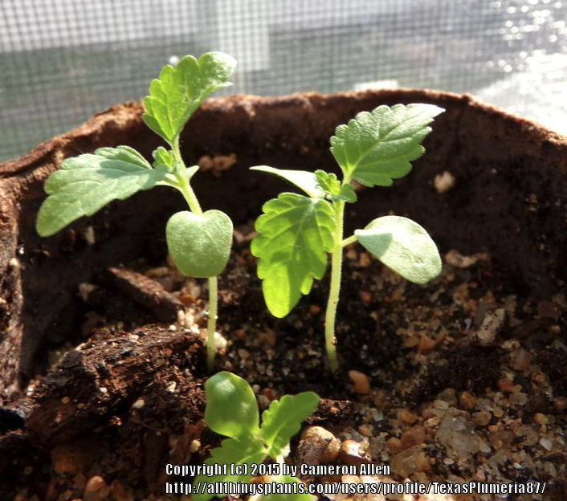
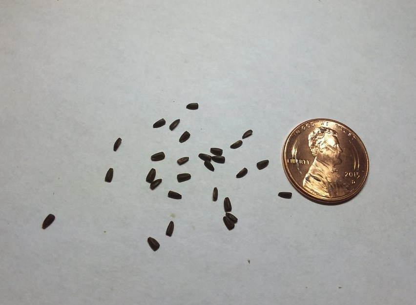
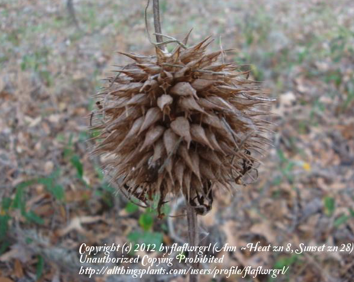

```{r setup, include=FALSE}
options(htmltools.dir.version = FALSE)
knitr::opts_chunk$set(
  echo = FALSE,
  fig.align = "center",
  message = FALSE,
  warning = FALSE,
  cache = TRUE
)

htmltools::tagList(rmarkdown::html_dependency_font_awesome()) #show twitter logo
```


## Cucurbitaceae

### Características

.pull-left[

- **Frutos**: formados pela maioria das espécies são peponídeos carnosos,

- **Inflorescência**: axilares, isoladas ou reunidas em inflorescência e sempre de sexo separado na mesma planta ou em plantas diferentes

- **Caule**: rastejante ou trepador 

- **Folhas**: alternadas, com o limbo recortado em lobos, pouco ou muito profundos
]

.pull-right[
```{r echo=FALSE, out.width=250, fig.align='center'}
knitr::include_graphics("https://upload.wikimedia.org/wikipedia/commons/thumb/2/2e/Luffa_operculata_01.JPG/253px-Luffa_operculata_01.JPG")
``` 

- **Variedades cultivadas**: pepinos, abóboras, melões, cabaças
]

---

## *Cucumis anguria*

#### Nome comum: cornichão-das-antilhas, maxixe, maxixe-bravo

.pull-left[

- **Ciclo de vida:** anual

- **Folha:** alternadas com pecíolos também com linhas de pelos e com uma gavinha, limbo piloso, profundamente recortado em aproximadamente 5 lobos principais

- **Inflorescência:** masculinas e femininas separadas na mesma planta

- **Caule:** prostrado ou trepador, verde com linhas de pelos eriçados nas projeções angulosas


]

.pull-right[
```{r echo=FALSE, out.width=200, fig.align='center'}
knitr::include_graphics("https://upload.wikimedia.org/wikipedia/commons/thumb/0/0d/Cucumis_anguria.JPG/1200px-Cucumis_anguria.JPG")
``` 

- **Habitat:** olericultura

]

---

.pull-left[
```{r echo=FALSE, out.width=500, fig.align='center'}
knitr::include_graphics("https://live.staticflickr.com/1745/27699801227_848f1fb409_b.jpg")
``` 

```{r echo=FALSE, out.width=500, fig.align='center'}
knitr::include_graphics("https://plants.usda.gov/gallery/standard/cuan_001_shp.jpg")
``` 
]

.pull-right[
```{r echo=FALSE, out.width=500, fig.align='center'}
knitr::include_graphics("https://upload.wikimedia.org/wikipedia/commons/c/c1/Cucumis_anguria%2C_Flower.jpg")
``` 

```{r echo=FALSE, out.width=500, fig.align='center'}
knitr::include_graphics("https://i.pinimg.com/474x/1b/7a/b3/1b7ab383b60109e5e64159ec71ea48f1.jpg")
``` 
]


---

## Commelinaceae

### Características

.pull-left[

- Plantas anuais ou perenes

- Caules carnosos, eretos ou prostrados e radicantes ao longo dos nós

- Folhas simples com bainha fechada e flores trímeras protegidas por brácteas

- Representada no Brasil por 14 gêneros nativos, alguns amplamente distribuídos e frequentemente instalados em áreas cultivadas e de difícil controle
]


.pull-right[


```{r echo=FALSE, out.width=350, fig.align='center'}
knitr::include_graphics("https://ars.els-cdn.com/content/image/1-s2.0-S2287884X18303741-gr1.jpg")
``` 
]

---

## *Commelina benghalensis*

#### Nome comum: trapoeraba

.pull-left[

- **Ciclo de vida:** herbácea perene

- **Folha:** simples, alternadas, sésseis ou curtamente pecioladas, bainha envolvendo o entrenó, aberta de um lado, estriada de vermelho e também pilosa

- **Cotilédones:** 

- **Caule:** caule rizomatoso e caule aéreo ereto a decumbente, muito ramificado, cilíndrico, verde e com esparsa pilosidade

- **Propagação**: fragmentação do rizoma e do caule aéreo e
algumas vezes por sementes

]

.pull-right[
```{r echo=FALSE, out.width=350, fig.align='center'}
knitr::include_graphics("https://upload.wikimedia.org/wikipedia/commons/f/f5/Commelina_benghalensis_L._%289076580538%29.jpg")
``` 

```{r echo=FALSE, out.width=350, fig.align='center'}
knitr::include_graphics("https://cnas-re.uog.edu/wp-content/uploads/2015/10/commelina-leaf.jpg")
``` 

]

---

.pull-left[
```{r echo=FALSE, out.width=300, fig.align='center'}
knitr::include_graphics("https://www.agrolink.com.br/upload/problemas/Commelina_benghalensis5.jpg")
``` 

```{r echo=FALSE, out.width=300, fig.align='center'}
knitr::include_graphics("https://www.agrolink.com.br/upload/problemas/Commelina%20benghalensis.jpg")
``` 
]

.pull-right[
```{r echo=FALSE, out.width=500, fig.align='center'}
knitr::include_graphics("https://cnas-re.uog.edu/wp-content/uploads/2015/10/Commelinaroots.jpg")
``` 

```{r echo=FALSE, out.width=250, fig.align='center'}
knitr::include_graphics("https://cnas-re.uog.edu/wp-content/uploads/2015/10/Commelinanode.jpg")
``` 
]


---

## Lamiaceae

### Características

.pull-left[

- Planta aromáticas

- Porte herbáceo a arbustivo

- Caules ou ramos quadrangulares

- Folhas opostas a verticiladas

- Inflorescência constituída por glomérulos, caracterizados por terem formato globoso, e flores sésseis dispostas de forma condensada
]


.pull-right[


```{r echo=FALSE, out.width=350, fig.align='center'}
knitr::include_graphics("https://upload.wikimedia.org/wikipedia/commons/a/a8/Lamium_purpureum_jamestown1.jpg")
``` 

- **Espécies cultivadas**: menta, manjericão

]


---

## *Leonotis nepetifolia*

#### Nome comum: cauda-de-leão, coração-de-frade, rubim

.pull-left[

- **Ciclo de vida:** herbácea anual

- **Folha:** opostas cruzadas, longo-pecioladas. Limbo com formato ovalado

- **Inflorescência** tipo glomérulo, localizado ao redor do caule na porção superior da planta

- **Caule:** ereto, verde, quadrangular, canaliculado, cujos canalículos possuem linhas de coloração verde-escura bem visíveis


]

.pull-right[
```{r echo=FALSE, out.width=350, fig.align='center'}
knitr::include_graphics("https://alchetron.com/cdn/leonotis-nepetifolia-ab62da91-45c9-41f1-8cb5-ed2ce4fc3a3-resize-750.jpg")
``` 

- **Habitat:** áreas agrícolas

]

---

.pull-left[
```{r echo=FALSE, out.width=500, fig.align='center'}
knitr::include_graphics("https://upload.wikimedia.org/wikipedia/commons/thumb/5/58/Starr-141025-2422-Leonotis_nepetifolia-leaves-Kawela_Bridge-Molokai_%2825129409182%29.jpg/800px-Starr-141025-2422-Leonotis_nepetifolia-leaves-Kawela_Bridge-Molokai_%2825129409182%29.jpg")
``` 

```{r echo=FALSE, out.width=500, fig.align='center'}

``` 
]

.pull-right[
```{r echo=FALSE, out.width=500, fig.align='center'}

``` 

```{r echo=FALSE, out.width=500, fig.align='center'}

``` 
]


---

---

## *Leonurus sibiricus*

#### Nome comum: rubim, erva-de-macaé

.pull-left[

- **Ciclo de vida:** herbácea anual ou bianual - aromática

- **Folha:** opostas, profundamente partidas e pubescentes em ambas as partes

- **Inflorescência** 

- **Caule:** quadrangular


]

.pull-right[
```{r echo=FALSE, out.width=350, fig.align='center'}
knitr::include_graphics("https://upload.wikimedia.org/wikipedia/commons/thumb/0/0a/Leonurus_sibiricus.jpg/1200px-Leonurus_sibiricus.jpg")
``` 

- **Habitat:** áreas agrícolas

]

---

.pull-left[
```{r echo=FALSE, out.width=500, fig.align='center'}
knitr::include_graphics("https://upload.wikimedia.org/wikipedia/commons/0/01/Leonurus_sibiricus%2C_known_as_Motherwort_or_as_Honeyweed_%2810498745695%29.jpg")
``` 

```{r echo=FALSE, out.width=500, fig.align='center'}
knitr::include_graphics("http://luirig.altervista.org/cpm/albums/fnam08/fnam3668.jpg")
``` 
]

.pull-right[
```{r echo=FALSE, out.width=500, fig.align='center'}
knitr::include_graphics("http://luirig.altervista.org/cpm/albums/bot-hawaii18/08805-Leonurus-sibiricus.jpg")
``` 

```{r echo=FALSE, out.width=500, fig.align='center'}
knitr::include_graphics("http://luirig.altervista.org/flora/maps/jpgcname.php?recn=157368&pid=119782&title=Mehaziki")
``` 
]

---

## Apiaceae

### Características

.pull-left[

- **Ciclo de vida**: principalmente bianual ou perene

- **Aparência**: arbustos - geralmente aromáticos com hastes ocas; folhas de samambaia

- **Folhas**: alternadamente, pinnately divididas

- **Flores**: dispostas em umbelas; as flores são pequenas e geralmente radiais

- **Frutos**: divididos ao meio, cada metade com uma semente

- **Cultivado**: cenoura, salsa
]

.pull-right[
```{r echo=FALSE, out.width=250, fig.align='center'}
knitr::include_graphics("https://upload.wikimedia.org/wikipedia/commons/8/86/AngelicaSylvestrisInflorescence.jpg")
``` 

```{r echo=FALSE, out.width=250, fig.align='center'}
knitr::include_graphics("https://www.uwgb.edu/biodiversity/herbarium/invasive_species/conmac_leaf03gf600.jpg")
``` 
]


---

## *Conium maculatum*

#### Nome comum: cicuta, funcho-selvagem, salsa-brava

.pull-left[

- **Ciclo de vida:** herbácea a subarbustiva, bianual

- **Folha:** alternadas, inseridas em nós engrossados, pecioladas e com bainha larga. Limbo profundamente recortado

- **Inflorescência** tipo corimbo de umbelas, contendo numerosas flores

- **Caule:** caule ereto, cilíndrico, muito ramificado com manchas avermelhadas


]

.pull-right[
```{r echo=FALSE, out.width=350, fig.align='center'}
knitr::include_graphics("https://www.myminnesotawoods.umn.edu/wp-content/uploads/2017/06/Image-courtesy-K.-Chayka.png")
``` 

- **Habitat:** pomares domésticos e hortas, entre outras áreas antropizadas

]

---

.pull-left[
```{r echo=FALSE, out.width=500, fig.align='center'}
knitr::include_graphics("https://ohiostate.pressbooks.pub/app/uploads/sites/11/2016/07/DSC_0687.jpg")
``` 

```{r echo=FALSE, out.width=500, fig.align='center'}
knitr::include_graphics("https://www.growforagecookferment.com/wp-content/uploads/2018/05/poison-hemlock-leaves-800x480.jpg")
``` 
]

.pull-right[
```{r echo=FALSE, out.width=500, fig.align='center'}
knitr::include_graphics("https://bugwoodcloud.org/images/768x512/5307017.jpg")
``` 

```{r echo=FALSE, out.width=500, fig.align='center'}
knitr::include_graphics("https://www.illinoiswildflowers.info/weeds/photos/ps_hemlock2.jpg")
``` 
]

---

# *Conium maculatum*

- Socrates foi sentenciado a morte com a ingestão de *Conium maculatum*

```{r echo=FALSE, out.width=500, fig.align='center'}
knitr::include_graphics("https://imageproxy.themaven.net//https%3A%2F%2Fwww.history.com%2F.image%2FMTU3ODc5MDg2NDMzNTEwNzI5%2Fdeath-of-socrates.jpg")
``` 


---


## Oxalidacea

### Características

.pull-left[

- Todos os representantes possuem ácido oxálico, conferindo um sabor azedo às folhas, flores e frutos

- Porte herbáceo

- Caule subterrâneo do tipo bulbo e rizomas superficiais,

- Folhas longo-pecioladas com o limbo dividido em 3 segmentos de base estreitada e ápice arredondado

- Inflorescência geralmente umbeliforme. Fruto do tipo cápsula equinada


]

.pull-right[
```{r echo=FALSE, out.width=250, fig.align='center'}
knitr::include_graphics("https://upload.wikimedia.org/wikipedia/commons/thumb/5/5b/Cleaned-Illustration_Oxalis_acetosella.jpg/253px-Cleaned-Illustration_Oxalis_acetosella.jpg")
``` 
]

---

## *Oxalis latifolia*

#### Nome comum: trevo azedo

.pull-left[

- **Ciclo de vida:** herbácea perene

- **Folha:** longo pecíolo, geralmente de coloração avermelhada, encimado pelo limbo recortado em 3 segmentos largos, simulando folha composta

- **Inflorescência** do tipo pleiocásio, caracterizada por apresentar um longo eixo, originado a partir do bulbo

- **Caule:** subterrâneo do tipo bulbo escamoso, capaz de originar folhas e estolões


]

.pull-right[
```{r echo=FALSE, out.width=350, fig.align='center'}
knitr::include_graphics("https://upload.wikimedia.org/wikipedia/commons/8/84/Oxalis_latifolia_%28Oxalidaceae%29.jpg")
``` 

- **Habitat:** olericultura, jardins

]

---

.pull-left[
```{r echo=FALSE, out.width=500, fig.align='center'}
knitr::include_graphics("images/oxalis_1.png")
``` 

```{r echo=FALSE, out.width=500, fig.align='center'}
knitr::include_graphics("images/oxalis_2.png")
``` 
]

.pull-right[
```{r echo=FALSE, out.width=500, fig.align='center'}
knitr::include_graphics("images/oxalis_3.png")
``` 

```{r echo=FALSE, out.width=500, fig.align='center'}
knitr::include_graphics("images/oxalis_4.png")
``` 
]


---

## Polygonaceae

### Características

.pull-left[

- Herbáceas e trepadeiras herbáceas

- **Ciclo de vida**: Anuais, bianuais e perenes

- **Folhas**: alternativa, simples, inteira, basal ou caulina

- **Flores**: perfeitas, imperfeitas ou funcionalmente unissexuais

- **Frutas**: aquênio

- Às vezes, estípulas das folhas embainham o caule, formando uma estrutura chamada "ócrea"
]

.pull-right[
```{r echo=FALSE, out.width=250, fig.align='center'}
knitr::include_graphics("https://upload.wikimedia.org/wikipedia/commons/8/8f/Polygonum_persicaria_bgiu.jpg")
``` 
]

---

class: middle

.pull-left[
```{r echo=FALSE, out.width=500, fig.align='center'}
knitr::include_graphics("https://upload.wikimedia.org/wikipedia/commons/9/99/Ocreae_of_a_Persicaria_maculosa_2006-aug-10_Gothenburg_Sweden.jpg")
``` 
]

.pull-right[
**Ócrea**: Bainhas de encontradas onde o pecíolo se liga ao caule
]

---

## *Polygonum convolvulus*

#### Nome comum: cipó-de-veado

.pull-left[

- **ciclo de vida:** herbácea anual

- **Folha:** simples alternadas, pecioladas, glabras, suculentas e com limbo cordiforme

- **Inflorescência:** axilar e terminal do tipo cacho, constituído por numerosas flores de coloração branca

- **Caule:** caule trepador volúvel ou então rasteja sobre o solo


]

.pull-right[
```{r echo=FALSE, out.width=300, fig.align='center'}
knitr::include_graphics("https://neinvasives.com/species/photos/sliders/field-bindweed-04.jpg")
``` 
]

---

.pull-left[
```{r echo=FALSE, out.width=400, fig.align='center'}
knitr::include_graphics("https://www.canr.msu.edu/pestid/uploads/images/Field-bindweed-seedling.jpg")
``` 

```{r echo=FALSE, out.width=400, fig.align='center'}
knitr::include_graphics("https://www.agrolink.com.br/upload/problemas/Polygonum_convolvulus85.jpg")
``` 
]

.pull-right[
```{r echo=FALSE, out.width=300, fig.align='center'}
knitr::include_graphics("https://www.agrolink.com.br/upload/problemas/Polygonum_convolvulus88.jpg")
``` 

```{r echo=FALSE, out.width=250, fig.align='center'}
knitr::include_graphics("https://www.agrolink.com.br/upload/problemas/Polygonum%20convolvulus2.jpg")
``` 
]

---


## *Polygonum persicaria*

#### Nome comum: erva-de-bixo, cataia

.pull-left[

- **ciclo de vida:** herbácea anual

- **Folha:** alternadas simples, curtamente pecioladas, limbo lanceolado, verde, podendo apresentar manchas irregulares mais claras ou mais escuras

- **Inflorescência:** terminal do tipo cacho de espigas longamente pedunculadas

- **Caule:** caule cilíndrico, ereto e com a parte mais velha decumbente, verde com forte pigmentação avermelhada. Ócrea membranácea, branca "pilosa"


]

.pull-right[
```{r echo=FALSE, out.width=350, fig.align='center'}
knitr::include_graphics("https://weedid.missouri.edu/images/images_optimized/2487optimized.jpg")
``` 
]

---

.pull-left[
```{r echo=FALSE, out.width=300, fig.align='center'}
knitr::include_graphics("http://www.canolacouncil.org/media/511332/ladysthumb150.jpg?maxwidth=500&height=500&crop=auto")
``` 

```{r echo=FALSE, out.width=200, fig.align='center'}
knitr::include_graphics("https://weedid.missouri.edu/images/images_optimized/2488optimized.jpg")
``` 
]

.pull-right[
```{r echo=FALSE, out.width=300, fig.align='center'}
knitr::include_graphics("https://m.farms.com/Portals/0/lady-1-3a.jpg")
``` 

```{r echo=FALSE, out.width=370, fig.align='center'}
knitr::include_graphics("https://weedid.missouri.edu/images/images_optimized/2486optimized.jpg")
``` 
]


---

## Portulacaceae

### Características


.pull-left[
- Herbáceas ou raramente arbustos

- **Ciclo de vida**: Anual ou perene

- **Folhas**: inteiras, opostas, alternadas ou em espiral, geralmente carnudas

- **Flores**: 2 sépalas, 3-18 pétalas, perfeitas

- **Frutos**: cápsula, sementes de um a maio, geralmente pretas e brilhantes
]

.pull-right[
```{r echo=FALSE, out.width=500, fig.align='center'}
knitr::include_graphics("https://www.fireflyforest.com/images/wildflowers/plants/Portulaca_olera_400.jpg")
``` 
]

---

## *Portulaca oleracea*

#### Nome comum: beldroega

.pull-left[

- **Ciclo de vida:** herbácea anual

- **Folha:** lternadas pouco distanciadas, desprovidas de
pecíolos, carnoso-sucosas

- **Caule:** cilíndrico e rastejante, com enraizamento ao longo dos nós

- **Propagaçaão:** sementes e por fragmentação do caule

- **Habitat:** áreas olerícolas
]

.pull-right[
```{r echo=FALSE, out.width=500, fig.align='center'}
knitr::include_graphics("https://worldofsucculents.com/wp-content/uploads/2013/09/Portulaca-oleracea-Common-Purslane.jpg")
``` 
]

---

.pull-left[
```{r echo=FALSE, out.width=500, fig.align='center'}
knitr::include_graphics("https://www.agrolink.com.br/upload/problemas/Portulaca_oleracea84.jpg")
``` 

```{r echo=FALSE, out.width=500, fig.align='center'}
knitr::include_graphics("https://www.agrolink.com.br/upload/problemas/Portulaca_oleracea87.jpg")
``` 
]

.pull-right[
```{r echo=FALSE, out.width=500, fig.align='center'}
knitr::include_graphics("https://www.agrolink.com.br/upload/problemas/Portulaca_oleracea81.jpg")
``` 

```{r echo=FALSE, out.width=500, fig.align='center'}
knitr::include_graphics("https://www.agrolink.com.br/upload/problemas/Portulaca_oleracea86.jpg")
``` 
]


