```{r setup, include=FALSE}
options(htmltools.dir.version = FALSE)
knitr::opts_chunk$set(
  echo = FALSE,
  fig.align = "center",
  message = FALSE,
  warning = FALSE,
  cache = TRUE
)

htmltools::tagList(rmarkdown::html_dependency_font_awesome()) #show twitter logo
```


## Cucurbitaceae

### Características

.pull-left[

750-1000 espécies em todo o mundo - Principalmente regiões tropicais

- **Ciclos de vida**: 

- **Raízes**: 

- **Inflorescência**: 

- **Flores**: Principalmente trepadeiras

- **Frutos**: 

- **Reprodução**: 

- **Variedades cultivadas**: pepinos, abóboras, melões, cabaças
]

.pull-right[
```{r echo=FALSE, out.width=250, fig.align='center'}
knitr::include_graphics("https://upload.wikimedia.org/wikipedia/commons/thumb/2/2e/Luffa_operculata_01.JPG/253px-Luffa_operculata_01.JPG")
``` 
]


---

## Lamiaceae

### Características

.pull-left[

- Caule quadrado

- Folhas opostas ou enroladas

- Muitas espécies aromáticas

- Herbáceas
]


.pull-right[


```{r echo=FALSE, out.width=350, fig.align='center'}
knitr::include_graphics("https://upload.wikimedia.org/wikipedia/commons/5/58/Vicia_villosa_schote.jpeg")
``` 
]


---

## Apiaceae

### Características

.pull-left[

- **Ciclo de vida**: principalmente bianual ou perene

- **Aparência**: arbustos - geralmente aromáticos com hastes ocas; folhas de samambaia

- **Folhas**: alternadamente, pinnately divididas

- **Flores**: dispostas em umbelas; as flores são pequenas e geralmente radiais

- **Frutos**: divididos ao meio, cada metade com uma semente

- **Cultivado**: cenoura, salsa
]

.pull-right[
```{r echo=FALSE, out.width=250, fig.align='center'}
knitr::include_graphics("https://upload.wikimedia.org/wikipedia/commons/8/86/AngelicaSylvestrisInflorescence.jpg")
``` 

```{r echo=FALSE, out.width=250, fig.align='center'}
knitr::include_graphics("https://www.uwgb.edu/biodiversity/herbarium/invasive_species/conmac_leaf03gf600.jpg")
``` 
]


---


## Asclepiadaceae

### Características

.pull-left[

Herbáceas, trepadeiras e arbustos principalmente perenes com seiva leitosa

- **Sementes**: tufo de pelos sedosos

- **Fruta**: folículos

- **Flores**: pétalas perfeitas, muitas vezes carnudas

- **Inflorescências**: geralmente umbelas

- **Folhas**: simples, opostas ou voltas, inteiras

- **Caules**: cheios de seiva leitosa


]

.pull-right[
```{r echo=FALSE, out.width=250, fig.align='center'}
knitr::include_graphics("https://cdn.shopify.com/s/files/1/1351/6403/products/Calotropis_SQ_693_1024x1024.jpg?v=1469314555")
``` 
]


---


## Oxalidacea

### Características

.pull-left[


- **Sementes**: 

- **Fruta**: 

- **Flores**: 

- **Inflorescências**: 

- **Folhas**:

- **Caules**: 


]

.pull-right[
```{r echo=FALSE, out.width=250, fig.align='center'}
knitr::include_graphics("https://upload.wikimedia.org/wikipedia/commons/thumb/5/5b/Cleaned-Illustration_Oxalis_acetosella.jpg/253px-Cleaned-Illustration_Oxalis_acetosella.jpg")
``` 
]

---

## *Oxalis latifolia*

#### Nome comum: trevo azedo

.pull-left[

- **ciclo de vida:** 

- **Folha:** 

- **Cotilédones:** 

- **Caule:** 


]

.pull-right[
```{r echo=FALSE, out.width=350, fig.align='center'}
knitr::include_graphics("https://upload.wikimedia.org/wikipedia/commons/8/84/Oxalis_latifolia_%28Oxalidaceae%29.jpg")
``` 
]

---

.pull-left[
```{r echo=FALSE, out.width=500, fig.align='center'}
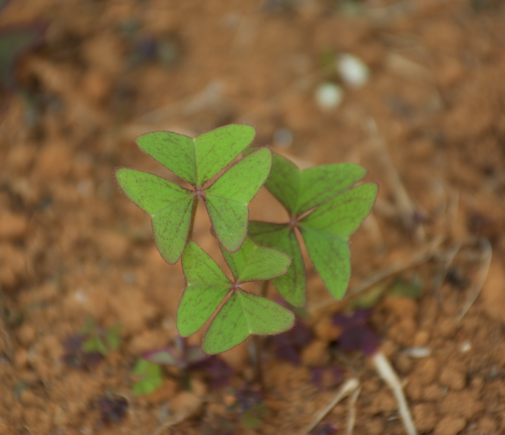
``` 

```{r echo=FALSE, out.width=500, fig.align='center'}
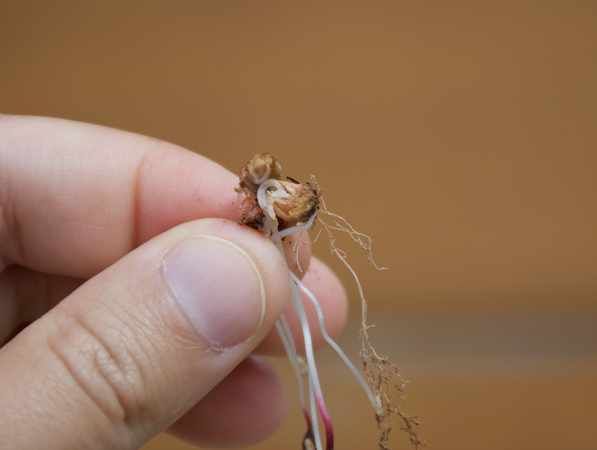
``` 
]

.pull-right[
```{r echo=FALSE, out.width=500, fig.align='center'}
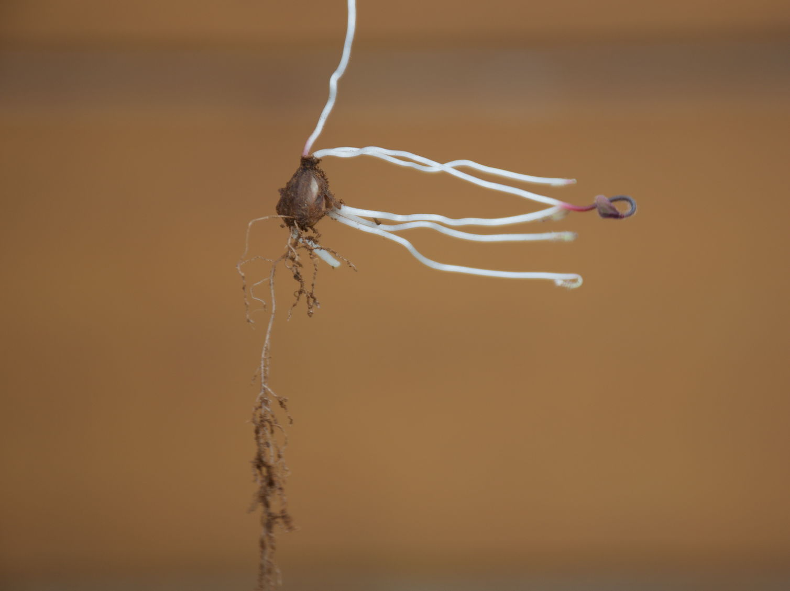
``` 

```{r echo=FALSE, out.width=500, fig.align='center'}
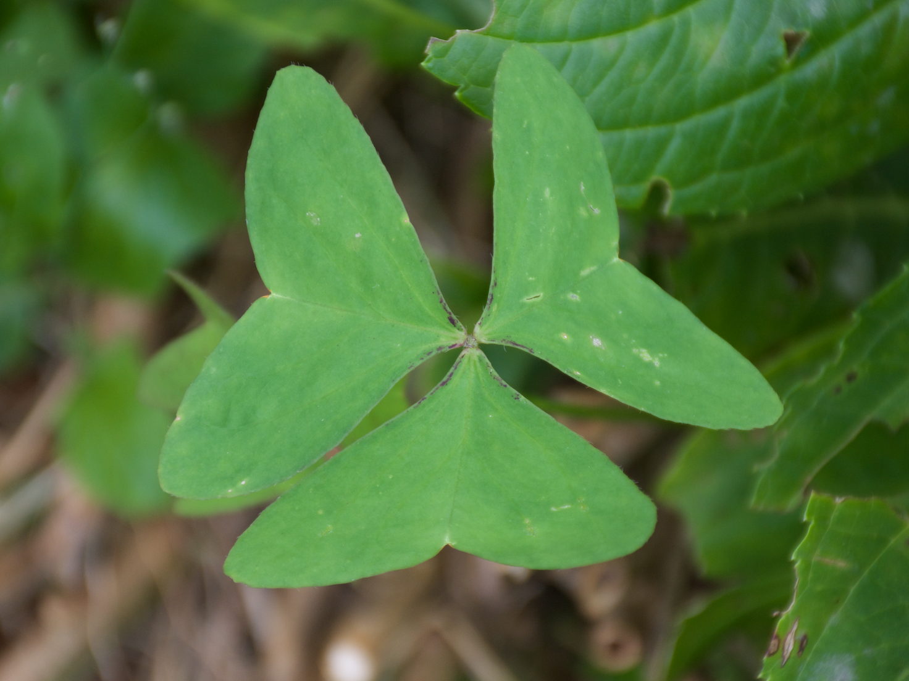
``` 
]


---

## Polygonaceae

### Características

.pull-left[

- Herbáceas e trepadeiras herbáceas

- **Ciclo de vida**: Anuais, bianuais e perenes

- **Folhas**: alternativa, simples, inteira, basal ou caulina

- **Flores**: perfeitas, imperfeitas ou funcionalmente unissexuais

- **Frutas**: aquênio

- Às vezes, estípulas das folhas embainham o caule, formando uma estrutura chamada "ocreia"
]

.pull-right[
```{r echo=FALSE, out.width=250, fig.align='center'}
knitr::include_graphics("https://upload.wikimedia.org/wikipedia/commons/8/8f/Polygonum_persicaria_bgiu.jpg")
``` 
]

---

class: middle

.pull-left[
```{r echo=FALSE, out.width=500, fig.align='center'}
knitr::include_graphics("https://upload.wikimedia.org/wikipedia/commons/9/99/Ocreae_of_a_Persicaria_maculosa_2006-aug-10_Gothenburg_Sweden.jpg")
``` 
]

.pull-right[
**OCHREA**
Bainhas de encontradas onde o pecíolo se liga ao caule
]

---

## *Polygonum convolvulus*

#### Nome comum: cipó-de-veado

.pull-left[

- **ciclo de vida:** 

- **Folha:** 

- **Cotilédones:** 

- **Caule:** 


]

.pull-right[
```{r echo=FALSE, out.width=300, fig.align='center'}
knitr::include_graphics("https://neinvasives.com/species/photos/sliders/field-bindweed-04.jpg")
``` 
]

---

.pull-left[
```{r echo=FALSE, out.width=400, fig.align='center'}
knitr::include_graphics("https://www.canr.msu.edu/pestid/uploads/images/Field-bindweed-seedling.jpg")
``` 

```{r echo=FALSE, out.width=400, fig.align='center'}
knitr::include_graphics("https://www.agrolink.com.br/upload/problemas/Polygonum_convolvulus85.jpg")
``` 
]

.pull-right[
```{r echo=FALSE, out.width=300, fig.align='center'}
knitr::include_graphics("https://www.agrolink.com.br/upload/problemas/Polygonum_convolvulus88.jpg")
``` 

```{r echo=FALSE, out.width=250, fig.align='center'}
knitr::include_graphics("https://www.agrolink.com.br/upload/problemas/Polygonum%20convolvulus2.jpg")
``` 
]

---


## *Polygonum persicaria*

#### Nome comum: erva-de-bixo

.pull-left[

- **ciclo de vida:** 

- **Folha:** 

- **Cotilédones:** 

- **Caule:** 


]

.pull-right[
```{r echo=FALSE, out.width=350, fig.align='center'}
knitr::include_graphics("https://weedid.missouri.edu/images/images_optimized/2487optimized.jpg")
``` 
]

---

.pull-left[
```{r echo=FALSE, out.width=300, fig.align='center'}
knitr::include_graphics("http://www.canolacouncil.org/media/511332/ladysthumb150.jpg?maxwidth=500&height=500&crop=auto")
``` 

```{r echo=FALSE, out.width=200, fig.align='center'}
knitr::include_graphics("https://weedid.missouri.edu/images/images_optimized/2488optimized.jpg")
``` 
]

.pull-right[
```{r echo=FALSE, out.width=300, fig.align='center'}
knitr::include_graphics("https://m.farms.com/Portals/0/lady-1-3a.jpg")
``` 

```{r echo=FALSE, out.width=370, fig.align='center'}
knitr::include_graphics("https://weedid.missouri.edu/images/images_optimized/2486optimized.jpg")
``` 
]

---

## Plantaginaceae

### Características


.pull-left[
- Herbáceas

- **Ciclo de vida**: Anuários e perenes

- **Folhas**: costelas geralmente basais, simples, longitudinais, sem estípulas

- **Inflorescência**: denso, pontas de vários comprimentos

- **Flores**: radiais, pequenas, carregadas em um caule sem folhas
]


.pull-right[
```{r echo=FALSE, out.width=350, fig.align='center'}
knitr::include_graphics("https://www.weedalogue.com/virginiaplantain/vp_02.jpg")
``` 
]


---

## Portulacaceae

### Características


.pull-left[
- Herbáceas ou raramente arbustos

- **Ciclo de vida**: Anual ou perene

- **Folhas**: inteiras, opostas, alternadas ou em espiral, geralmente carnudas

- **Flores**: 2 sépalas, 3-18 pétalas, perfeitas

- **Frutos**: cápsula, sementes de um a maio, geralmente pretas e brilhantes
]

.pull-right[
```{r echo=FALSE, out.width=500, fig.align='center'}
knitr::include_graphics("https://www.fireflyforest.com/images/wildflowers/plants/Portulaca_olera_400.jpg")
``` 
]

---

## *Portulaca oleracea*

#### Nome comum: beldroega

.pull-left[

- **ciclo de vida:** 

- **Folha:** 

- **Cotilédones:** 

- **Caule:** 

- **Raiz:** 
]

.pull-right[
```{r echo=FALSE, out.width=500, fig.align='center'}
knitr::include_graphics("https://worldofsucculents.com/wp-content/uploads/2013/09/Portulaca-oleracea-Common-Purslane.jpg")
``` 
]

---

.pull-left[
```{r echo=FALSE, out.width=500, fig.align='center'}
knitr::include_graphics("https://www.agrolink.com.br/upload/problemas/Portulaca_oleracea84.jpg")
``` 

```{r echo=FALSE, out.width=500, fig.align='center'}
knitr::include_graphics("https://www.agrolink.com.br/upload/problemas/Portulaca_oleracea87.jpg")
``` 
]

.pull-right[
```{r echo=FALSE, out.width=500, fig.align='center'}
knitr::include_graphics("https://www.agrolink.com.br/upload/problemas/Portulaca_oleracea81.jpg")
``` 

```{r echo=FALSE, out.width=500, fig.align='center'}
knitr::include_graphics("https://www.agrolink.com.br/upload/problemas/Portulaca_oleracea86.jpg")
``` 
]

---

## Rubiaceae

### Características


.pull-left[
- 

- **Ciclo de vida**: 

- **Folhas**: 

- **Flores**: 

- **Frutos**: 
]

.pull-right[
```{r echo=FALSE, out.width=300, fig.align='center'}
knitr::include_graphics("https://pbs.twimg.com/media/EagDUEmXsAAvvhP?format=jpg&name=large")
``` 
]

---

## *Diodella teres*

#### Nome comum: mata pasto

.pull-left[

- **ciclo de vida:** 

- **Folha:** 

- **Cotilédones:** 

- **Caule:** 

- **Raiz:** 
]

.pull-right[
```{r echo=FALSE, out.width=200, fig.align='center'}
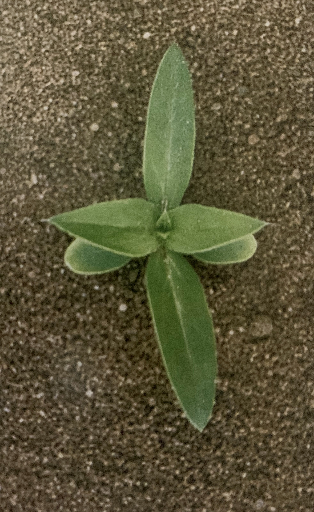
``` 
]

---

.pull-left[
```{r echo=FALSE, out.width=400, fig.align='center'}
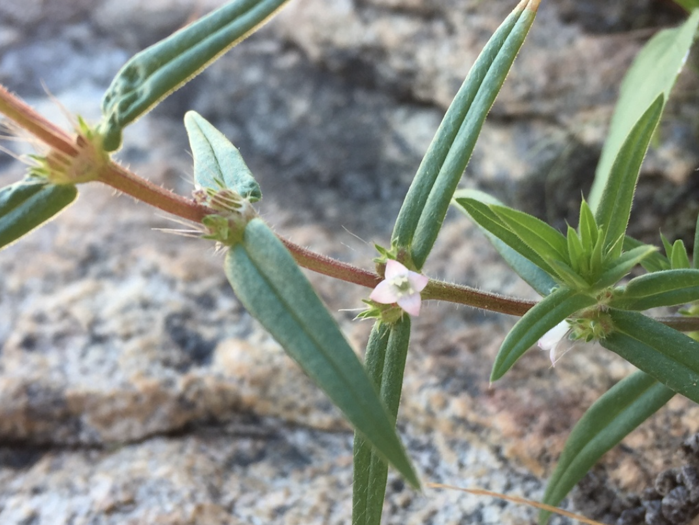
``` 

```{r echo=FALSE, out.width=400, fig.align='center'}
knitr::include_graphics("https://ncwildflower.org/images/plants/Diodia_teres,_Poorjoe,_Wilmington_2012_August_20_003_web_resized.jpg")
``` 
]

.pull-right[
```{r echo=FALSE, out.width=300, fig.align='center'}
knitr::include_graphics("https://ncwildflower.org/images/plants/Diodia_teres_flower_close-up_Wilmington_2012_August_20_003_resized.jpg")
``` 

```{r echo=FALSE, out.width=300, fig.align='center'}
knitr::include_graphics("https://ncwildflower.org/images/plants/Diodia_teres_flower_close-up_web_Wilmington_2012_late_August_001_resized.jpg")
``` 
]


---

## *Richardia brasiliensis*

#### Nome comum: poaia-branca

.pull-left[

- **ciclo de vida:** anual, herbácea, prostrada

- **Folha:** pubescente em ambas as faces

- **Cotilédones:** 

- **Caule:** ramificado, densamente pubescente

- **Raiz:** 
]

.pull-right[
```{r echo=FALSE, out.width=500, fig.align='center'}
knitr::include_graphics("images/poaia-branca.png")
``` 
]

---

.pull-left[
```{r echo=FALSE, out.width=250, fig.align='center'}
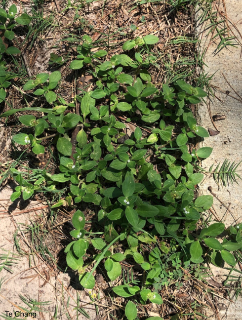
``` 

```{r echo=FALSE, out.width=300, fig.align='center'}
knitr::include_graphics("https://www.agrolink.com.br/upload/problemas/Richardia%20brasiliensis5.jpg")
``` 
]

.pull-right[
```{r echo=FALSE, out.width=300, fig.align='center'}
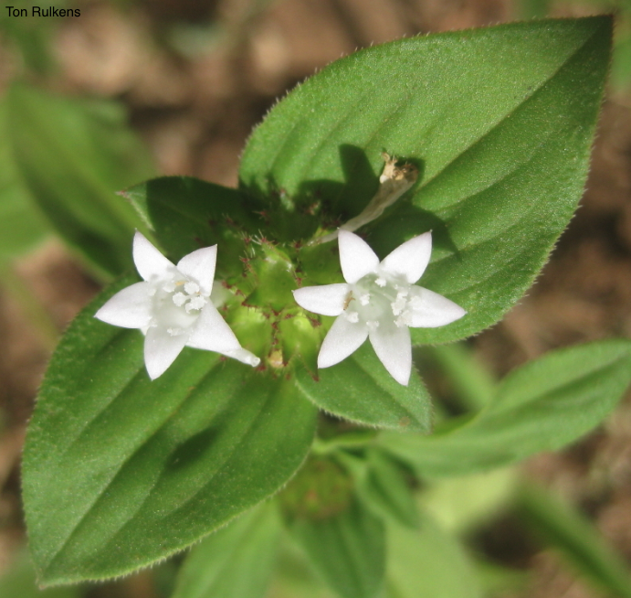
``` 

```{r echo=FALSE, out.width=200, fig.align='center'}
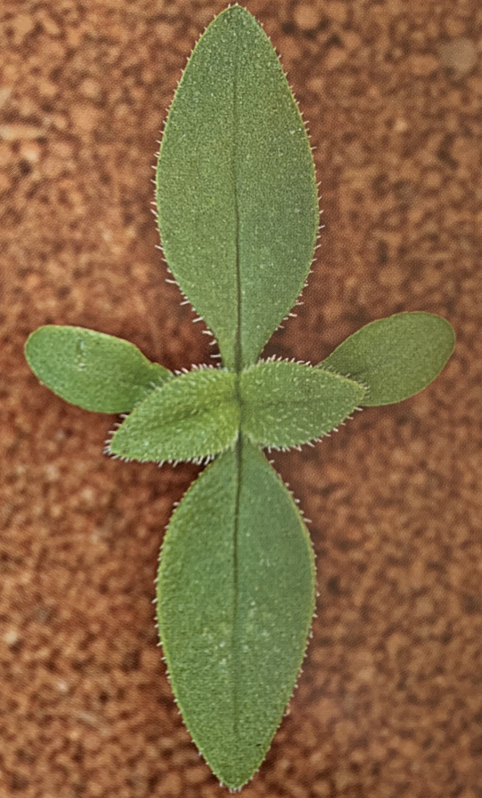
``` 
]

---

## *Spermacoce latifolia*

#### Nome comum: erva-quente

.pull-left[

- **ciclo de vida:** anual, herbácea, prostrada ou ascendente

- **Folha:** nervuras impressas

- **Cotilédones:** 

- **Caule:** tetragonal com ângulos rígido-pubescentes

- **Raiz:** 
]

.pull-right[
```{r echo=FALSE, out.width=300, fig.align='center'}
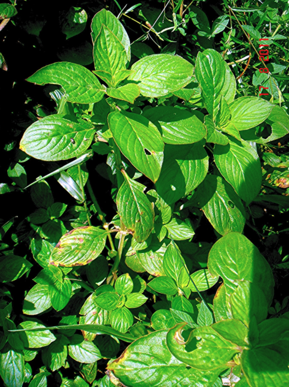
``` 
]

---

.pull-left[
```{r echo=FALSE, out.width=250, fig.align='center'}
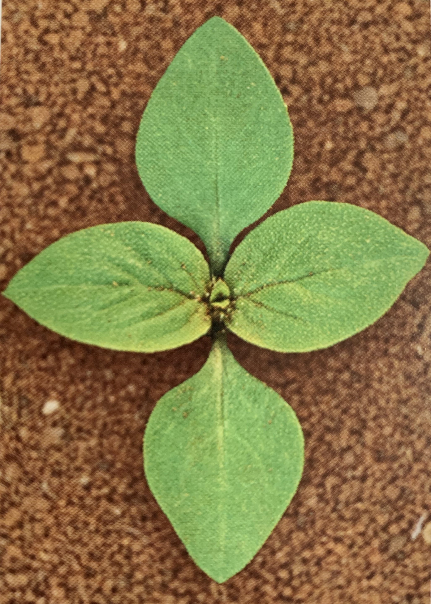
``` 

```{r echo=FALSE, out.width=300, fig.align='center'}
knitr::include_graphics("https://www.agrolink.com.br/upload/problemas/Spermacoce_latifolia85.jpg")
``` 
]

.pull-right[
```{r echo=FALSE, out.width=300, fig.align='center'}
knitr::include_graphics("https://www.agrolink.com.br/upload/problemas/Spermacoce_latifolia81.jpg")
``` 

```{r echo=FALSE, out.width=250, fig.align='center'}
knitr::include_graphics("https://www.agrolink.com.br/upload/problemas/Spermacoce_latifolia88.jpg")
``` 
]


---

## Solanaceae

### Características

Nenhuma característica única comum nessa família

.pull-left[
- **Folhas**: geralmente alternadas, simples, peludas, com odor característico, pecíolo, ovo ou formato triangular

- **Inflorescência**: racemos ou umbels

- **Flores**: perfeitas, em pequenos grupos, tipicamente branco ou rosa

- **Frutas**: baga ou cápsula

- **Cultivado**: tomate, batata, pimentão, berinjela, tabaco, pimentão, petúnias
]

.pull-right[
```{r echo=FALSE, out.width=450, fig.align='center'}
knitr::include_graphics("https://cdn.britannica.com/80/138780-050-63F55DC9/Nightshade.jpg")
``` 
]

---


## *Datura stramonium*

#### Nome comum: quinquilho, figueira-do-inferno

.pull-left[

- **ciclo de vida:** anual, herbácea, cheiro forte quando macerada, 

- **Folha:** alternadas, ovata-pontas pontiagudas, margens dentado-sinuado, glabro, macia

- **Cotilédones:** grosso, sem pêlos, longo e de contorno linear

- **Caule:** ereto, ramificado na parte superior, verde-roxo 

- Contém alto nível de alcalóides (venenono)
]

.pull-right[
```{r echo=FALSE, out.width=300, fig.align='center'}
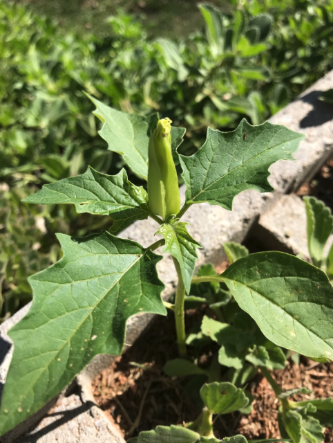
``` 
]

---

.pull-left[
```{r echo=FALSE, out.width=250, fig.align='center'}
knitr::include_graphics("http://ipm.ucanr.edu/PMG/IMAGES/D/W-SO-DSTR-SG.003.jpg")
``` 

```{r echo=FALSE, out.width=300, fig.align='center'}
knitr::include_graphics("http://ipm.ucanr.edu/PMG/IMAGES/D/W-SO-DSTR-FR.001.jpg")
``` 
]

.pull-right[
```{r echo=FALSE, out.width=400, fig.align='center'}
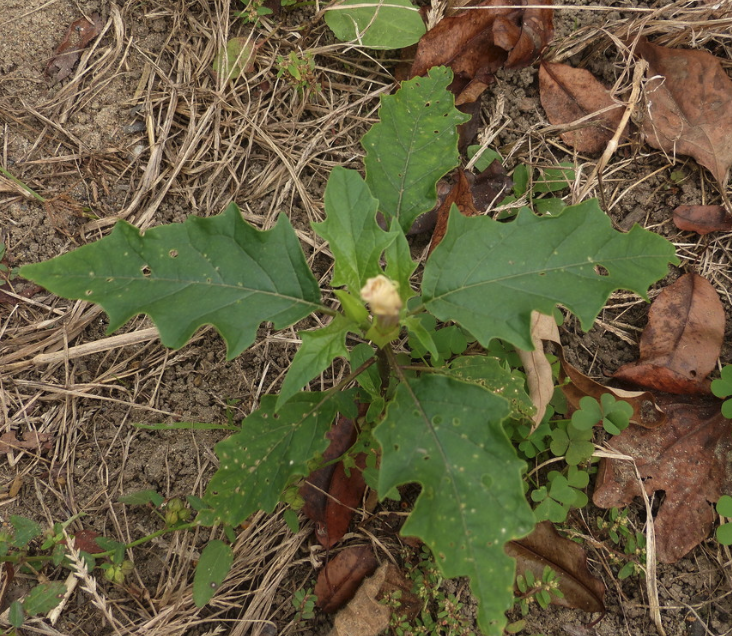
``` 

```{r echo=FALSE, out.width=350, fig.align='center'}
knitr::include_graphics("http://ipm.ucanr.edu/PMG/IMAGES/D/W-SO-DSTR-SD.001.jpg")
``` 
]


---


## *Nicandra physalodes*

#### Nome comum: joá-de-capote

.pull-left[

- **ciclo de vida:** anual, herbácea, glabra

- **Folha:** 

- **Cotilédones:** 

- **Caule:** 


]

.pull-right[
```{r echo=FALSE, out.width=300, fig.align='center'}
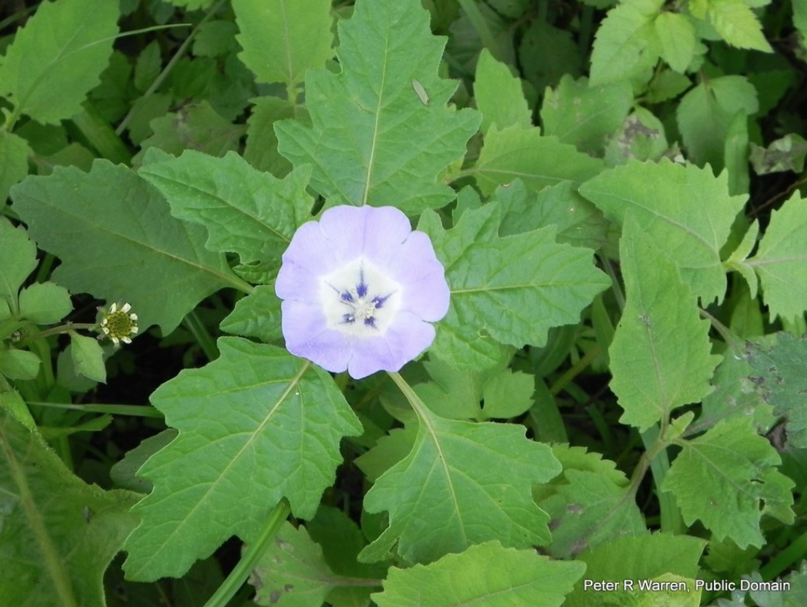
``` 

```{r echo=FALSE, out.width=300, fig.align='center'}
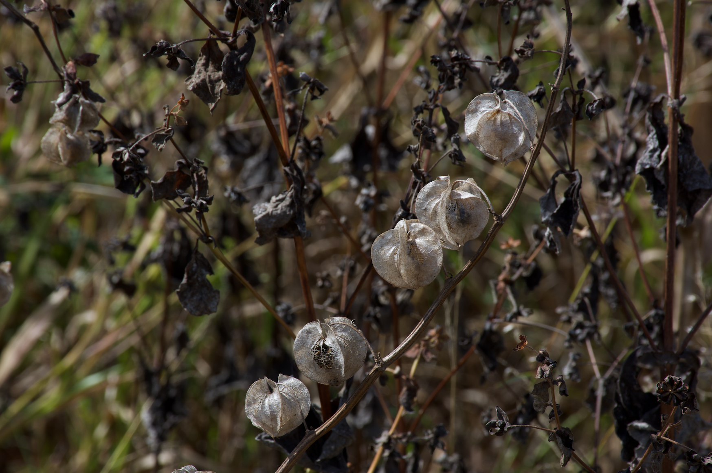
```
]

---

.pull-left[
```{r echo=FALSE, out.width=200, fig.align='center'}
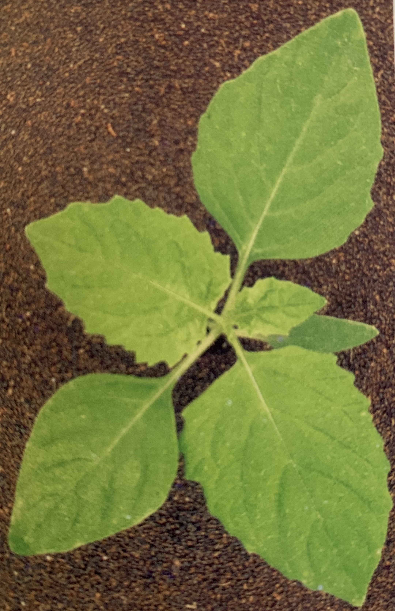
``` 

```{r echo=FALSE, out.width=350, fig.align='center'}
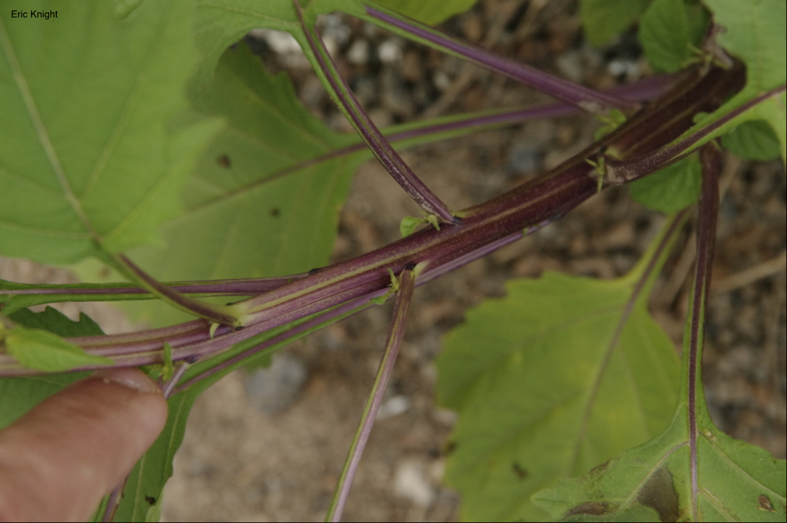
``` 
]

.pull-right[
```{r echo=FALSE, out.width=300, fig.align='center'}
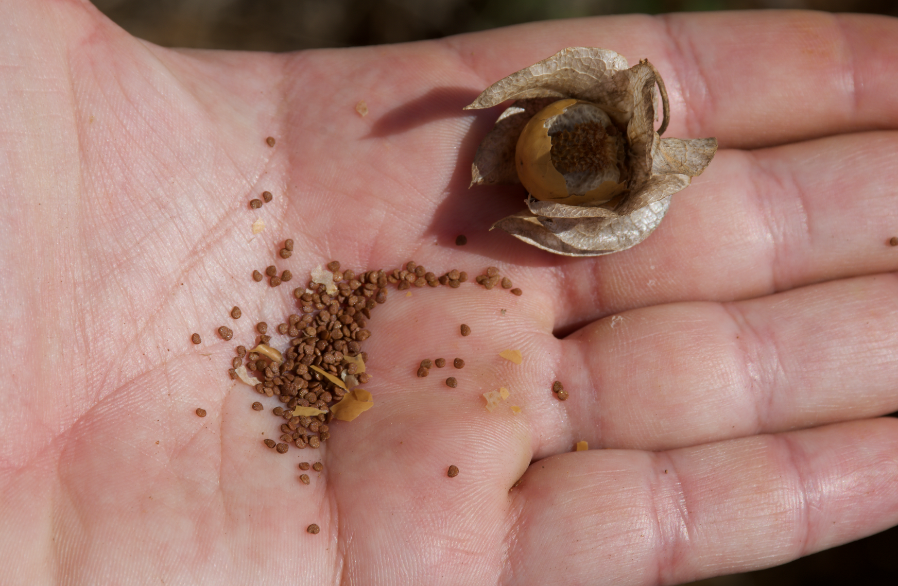
``` 

```{r echo=FALSE, out.width=300, fig.align='center'}
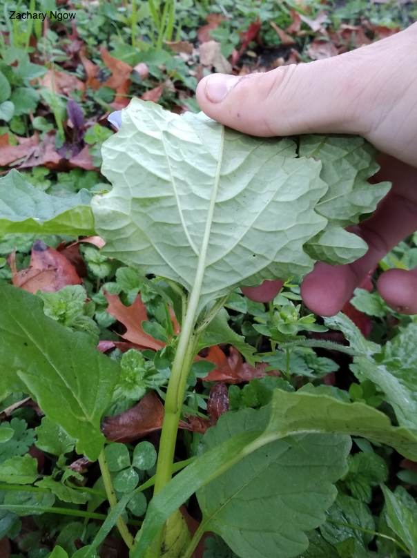
``` 
]

---


## *Solanum americanum*

#### Nome comum: maria-pretinha

.pull-left[

- **ciclo de vida:** anual, herbácea, glabra

- **Folha:** 

- **Cotilédones:** 

- **Caule:** 


]

.pull-right[
```{r echo=FALSE, out.width=300, fig.align='center'}
knitr::include_graphics("https://www.agrolink.com.br/upload/problemas/Solanum_americanum81.jpg")
``` 
]

---

.pull-left[
```{r echo=FALSE, out.width=400, fig.align='center'}
knitr::include_graphics("https://www.agrolink.com.br/upload/problemas/Solanum_americanum84.jpg")
``` 

```{r echo=FALSE, out.width=400, fig.align='center'}
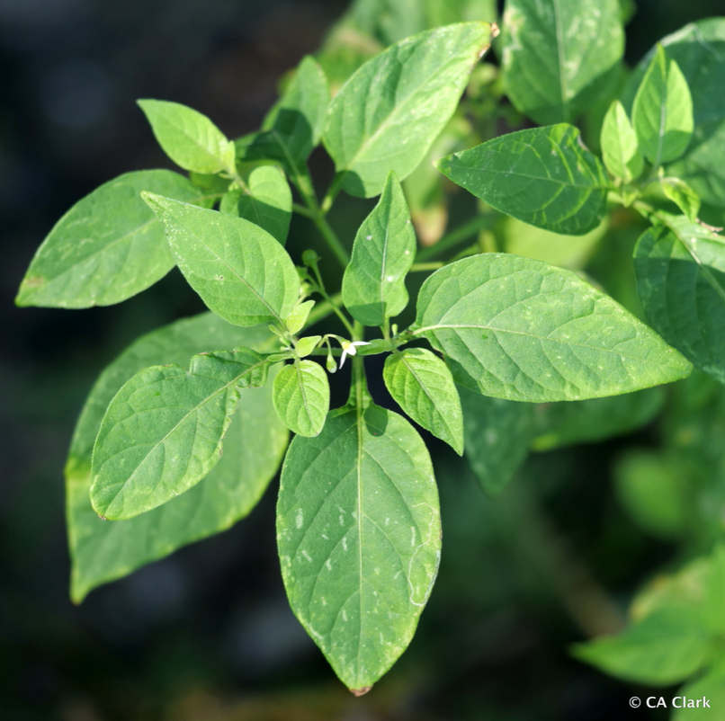
``` 
]

.pull-right[
```{r echo=FALSE, out.width=200, fig.align='center'}
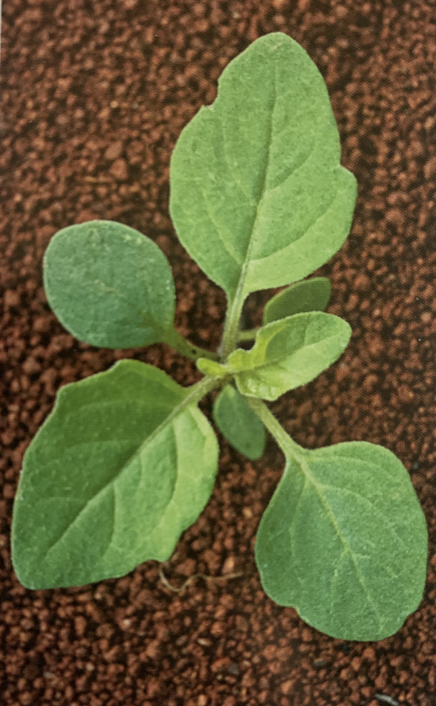
``` 

```{r echo=FALSE, out.width=350, fig.align='center'}
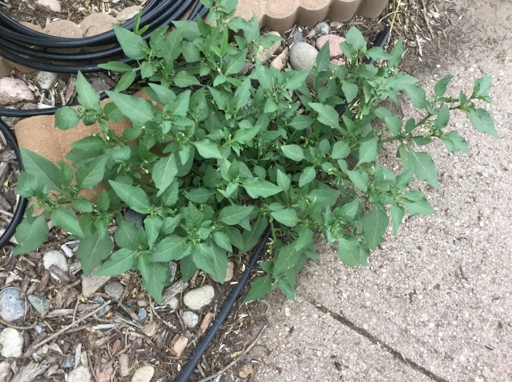
``` 
]