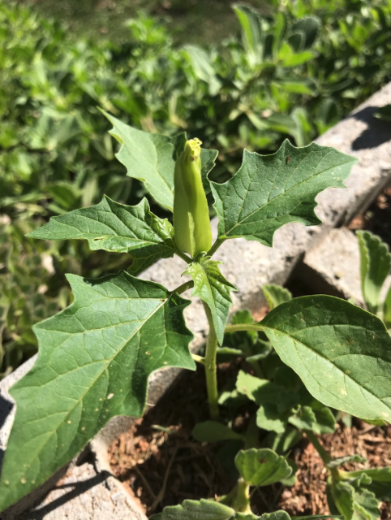
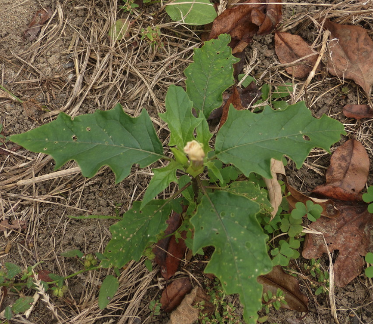
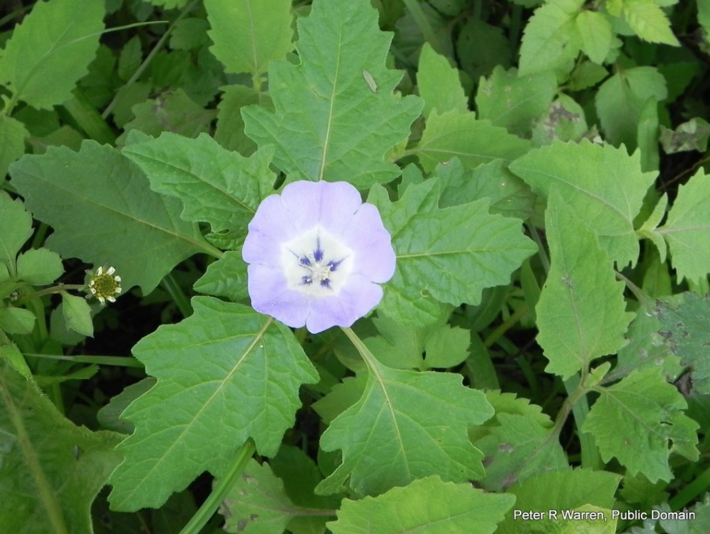
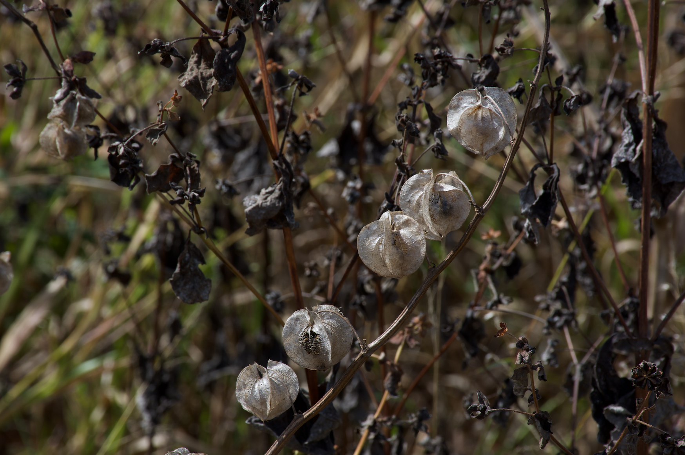
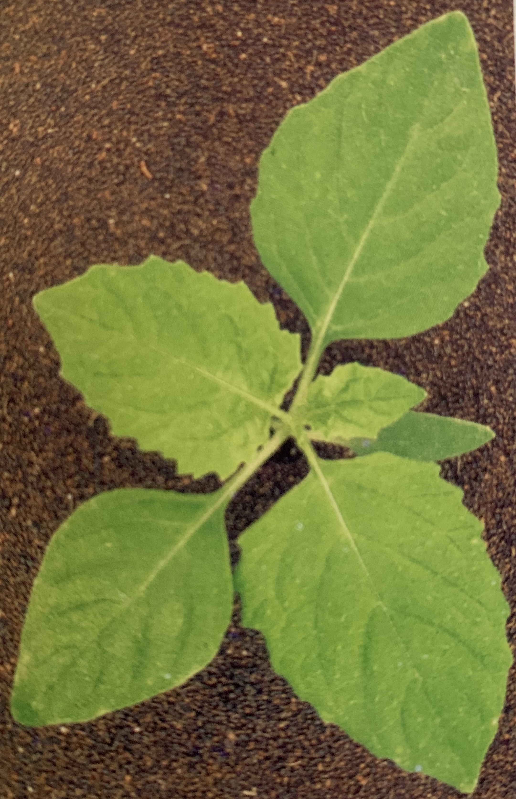
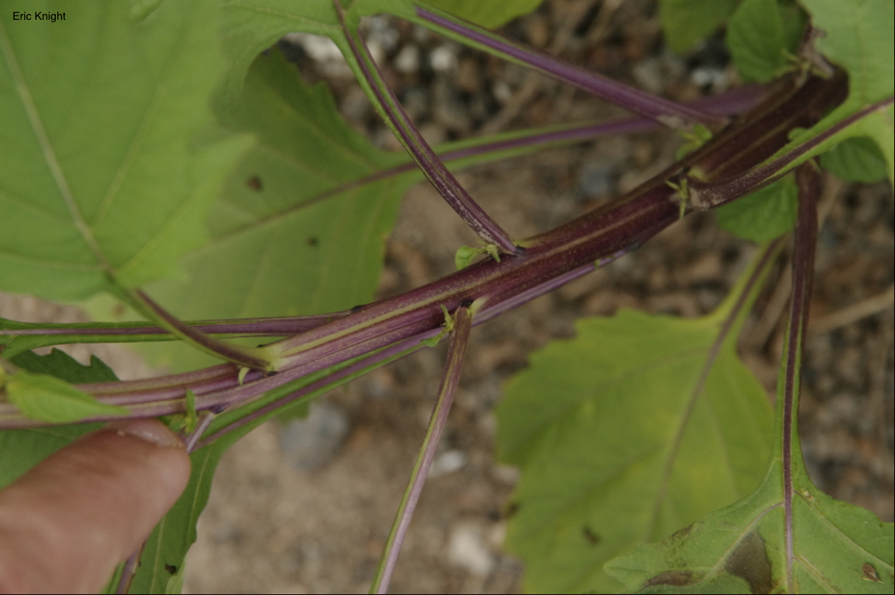
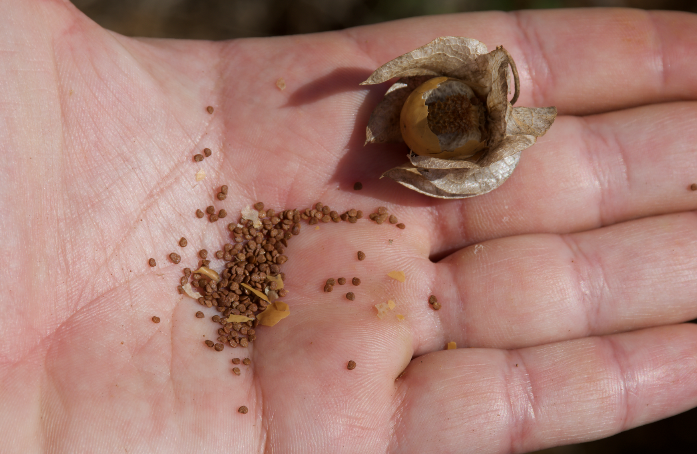
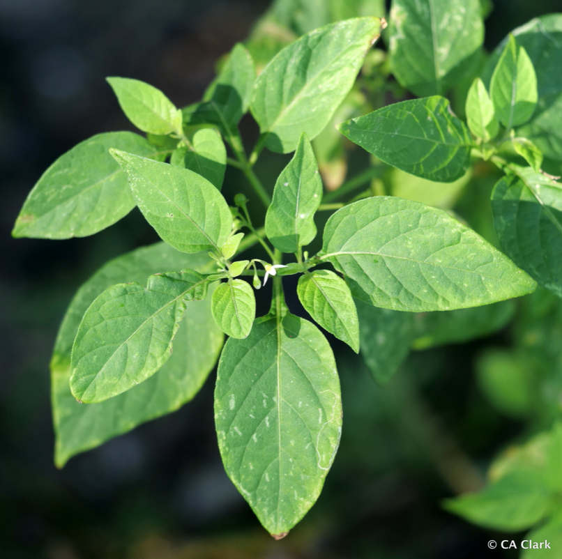
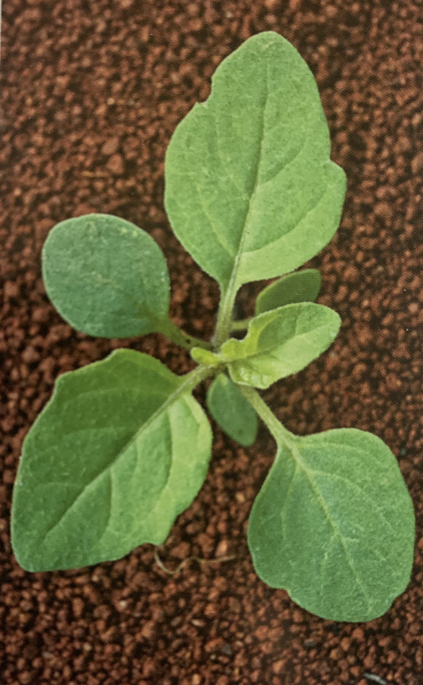
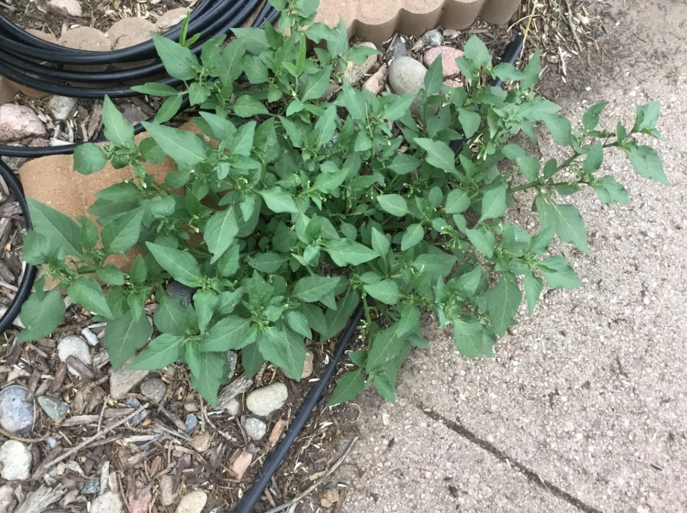

```{r setup, include=FALSE}
options(htmltools.dir.version = FALSE)
knitr::opts_chunk$set(
  echo = FALSE,
  fig.align = "center",
  message = FALSE,
  warning = FALSE,
  cache = TRUE
)

htmltools::tagList(rmarkdown::html_dependency_font_awesome()) #show twitter logo
```


class: inverse

## Asclepiadaceae

### Características

.pull-left[

Herbáceas, trepadeiras e arbustos principalmente perenes com seiva leitosa

- **Sementes**: tufo de pelos sedosos

- **Fruta**: folículos

- **Flores**: pétalas perfeitas, muitas vezes carnudas

- **Inflorescências**: geralmente umbelas

- **Folhas**: simples, opostas ou voltas, inteiras


]

.pull-right[
```{r echo=FALSE, out.width=350, fig.align='center'}
knitr::include_graphics("https://cdn.shopify.com/s/files/1/1351/6403/products/Calotropis_SQ_693_1024x1024.jpg?v=1469314555")
``` 

- **Caules**: cheios de seiva leitosa
]


---

## Solanaceae

### Características

Nenhuma característica única comum nessa família

.pull-left[
- **Folhas**: geralmente alternadas, simples, peludas, com odor característico, pecíolo, ovo ou formato triangular

- **Inflorescência**: racemos ou umbels

- **Flores**: perfeitas, em pequenos grupos, tipicamente branco ou rosa

- **Frutas**: baga ou cápsula

- **Cultivado**: tomate, batata, pimentão, berinjela, tabaco, pimentão, petúnias
]

.pull-right[
```{r echo=FALSE, out.width=450, fig.align='center'}
knitr::include_graphics("https://cdn.britannica.com/80/138780-050-63F55DC9/Nightshade.jpg")
``` 
]

---


## *Datura stramonium*

#### Nome comum: quinquilho, figueira-do-inferno

.pull-left[

- **ciclo de vida:** anual, herbácea, cheiro forte quando macerada, 

- **Folha:** alternadas, ovata-pontas pontiagudas, margens dentado-sinuado, glabro, macia

- **Cotilédones:** grosso, sem pêlos, longo e de contorno linear

- **Caule:** ereto, ramificado na parte superior, verde-roxo 

- Contém alto nível de alcalóides (venenono)
]

.pull-right[
```{r echo=FALSE, out.width=300, fig.align='center'}

``` 
]

---

.pull-left[
```{r echo=FALSE, out.width=250, fig.align='center'}
knitr::include_graphics("http://ipm.ucanr.edu/PMG/IMAGES/D/W-SO-DSTR-SG.003.jpg")
``` 

```{r echo=FALSE, out.width=300, fig.align='center'}
knitr::include_graphics("http://ipm.ucanr.edu/PMG/IMAGES/D/W-SO-DSTR-FR.001.jpg")
``` 
]

.pull-right[
```{r echo=FALSE, out.width=400, fig.align='center'}

``` 

```{r echo=FALSE, out.width=350, fig.align='center'}
knitr::include_graphics("http://ipm.ucanr.edu/PMG/IMAGES/D/W-SO-DSTR-SD.001.jpg")
``` 
]


---


## *Nicandra physalodes*

#### Nome comum: joá-de-capote

.pull-left[

- **ciclo de vida:** subarbustiva anual

- **Folha:** alternadas helicoidais, simples, pecioladas e com o limbo muito desenvolvido e de forma ovalada, margens muito irregularmente recortadas ou serreadas

- **Flores:**  isoladas, axilares, pedunculadas, cálice
com 5 sépalas soldadas que continuam o crescimento para isolar o fruto em desenvolvimento

- **Caule:** verde, pouco tetrágono, canaliculado, ramos com tendência a ramificação dicotômica


]

.pull-right[
```{r echo=FALSE, out.width=300, fig.align='center'}

``` 

```{r echo=FALSE, out.width=300, fig.align='center'}

```
]

---

.pull-left[
```{r echo=FALSE, out.width=200, fig.align='center'}

``` 

```{r echo=FALSE, out.width=350, fig.align='center'}

``` 
]

.pull-right[
```{r echo=FALSE, out.width=300, fig.align='center'}

``` 

```{r echo=FALSE, out.width=300, fig.align='center'}
knitr::include_graphics("images/nicandra_2.png")
``` 
]

---


## *Solanum americanum*

#### Nome comum: maria-pretinha

.pull-left[

- **ciclo de vida:** anual, herbácea, glabra

- **Folha:** alternadas com base estreitada continuando pelo pecíolo, limbo de
forma ovalada ou lanceolada, com margens onduladas irregularmente

- **Caule:** cilíndrico, às vezes canaliculado, verde, ramificado desde a base e apresentando concaulescência de gemas

- **Habitat:** áreas agrícolas ocupadas com lavouras anuais e perenes

]

.pull-right[
```{r echo=FALSE, out.width=300, fig.align='center'}
knitr::include_graphics("https://www.agrolink.com.br/upload/problemas/Solanum_americanum81.jpg")
``` 
- Pode ser reconhecida em campo pelas flores estreladas de coloração branca e pelas inflorescências umbeliformes, localizadas fora das axilas das folhas, e ainda pela coloração dos fruto
]

---

.pull-left[
```{r echo=FALSE, out.width=400, fig.align='center'}
knitr::include_graphics("https://www.agrolink.com.br/upload/problemas/Solanum_americanum84.jpg")
``` 

```{r echo=FALSE, out.width=400, fig.align='center'}

``` 
]

.pull-right[
```{r echo=FALSE, out.width=200, fig.align='center'}

``` 

```{r echo=FALSE, out.width=350, fig.align='center'}

``` 
]


---

class: inverse

## Caryophyllaceae

### Características


.pull-left[
- **Folhas**: 

- **Inflorescência**: 

- **Flores**: 

- **Frutas**: 

- **Cultivado**: 
]

.pull-right[
```{r echo=FALSE, out.width=450, fig.align='center'}
knitr::include_graphics("https://cdn.britannica.com/80/138780-050-63F55DC9/Nightshade.jpg")
``` 
]

---


## *Stellaria media*

#### Nome comum: esperguta

.pull-left[

- **ciclo de vida:** anual, herbácea, cheiro forte quando macerada, 

- **Folha:** alternadas, ovata-pontas pontiagudas, margens dentado-sinuado, glabro, macia

- **Cotilédones:** grosso, sem pêlos, longo e de contorno linear

- **Caule:** ereto, ramificado na parte superior, verde-roxo 

- Contém alto nível de alcalóides (venenono)
]

.pull-right[
```{r echo=FALSE, out.width=300, fig.align='center'}
knitr::include_graphics("https://ipcm.wisc.edu/wp-content/uploads/sites/54/2017/05/Chickweeds2017.jpg")
``` 
]

---

.pull-left[
```{r echo=FALSE, out.width=350, fig.align='center'}
knitr::include_graphics("https://plantevaernonline.dlbr.dk/cp/graphics/ImageDatabase/STEME-COT-700.jpg")
``` 

```{r echo=FALSE, out.width=400, fig.align='center'}
knitr::include_graphics("https://content.ces.ncsu.edu/media/images/common-chickweed-11491-p1030758.jpg")
``` 
]

.pull-right[
```{r echo=FALSE, out.width=400, fig.align='center'}
knitr::include_graphics("https://content.ces.ncsu.edu/media/images/common-chickweed-11491-flowers.jpg")
``` 

```{r echo=FALSE, out.width=350, fig.align='center'}
knitr::include_graphics("https://upload.wikimedia.org/wikipedia/commons/0/05/Kaldari_Stellaria_media_01.jpg")
``` 
]

---

class: inverse

## Plantaginaceae

### Características


.pull-left[
- Herbáceas

- **Ciclo de vida**: Anuais e perenes

- **Folhas**: costelas geralmente basais, simples, longitudinais, sem estípulas

- **Inflorescência**: denso, pontas de vários comprimentos

- **Flores**: radiais, pequenas, carregadas em um caule sem folhas
]


.pull-right[
```{r echo=FALSE, out.width=350, fig.align='center'}
knitr::include_graphics("https://www.weedalogue.com/virginiaplantain/vp_02.jpg")
``` 
]


---


## *Plantago tomentosa*

#### Nome comum: tanchagem, plantagem

.pull-left[

- **ciclo de vida:** anual, herbácea - densamente pubescente

- **Folha:** roseta basal, nervura impressas

- **Cotilédones:** 

- **Caule:** acaule


]

.pull-right[
```{r echo=FALSE, out.width=300, fig.align='center'}
knitr::include_graphics("https://www.agrolink.com.br/upload/problemas/Plantago_tomentosa85.jpg")
``` 
]

---

.pull-left[
```{r echo=FALSE, out.width=200, fig.align='center'}
knitr::include_graphics("https://www.agrolink.com.br/upload/problemas/Plantago_tomentosa81.jpg")
``` 

```{r echo=FALSE, out.width=300, fig.align='center'}
knitr::include_graphics("https://sites.unicentro.br/wp/manejoflorestal/files/2012/11/1-Plantago-tomentosa-Lam.jpg")
``` 
]

.pull-right[
```{r echo=FALSE, out.width=400, fig.align='center'}
knitr::include_graphics("https://www.agrolink.com.br/upload/problemas/Plantago_tomentosa88.jpg")
``` 

```{r echo=FALSE, out.width=350, fig.align='center'}
knitr::include_graphics("https://www.agrolink.com.br/upload/problemas/Plantago_tomentosa83.jpg")
``` 
]
