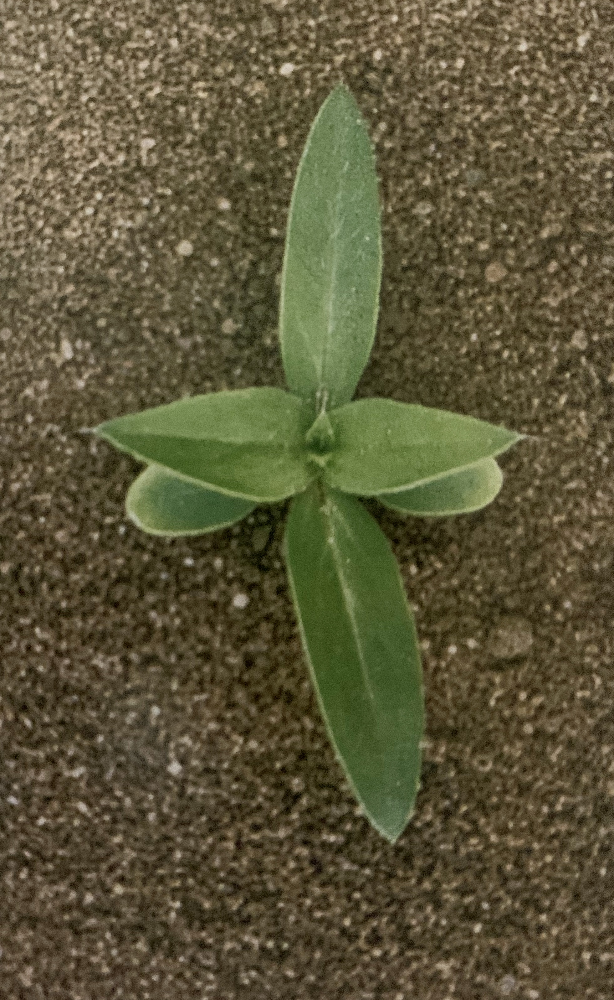
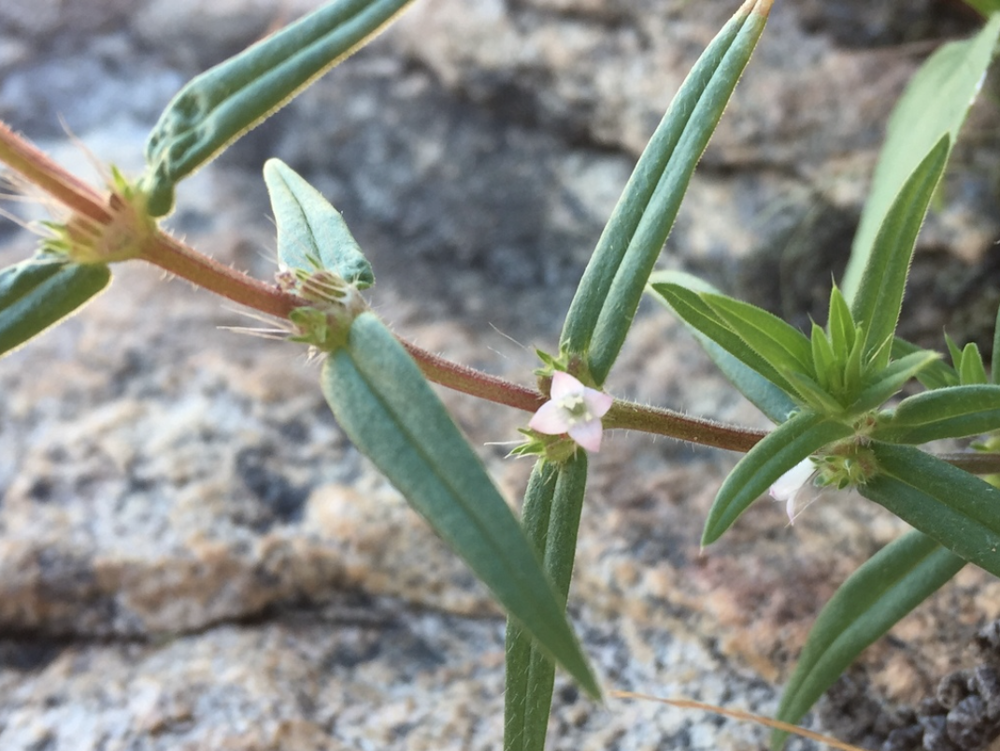
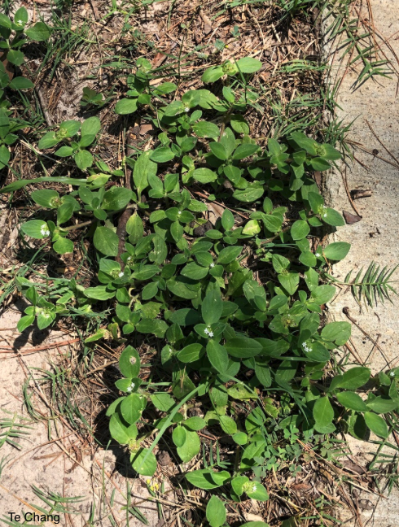
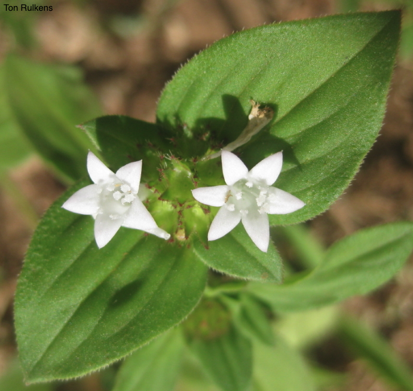
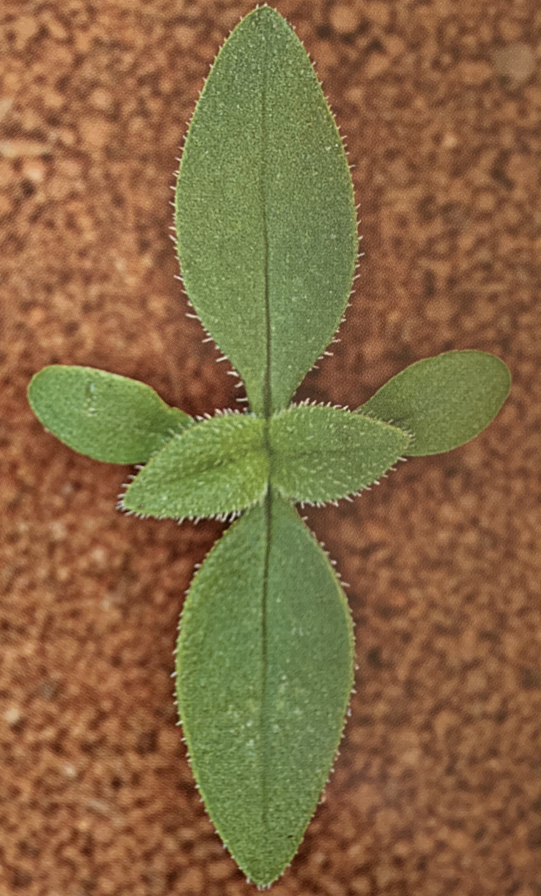
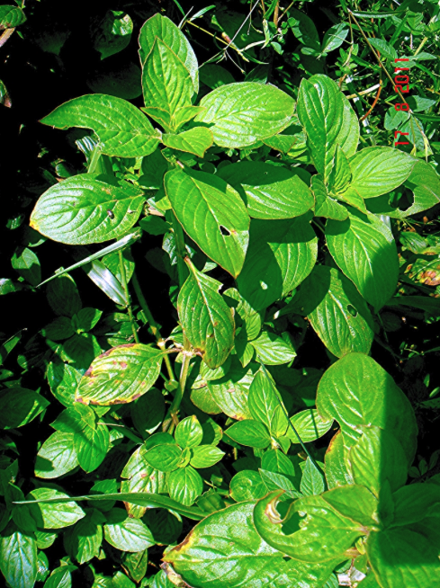
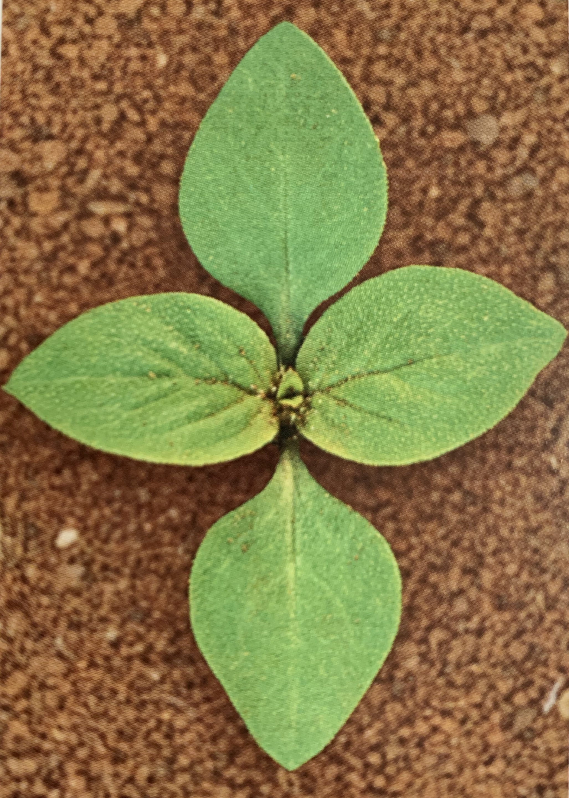
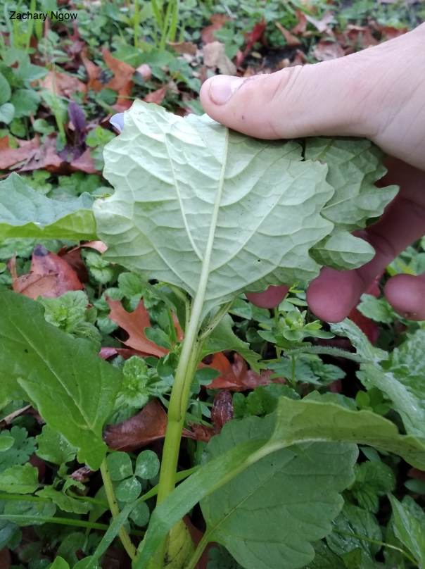

```{r setup, include=FALSE}
options(htmltools.dir.version = FALSE)
knitr::opts_chunk$set(
  echo = FALSE,
  fig.align = "center",
  message = FALSE,
  warning = FALSE,
  cache = TRUE
)

htmltools::tagList(rmarkdown::html_dependency_font_awesome()) #show twitter logo
```


class: inverse

## Rubiaceae

### Características


.pull-left[
- Trata-se de uma das maiores famílias das dicotiledôneas no Brasil

- **Ciclo de vida**: 

- **Folhas**: sempre opostas e com as estípulas localizadas entre os pecíolos

- **Flores**: apresentam perianto constituído por 4 ou 5 sépalas e a corola com 4 a 8 pétalas, androceu com estames em número igual ao das pétalas e gineceu pluricarpelar

- **Plantas cultivadas:** café
]

.pull-right[
```{r echo=FALSE, out.width=300, fig.align='center'}
knitr::include_graphics("https://pbs.twimg.com/media/EagDUEmXsAAvvhP?format=jpg&name=large")
``` 
]

---

## *Diodella teres*

#### Nome comum: mata pasto

.pull-left[

- **Ciclo de vida:** herbácea anual

- **Folha:** opostas, pubescentes

- **Caule:** ascendente, ramificado, angulado, áspero-pubescente

- **Reprodução:** sementes
]

.pull-right[
```{r echo=FALSE, out.width=200, fig.align='center'}

``` 
]

---

.pull-left[
```{r echo=FALSE, out.width=400, fig.align='center'}

``` 

```{r echo=FALSE, out.width=400, fig.align='center'}
knitr::include_graphics("https://ncwildflower.org/images/plants/Diodia_teres,_Poorjoe,_Wilmington_2012_August_20_003_web_resized.jpg")
``` 
]

.pull-right[
```{r echo=FALSE, out.width=300, fig.align='center'}
knitr::include_graphics("https://ncwildflower.org/images/plants/Diodia_teres_flower_close-up_Wilmington_2012_August_20_003_resized.jpg")
``` 

```{r echo=FALSE, out.width=300, fig.align='center'}
knitr::include_graphics("https://ncwildflower.org/images/plants/Diodia_teres_flower_close-up_web_Wilmington_2012_late_August_001_resized.jpg")
``` 
]


---

## *Richardia brasiliensis*

#### Nome comum: poaia-branca

.pull-left[

- **Ciclo de vida:** anual, herbácea, prostrada

- **Folha:** opostas cruzadas, com pecíolo muito curto ou ausente

- **Caule:** muito ramificado, cilíndrico ou quadrangular, verde ou com forte pigmentação acastanhada, revestido por um indumento de pelos brancos

- **Flores:** Flores desprovidas de pedúnculo, cálice com 5 a 6 sépalas soldadas

- **Propagação:** sementes
]

.pull-right[
```{r echo=FALSE, out.width=500, fig.align='center'}
knitr::include_graphics("images/poaia-branca.png")
``` 

- **Habitat**: cultivos perenes 

]

---

.pull-left[
```{r echo=FALSE, out.width=250, fig.align='center'}

``` 

```{r echo=FALSE, out.width=300, fig.align='center'}
knitr::include_graphics("https://www.agrolink.com.br/upload/problemas/Richardia%20brasiliensis5.jpg")
``` 
]

.pull-right[
```{r echo=FALSE, out.width=300, fig.align='center'}

``` 

```{r echo=FALSE, out.width=200, fig.align='center'}

``` 
]

---

## *Spermacoce latifolia*

#### Nome comum: erva-quente

.pull-left[

- **Ciclo de vida:** anual, herbácea, prostrada ou ascendente

- **Folha:** alternadas, nervuras impressas, pubescentes

- **Flores:** aglomerados axilares

- **Caule:** tetragonal com ângulos rígido-pubescentes


]

.pull-right[
```{r echo=FALSE, out.width=300, fig.align='center'}

``` 
]

---

.pull-left[
```{r echo=FALSE, out.width=250, fig.align='center'}

``` 

```{r echo=FALSE, out.width=300, fig.align='center'}
knitr::include_graphics("https://www.agrolink.com.br/upload/problemas/Spermacoce_latifolia85.jpg")
``` 
]

.pull-right[
```{r echo=FALSE, out.width=300, fig.align='center'}
knitr::include_graphics("https://www.agrolink.com.br/upload/problemas/Spermacoce_latifolia81.jpg")
``` 

```{r echo=FALSE, out.width=250, fig.align='center'}
knitr::include_graphics("https://www.agrolink.com.br/upload/problemas/Spermacoce_latifolia88.jpg")
``` 
]


---

## *Spermacoce verticillata*

#### Nome comum: vassoura-de-botão

.pull-left[

- **Ciclo de vida:** herbácea perene

- **Folha:** simples, desprovidas de pecíolos, dispostas em forma de verticílios ao longo dos nós. Limbo linear-lanceolado com uma nervura bem acentuada

- **Caule:** ramificado na base, quadrático nas partes jovens, revestido por indumento de pelos brancos e com nós e entrenós bem definidos

]

.pull-right[
```{r echo=FALSE, out.width=300, fig.align='center'}
knitr::include_graphics("http://phytoimages.siu.edu/users/paraman1/1_7_08_2/Horiz27/34_05.jpg")
``` 

- Pode ser identificada em campo por meio das folhas dispostas em verticílio, com o limbo linear-lanceolado, e pelo último glomérulo assentado sobre brácteas pendentes

]

---

.pull-left[
```{r echo=FALSE, out.width=200, fig.align='center'}
knitr::include_graphics("http://www.conabio.gob.mx/malezasdemexico/rubiaceae/borreria-verticillata/imagenes/borreria-verticillata-tallo-y-hojas.jpg")
``` 

```{r echo=FALSE, out.width=200, fig.align='center'}
knitr::include_graphics("http://www.conabio.gob.mx/malezasdemexico/rubiaceae/borreria-verticillata/imagenes/borreria-verticillata-detalle3.jpg")
``` 
]

.pull-right[
```{r echo=FALSE, out.width=400, fig.align='center'}
knitr::include_graphics("http://www.conabio.gob.mx/malezasdemexico/rubiaceae/borreria-verticillata/imagenes/borreria-verticillata-hojas-haz.jpg")
``` 

```{r echo=FALSE, out.width=400, fig.align='center'}
knitr::include_graphics("http://www.conabio.gob.mx/malezasdemexico/rubiaceae/borreria-verticillata/imagenes/borreria-verticillata-hojas2.jpg")
``` 
]


---

class: inverse

## Solanaceae

### Características

Nenhuma característica única comum nessa família

.pull-left[
- **Folhas**: geralmente alternadas, simples, peludas, com odor característico, pecíolo, ovo ou formato triangular

- **Inflorescência**: racemos ou umbels

- **Flores**: perfeitas, em pequenos grupos, tipicamente branco ou rosa

- **Frutas**: baga ou cápsula

- **Cultivado**: tomate, batata, pimentão, berinjela, tabaco, pimentão, petúnias
]

.pull-right[
```{r echo=FALSE, out.width=450, fig.align='center'}
knitr::include_graphics("https://cdn.britannica.com/80/138780-050-63F55DC9/Nightshade.jpg")
``` 
]

---


## *Datura stramonium*

#### Nome comum: quinquilho, figueira-do-inferno

.pull-left[

- **Ciclo de vida:** anual, herbácea, cheiro forte quando macerada, 

- **Folha:** alternadas, ovata-pontas pontiagudas, margens dentado-sinuado, glabro, macia

- **Cotilédones:** grosso, sem pêlos, longo e de contorno linear

- **Caule:** ereto, ramificado na parte superior, verde-roxo 

- Contém alto nível de alcalóides (venenono)
]

.pull-right[
```{r echo=FALSE, out.width=300, fig.align='center'}
knitr::include_graphics("images/datura_2.png")
``` 
]

---

.pull-left[
```{r echo=FALSE, out.width=250, fig.align='center'}
knitr::include_graphics("http://ipm.ucanr.edu/PMG/IMAGES/D/W-SO-DSTR-SG.003.jpg")
``` 

```{r echo=FALSE, out.width=300, fig.align='center'}
knitr::include_graphics("http://ipm.ucanr.edu/PMG/IMAGES/D/W-SO-DSTR-FR.001.jpg")
``` 
]

.pull-right[
```{r echo=FALSE, out.width=400, fig.align='center'}
knitr::include_graphics("images/datura_1.png")
``` 

```{r echo=FALSE, out.width=350, fig.align='center'}
knitr::include_graphics("http://ipm.ucanr.edu/PMG/IMAGES/D/W-SO-DSTR-SD.001.jpg")
``` 
]


---


## *Nicandra physalodes*

#### Nome comum: joá-de-capote

.pull-left[

- **Ciclo de vida:** subarbustiva anual

- **Folha:** alternadas helicoidais, simples, pecioladas e com o limbo muito desenvolvido e de forma ovalada, margens muito irregularmente recortadas ou serreadas

- **Flores:**  isoladas, axilares, pedunculadas, cálice
com 5 sépalas soldadas que continuam o crescimento para isolar o fruto em desenvolvimento

- **Caule:** verde, pouco tetrágono, canaliculado, ramos com tendência a ramificação dicotômica


]

.pull-right[
```{r echo=FALSE, out.width=300, fig.align='center'}
knitr::include_graphics("images/nicandra_3.png")
``` 

```{r echo=FALSE, out.width=300, fig.align='center'}
knitr::include_graphics("images/nicandra_5.png")
```
]

---

.pull-left[
```{r echo=FALSE, out.width=200, fig.align='center'}
knitr::include_graphics("images/nicandra.jpg")
``` 

```{r echo=FALSE, out.width=350, fig.align='center'}
knitr::include_graphics("images/nicandra_1.png")
``` 
]

.pull-right[
```{r echo=FALSE, out.width=300, fig.align='center'}
knitr::include_graphics("images/nicandra_4.png")
``` 

```{r echo=FALSE, out.width=300, fig.align='center'}

``` 
]

---


## *Solanum americanum*

#### Nome comum: maria-pretinha

.pull-left[

- **Ciclo de vida:** anual, herbácea, glabra

- **Folha:** alternadas com base estreitada continuando pelo pecíolo, limbo de
forma ovalada ou lanceolada, com margens onduladas irregularmente

- **Caule:** cilíndrico, às vezes canaliculado, verde, ramificado desde a base e apresentando concaulescência de gemas

- **Habitat:** áreas agrícolas ocupadas com lavouras anuais e perenes

]

.pull-right[
```{r echo=FALSE, out.width=300, fig.align='center'}
knitr::include_graphics("https://www.agrolink.com.br/upload/problemas/Solanum_americanum81.jpg")
``` 
- Pode ser reconhecida em campo pelas flores estreladas de coloração branca e pelas inflorescências umbeliformes, localizadas fora das axilas das folhas, e ainda pela coloração dos fruto
]

---

.pull-left[
```{r echo=FALSE, out.width=400, fig.align='center'}
knitr::include_graphics("https://www.agrolink.com.br/upload/problemas/Solanum_americanum84.jpg")
``` 

```{r echo=FALSE, out.width=400, fig.align='center'}
knitr::include_graphics("images/pretinha_1.png")
``` 
]

.pull-right[
```{r echo=FALSE, out.width=200, fig.align='center'}
knitr::include_graphics("images/pretinha.jpg")
``` 

```{r echo=FALSE, out.width=350, fig.align='center'}
knitr::include_graphics("images/pretinha_2.png")
``` 
]


---

class: inverse

## Caryophyllaceae

### Características


.pull-left[

- **Ciclo de vida:** herbáceo

- **Folhas:** opostas, geralmente lineares a lanceoladas

- **Flores:** monoperiantadas ou diperiantadas, androceu com 5
ou 10 estames e gineceu com 2 a 5 carpelos

- **Frutos:** cápsulas loculicidas, deiscente por 2 a 10 valvas ou dentes apicais

- **Cultivadas:** craveiros

]

.pull-right[
```{r echo=FALSE, out.width=200, fig.align='center'}
knitr::include_graphics("https://upload.wikimedia.org/wikipedia/commons/thumb/3/3d/Red_campion_close_700.jpg/220px-Red_campion_close_700.jpg")
``` 

- Está representada no Brasil por espécies cultivadas como ornamentais e espécies
consideradas invasivas

]

---


## *Stellaria media*

#### Nome comum: esperguta

.pull-left[

- **Ciclo de vida:** anual, herbácea, cheiro forte quando macerada, 

- **Folha:** alternadas, ovata-pontas pontiagudas, margens dentado-sinuado, glabro, macia

- **Cotilédones:** grosso, sem pêlos, longo e de contorno linear

- **Caule:** ereto, ramificado na parte superior, verde-roxo 

- Contém alto nível de alcalóides (venenono)
]

.pull-right[
```{r echo=FALSE, out.width=300, fig.align='center'}
knitr::include_graphics("https://ipcm.wisc.edu/wp-content/uploads/sites/54/2017/05/Chickweeds2017.jpg")
``` 
]

---

.pull-left[
```{r echo=FALSE, out.width=350, fig.align='center'}
knitr::include_graphics("https://plantevaernonline.dlbr.dk/cp/graphics/ImageDatabase/STEME-COT-700.jpg")
``` 

```{r echo=FALSE, out.width=400, fig.align='center'}
knitr::include_graphics("https://content.ces.ncsu.edu/media/images/common-chickweed-11491-p1030758.jpg")
``` 
]

.pull-right[
```{r echo=FALSE, out.width=400, fig.align='center'}
knitr::include_graphics("https://content.ces.ncsu.edu/media/images/common-chickweed-11491-flowers.jpg")
``` 

```{r echo=FALSE, out.width=350, fig.align='center'}
knitr::include_graphics("https://upload.wikimedia.org/wikipedia/commons/0/05/Kaldari_Stellaria_media_01.jpg")
``` 
]

---


class: inverse

## Molluginaceae

### Características


.pull-left[
- Herbáceas

- Encontra-se representada no Brasil por 3 gêneros nativos

- Grande diferenciação morfológica entre as espécies

- **Ciclo de vida**: herbáceo, arbustivo

- **Folhas**: simples, linear-lanceolado a quase orbicular e flores

- **Flores:**  monoperiantadas, corola com 5 peças, androceu com 3 a muitos estames e gineceu pluricarpelar

- **Frutos:** frutos secos do tipo cápsula com 3 valvas (ênero Mollugo)

]


.pull-right[
```{r echo=FALSE, out.width=250, fig.align='center'}
knitr::include_graphics("https://upload.wikimedia.org/wikipedia/commons/thumb/2/21/Mollugo_verticillata_%28USDA%29.jpg/220px-Mollugo_verticillata_%28USDA%29.jpg")
``` 
]


---


## *Mollugo verticillata*

#### Nome comum: capim-tapete

.pull-left[

- **Ciclo de vida:** anual

- **Cotilédones:** são oblongos, espessos, lisos e de 1,5 a 3,0 mm de comprimento

- **Folha:** macia, em espirais de 3-8 em cada nó.

- **Caule:** liso e muito ramificado, deitado no chão com as pontas ascendentes (decumbentes)

- **Inflorescência:** cachos de 2 a 5 com caules delgados de 5-15 mm de comprimento

]

.pull-right[
```{r echo=FALSE, out.width=500, fig.align='center'}
knitr::include_graphics("https://www.backyardnature.net/n/09/090816cw.jpg")
``` 
]

---

.pull-left[
```{r echo=FALSE, out.width=300, fig.align='center'}
knitr::include_graphics("https://weedid.missouri.edu/images/images_optimized/2511optimized.jpg")
``` 

```{r echo=FALSE, out.width=300, fig.align='center'}
knitr::include_graphics("https://weedid.missouri.edu/images/images_optimized/2511optimized.jpg")
``` 
]

.pull-right[
```{r echo=FALSE, out.width=400, fig.align='center'}
knitr::include_graphics("https://weedid.missouri.edu/images/images_optimized/71optimized.jpg")
``` 

```{r echo=FALSE, out.width=350, fig.align='center'}
knitr::include_graphics("https://weedid.missouri.edu/images/images_optimized/2779optimized.jpg")
``` 
]


---

class: inverse

## Plantaginaceae

### Características


.pull-left[
- Herbáceas

- **Ciclo de vida**: Anuais e perenes

- **Folhas**: costelas geralmente basais, simples, longitudinais, sem estípulas

- **Inflorescência**: denso, pontas de vários comprimentos

- **Flores**: radiais, pequenas, carregadas em um caule sem folhas
]


.pull-right[
```{r echo=FALSE, out.width=350, fig.align='center'}
knitr::include_graphics("https://www.weedalogue.com/virginiaplantain/vp_02.jpg")
``` 
]


---


## *Plantago tomentosa*

#### Nome comum: tanchagem, plantagem

.pull-left[

- **Ciclo de vida:** anual, herbácea - densamente pubescente

- **Folha:** roseta basal, nervura impressas

- **Caule:** acaule

- **Reprodução:** sementes

]

.pull-right[
```{r echo=FALSE, out.width=300, fig.align='center'}
knitr::include_graphics("https://www.agrolink.com.br/upload/problemas/Plantago_tomentosa85.jpg")
``` 
]

---

.pull-left[
```{r echo=FALSE, out.width=200, fig.align='center'}
knitr::include_graphics("https://www.agrolink.com.br/upload/problemas/Plantago_tomentosa81.jpg")
``` 

```{r echo=FALSE, out.width=300, fig.align='center'}
knitr::include_graphics("https://sites.unicentro.br/wp/manejoflorestal/files/2012/11/1-Plantago-tomentosa-Lam.jpg")
``` 
]

.pull-right[
```{r echo=FALSE, out.width=400, fig.align='center'}
knitr::include_graphics("https://www.agrolink.com.br/upload/problemas/Plantago_tomentosa88.jpg")
``` 

```{r echo=FALSE, out.width=350, fig.align='center'}
knitr::include_graphics("https://www.agrolink.com.br/upload/problemas/Plantago_tomentosa83.jpg")
``` 
]
