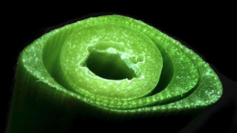
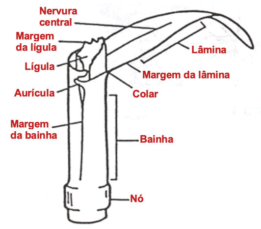
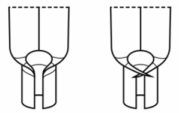
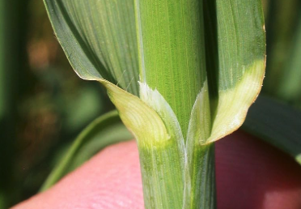
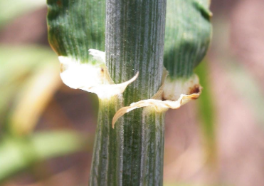
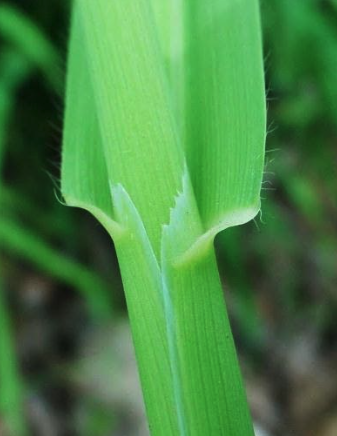
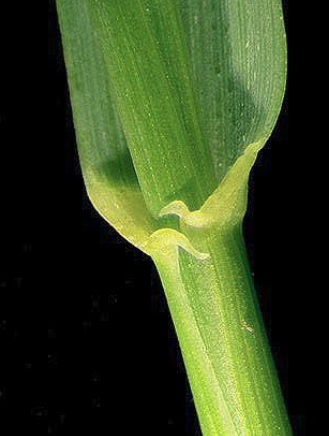
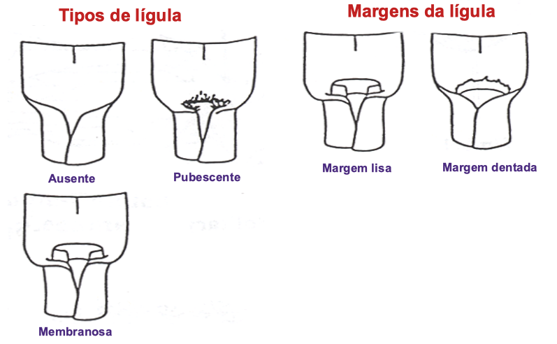
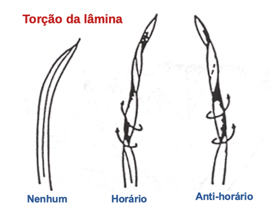
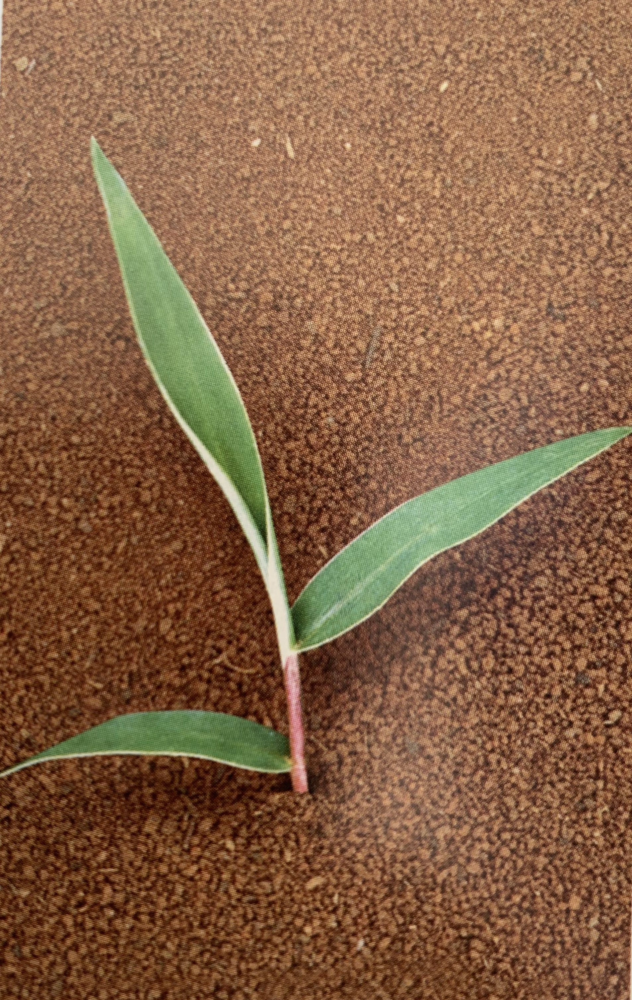

```{r setup, include=FALSE}
options(htmltools.dir.version = FALSE)
knitr::opts_chunk$set(
  echo = FALSE,
  fig.align = "center",
  message = FALSE,
  warning = FALSE,
  cache = TRUE
)

htmltools::tagList(rmarkdown::html_dependency_font_awesome()) #show twitter logo
```


## Poaceae

### Características

.pull-left[

- **Flores:** flores diminutas dispostas em espiguetas

- **Folhas:** em forma de tira, venação alternada, paralela, folhas; bainha e lâmina

- **Caules:** geralmente ocos (colmo), sólidos nos nós

- **Cultivado:** milho, cevada, sorgo em grão, aveia, trigo, centeio, milheto
]

.pull-right[
```{r echo=FALSE, out.width=250, fig.align='center'}

``` 

- **Variedades cultivadas**: pepinos, abóboras, melões, cabaças
]

---

## ID de gramíneas: partes

```{r echo=FALSE, out.width=500, fig.align='center'}

``` 


---

## ID de gramíneas: aurículas

```{r echo=FALSE, out.width=200, fig.align='center'}

``` 


.pull-left[
```{r echo=FALSE, out.width=500, fig.align='center'}

``` 
Aveia (*Avena sativa*) - sem aurículas
]


.pull-right[
```{r echo=FALSE, out.width=500, fig.align='center'}

``` 
Cevada (*Hordeum vulgare*) - aurículas
]


---


## ID de gramíneas: aurículas


.pull-left[
```{r echo=FALSE, out.width=500, fig.align='center'}

``` 
Aveia selvagem (*Avena fatua*) - sem aurículas
]


.pull-right[
```{r echo=FALSE, out.width=500, fig.align='center'}

``` 
Grama-francesa (*Elymus repens*) - aurículas
]


---


## ID de gramíneas: lígulas


```{r echo=FALSE, out.width=600, fig.align='center'}

``` 


---

## ID de gramíneas: lígulas

```{r echo=FALSE, out.width=600, fig.align='center'}

``` 

---

## ID de gramíneas: lígulas

.pull-left[
```{r echo=FALSE, out.width=300, fig.align='center'}
knitr::include_graphics("https://www.backyardnature.net/n/14/140831pp.jpg")
``` 

```{r echo=FALSE, out.width=250, fig.align='center'}
knitr::include_graphics("https://weedid.missouri.edu/images/images_optimized/2222optimized.jpg")
``` 
]

.pull-right[
```{r echo=FALSE, out.width=600, fig.align='center'}
knitr::include_graphics("https://content.ces.ncsu.edu/media/images/large-crabgrass-11258-ligule2.jpg")
``` 

```{r echo=FALSE, out.width=600, fig.align='center'}
knitr::include_graphics("https://www.canr.msu.edu/pestid/uploads/images/Fall-panicum-ligule.jpg")
``` 

]


---


## ID de gramíneas: torção da lâmina

```{r echo=FALSE, out.width=500, fig.align='center'}

``` 


---

## Dúvidas em morfologia de gramíneas?


```{r echo=FALSE, out.width=500, fig.align='center'}
knitr::include_graphics("https://media.giphy.com/media/24RWVQlg1oRri/giphy.gif")
``` 


---

## *Digitaria insularis*

#### Nome comum: capim amargoso

.pull-left[

- **Ciclo de vida:** perene

- **Folha:** 

- **Lígula:** 


]

.pull-right[
```{r echo=FALSE, out.width=200, fig.align='center'}
knitr::include_graphics("https://upload.wikimedia.org/wikipedia/commons/thumb/0/0d/Cucumis_anguria.JPG/1200px-Cucumis_anguria.JPG")
``` 

- **Habitat:** 

]

---

.pull-left[
```{r echo=FALSE, out.width=500, fig.align='center'}
knitr::include_graphics("https://live.staticflickr.com/1745/27699801227_848f1fb409_b.jpg")
``` 

```{r echo=FALSE, out.width=500, fig.align='center'}
knitr::include_graphics("https://plants.usda.gov/gallery/standard/cuan_001_shp.jpg")
``` 
]

.pull-right[
```{r echo=FALSE, out.width=500, fig.align='center'}
knitr::include_graphics("https://upload.wikimedia.org/wikipedia/commons/c/c1/Cucumis_anguria%2C_Flower.jpg")
``` 

```{r echo=FALSE, out.width=500, fig.align='center'}
knitr::include_graphics("https://i.pinimg.com/474x/1b/7a/b3/1b7ab383b60109e5e64159ec71ea48f1.jpg")
``` 
]

---

## *Cenchrus echinatus*

#### Nome comum: capim-carrapicho

.pull-left[

- **Ciclo de vida**: Anual, herbácea

- **Lâmina:** 

- **Lígula:** 

- **Bainha:** 

- **Folha:** 

- **Espiga:** espigueta espinhenta

]

.pull-right[
```{r echo=FALSE, out.width=250, fig.align='center'}
knitr::include_graphics("https://alchetron.com/cdn/cenchrus-echinatus-2d4b9ed8-9719-4686-8094-395bdfa77d1-resize-750.jpeg")
``` 


]

---

.pull-left[
```{r echo=FALSE, out.width=300, fig.align='center'}
knitr::include_graphics("https://www.soilcropandmore.info/crops/Grasses/Southern_Sandbur/tallo-y-hoja-vaina.jpg")
``` 

```{r echo=FALSE, out.width=300, fig.align='center'}
knitr::include_graphics("https://keyserver.lucidcentral.org/weeds/data/media/Images/cenchrus_echinatus/cenchrusechinatus11.jpg")
``` 
]

.pull-right[
```{r echo=FALSE, out.width=300, fig.align='center'}
knitr::include_graphics("https://www.alabamaplants.com/Grasses/Cenchrus_echinatus_ligule.jpg")
``` 

```{r echo=FALSE, out.width=220, fig.align='center'}
knitr::include_graphics("https://lh3.googleusercontent.com/proxy/iJgYko6zqX9r0nv0-vcPfM18LjlA_zk7_BH2XMwz6FP8m2mHYD-K5s1DmlNE0e-27zu4zKHXKAQDzYN3vL5HUZ4e5AO-8KWQVAWVxCUWSQU0SRNk8Dtg0oTcd7KC_4BgdF3VwSJZEq7DIgdwkYwYNBcy")
``` 
]


---


## *Cynodon dactylon*

#### Nome comum: grama-seda, capim-bermuda

.pull-left[

- **Ciclo de vida**: perene, herbácea, prostrada

- **Lâmina:** macia e pouco pubescente proximo a base

- **Aurículas:** Sem

- **Lígula:** franja pubescente 0.5 mm

- **Bainha:**  pubescente (1 a 3 mm) perto do colar apenas

- **Folha:** rolled in a bud - pubescente na regiaão do colar

- **Raiz:** rizoma e estolão
]

.pull-right[
```{r echo=FALSE, out.width=250, fig.align='center'}
knitr::include_graphics("https://weedid.missouri.edu/images/images_optimized/2233optimized.jpg")
``` 


]

---

.pull-left[
```{r echo=FALSE, out.width=300, fig.align='center'}
knitr::include_graphics("https://weedid.missouri.edu/images/images_optimized/2234optimized.jpg")
``` 

```{r echo=FALSE, out.width=250, fig.align='center'}
knitr::include_graphics("https://weedid.missouri.edu/images/images_optimized/2236optimized.jpg")
``` 

```{r echo=FALSE, out.width=220, fig.align='center'}
knitr::include_graphics("https://weedid.missouri.edu/images/images_optimized/2240optimized.jpg")
``` 
]

.pull-right[
```{r echo=FALSE, out.width=300, fig.align='center'}
knitr::include_graphics("https://weedid.missouri.edu/images/images_optimized/2238optimized.jpg")
``` 


]


---


## *Digitaria sanguinalis*

#### Nome comum: capim colchão

.pull-left[

- **Ciclo de vida**: Anual, prostrada

- **Lâmina:** desamente pubescente - (90 graus)

- **Lígula:** 1-2 cm, membranosa

- **Bainha:** desamente pubescente - (90 graus)

- **Folha:** com margem irregular

- **Plântulas:** Bainhas e lâminas geralmente densamente pubescente, com uma lígula membranosa denteada

]

.pull-right[
```{r echo=FALSE, out.width=300, fig.align='center'}
knitr::include_graphics("https://www.agrolink.com.br/upload/problemas/Eleusine_indica83.jpg")
``` 


]

---

.pull-left[
```{r echo=FALSE, out.width=500, fig.align='center'}
knitr::include_graphics("https://weedid.missouri.edu/images/images_optimized/2038optimized.jpg")
``` 

```{r echo=FALSE, out.width=500, fig.align='center'}
knitr::include_graphics("https://weedid.missouri.edu/images/images_optimized/2042optimized.jpg")
``` 
]

.pull-right[
```{r echo=FALSE, out.width=250, fig.align='center'}
knitr::include_graphics("https://weedid.missouri.edu/images/images_optimized/2043optimized.jpg")
``` 

```{r echo=FALSE, out.width=500, fig.align='center'}
knitr::include_graphics("https://weedid.missouri.edu/images/images_optimized/2046optimized.jpg")
``` 
]


---


## *Echinochloa crus-galli*

#### Nome comum: capim-arroz

.pull-left[

- **Ciclo de vida**: anual, herbácea

- **Plântula:** sem cabelos (glabro), aurículas e lígulas

- **Aurículas:** Sem

- **Lígula:** Sem

- **Bainha:** frequentemente tingidos de vermelho ou marrom na base

- **Folha:** Rolled in the shoot - nervura central branca distinta, pode ter pelos curtos nas bases das folhas

- **Raiz:** fribrosa
]

.pull-right[
```{r echo=FALSE, out.width=250, fig.align='center'}
knitr::include_graphics("https://weedid.missouri.edu/images/images_optimized/2220optimized.jpg")
``` 


]

---

.pull-left[
```{r echo=FALSE, out.width=350, fig.align='center'}
knitr::include_graphics("https://extension.umass.edu/landscape/sites/landscape/files/weeds/leaves/echcg9084w.jpg")
``` 

```{r echo=FALSE, out.width=350, fig.align='center'}
knitr::include_graphics("https://extension.umass.edu/landscape/sites/landscape/files/weeds/seedheads/echcg2881w.jpg")
``` 


]

.pull-right[
```{r echo=FALSE, out.width=300, fig.align='center'}
knitr::include_graphics("https://weedid.missouri.edu/images/images_optimized/2219optimized.jpg")
``` 

```{r echo=FALSE, out.width=220, fig.align='center'}
knitr::include_graphics("https://extension.umass.edu/landscape/sites/landscape/files/weeds/leaves/echcg8365w.jpg")
``` 
]


---


## *Echinochloa colona*

#### Nome comum: capim-arroz

.pull-left[

- **Ciclo de vida**: anual, herbácea

- **Plântula:** sem cabelos (glabro), aurículas e lígulas

- **Aurículas:** Sem

- **Lígula:** Sem

- **Bainha:** frequentemente tingidos de vermelho ou marrom na base

- **Folha:** Rolled in the shoot - nervura central branca distinta, pode ter pelos curtos nas bases das folhas

- **Raiz:** fribrosa
]

.pull-right[
```{r echo=FALSE, out.width=250, fig.align='center'}
knitr::include_graphics("https://aggieturf.tamu.edu/wp-content/uploads/2015/03/JR.SH2_.jpg")
``` 

```{r echo=FALSE, out.width=250, fig.align='center'}
knitr::include_graphics("https://www.clemson.edu/cafls/research/weeds/weed-id-bio/grasses-parent/grasslfsannual/jungle-rice-leafflower.jpg")
``` 

]

---

.pull-left[
```{r echo=FALSE, out.width=450, fig.align='center'}
knitr::include_graphics("https://aggieturf.tamu.edu/wp-content/uploads/2015/03/JR.Spikelets.jpg")
``` 

```{r echo=FALSE, out.width=450, fig.align='center'}
knitr::include_graphics("https://aggieturf.tamu.edu/wp-content/uploads/2015/03/JR.GH2_.jpg")
``` 


]

.pull-right[
```{r echo=FALSE, out.width=350, fig.align='center'}
knitr::include_graphics("http://www.fresnostate.edu/jcast/weedscience/images/Junglerice-web.jpg")
``` 

```{r echo=FALSE, out.width=350, fig.align='center'}
knitr::include_graphics("http://ipm.ucanr.edu/PMG/IMAGES/E/W-GM-ECOL-SG.002.jpg")
``` 
]


---

## *Sorghum halepense*

#### Nome comum: capim massambará

.pull-left[

- **Lâmina:** Linear, plana, nervura central proeminente (cor mais clara normalmente branca), geralmente sem pelos.

- **Lígula:** Membranosa, truncada, erose (ou seja, irregularmente entalhada na ponta ou margem; aparentando ser roída ou erodida).

- **Bainha:** aberta, redonda.

- **Rizomas:** rasteiros e grossos.

- **Habitat:** 

]

.pull-right[
```{r echo=FALSE, out.width=300, fig.align='center'}
knitr::include_graphics("https://weedid.missouri.edu/images/images_optimized/2060optimized.jpg")
``` 


]

---

.pull-left[
```{r echo=FALSE, out.width=500, fig.align='center'}
knitr::include_graphics("https://weedid.missouri.edu/images/images_optimized/2061optimized.jpg")
``` 

```{r echo=FALSE, out.width=500, fig.align='center'}
knitr::include_graphics("https://weedid.missouri.edu/images/images_optimized/2063optimized.jpg")
``` 
]

.pull-right[
```{r echo=FALSE, out.width=300, fig.align='center'}
knitr::include_graphics("https://weedid.missouri.edu/images/images_optimized/2059optimized.jpg")
``` 

```{r echo=FALSE, out.width=500, fig.align='center'}
knitr::include_graphics("https://secure.caes.uga.edu/extension/publications/files/html/B1513/images/mceclip3.png")
``` 
]

---


## *Lolium multiflorum*

#### Nome comum: azevem

.pull-left[
- **Ciclo de vida:** anual ou bianual, herbácea

- **Folha:** 

- **Lígula:** 

- **Bainha:** 

- **Rizomas:** 

- **Habitat:** 

]

.pull-right[
```{r echo=FALSE, out.width=250, fig.align='center'}
knitr::include_graphics("https://www.agrolink.com.br/upload/problemas/Lolium%20multiflorum1.jpg")
``` 


]

---

.pull-left[
```{r echo=FALSE, out.width=300, fig.align='center'}
knitr::include_graphics("https://soilcropandmore.info/crops/Grasses/Annual_ryegrass/Lolium_multiflorum_ligule.jpg")
``` 

```{r echo=FALSE, out.width=300, fig.align='center'}
knitr::include_graphics("https://content.ces.ncsu.edu/media/images/annual-ryegrass-auricle-2.jpg")
``` 
]

.pull-right[
```{r echo=FALSE, out.width=250, fig.align='center'}
knitr::include_graphics("https://plantevaernonline.dlbr.dk/cp/graphics/ImageDatabase/LOLMU-EAR-700.JPG")
``` 

```{r echo=FALSE, out.width=250, fig.align='center'}
knitr::include_graphics("https://plantevaernonline.dlbr.dk/cp/graphics/ImageDatabase/LOLMU-SEE-700.JPG")
``` 
]

---


## *Eleusine indica*

#### Nome comum: capim pé-de-galinha

.pull-left[

- **Lâmina:** 

- **Lígula:** 

- **Bainha:** 

- **Rizomas:** 

- **Habitat:** 

]

.pull-right[
```{r echo=FALSE, out.width=300, fig.align='center'}
knitr::include_graphics("https://turf.purdue.edu/wp-content/uploads/2013/07/IMG_3170.JPG")
``` 


]

---

.pull-left[
```{r echo=FALSE, out.width=250, fig.align='center'}
knitr::include_graphics("https://soilcropandmore.info/crops/Grasses/Goosegrass/Eleusine_indica_leaf_base.jpg")
``` 

```{r echo=FALSE, out.width=500, fig.align='center'}
knitr::include_graphics("https://turf.purdue.edu/wp-content/uploads/2013/07/DSC_4172.JPG")
``` 
]

.pull-right[
```{r echo=FALSE, out.width=500, fig.align='center'}
knitr::include_graphics("https://turf.purdue.edu/wp-content/uploads/2013/07/IMG_1576.JPG")
``` 

```{r echo=FALSE, out.width=500, fig.align='center'}
knitr::include_graphics("https://content.ces.ncsu.edu/media/images/goosegrass-11254-ligule.jpg")
``` 
]

---


## *Chloris elata*

#### Nome comum: capim branco

.pull-left[

- **Lâmina:** 

- **Lígula:** 

- **Bainha:** 

- **Rizomas:** 

- **Habitat:** 

]

.pull-right[
```{r echo=FALSE, out.width=300, fig.align='center'}
knitr::include_graphics("https://live.staticflickr.com/767/32496352856_3b68892c9e_b.jpg")
``` 


]

---

.pull-left[
```{r echo=FALSE, out.width=500, fig.align='center'}
knitr::include_graphics("https://weedid.missouri.edu/images/images_optimized/2061optimized.jpg")
``` 

```{r echo=FALSE, out.width=500, fig.align='center'}
knitr::include_graphics("https://weedid.missouri.edu/images/images_optimized/2063optimized.jpg")
``` 
]

.pull-right[
```{r echo=FALSE, out.width=300, fig.align='center'}
knitr::include_graphics("https://weedid.missouri.edu/images/images_optimized/2059optimized.jpg")
``` 

```{r echo=FALSE, out.width=500, fig.align='center'}
knitr::include_graphics("http://www.weedscience.org/images/weedid/316.jpg")
``` 
]


---


## *Urochloa decumbens*

#### Nome comum: capim-braquiária

.pull-left[

- **Lâmina:** 

- **Folha:** Pubescente

- **Aurículas:** Ausente

- **Lígula:** ciliada

- **Bainha:** pubescente

- **Habitat:** 

]

.pull-right[
```{r echo=FALSE, out.width=300, fig.align='center'}
knitr::include_graphics("https://weeds.brisbane.qld.gov.au/sites/default/files/styles/large/public/images/brachiaria_decumbens9.jpg?itok=IRuJVxak")
``` 


]

---

.pull-left[
```{r echo=FALSE, out.width=300, fig.align='center'}
knitr::include_graphics("https://upload.wikimedia.org/wikipedia/commons/8/8c/Urochloa_decumbens_ligule2_%287429388496%29.jpg")
``` 

```{r echo=FALSE, out.width=300, fig.align='center'}
knitr::include_graphics("https://keyserver.lucidcentral.org/weeds/data/media/Images/urochloa_decumbens/brachiariadecumbens1.jpg")
``` 
]

.pull-right[
```{r echo=FALSE, out.width=300, fig.align='center'}
knitr::include_graphics("https://weeds.brisbane.qld.gov.au/sites/default/files/styles/large/public/images/brachiaria_decumbens13.jpg?itok=oMZSQWg_")
``` 

```{r echo=FALSE, out.width=300, fig.align='center'}

``` 
]