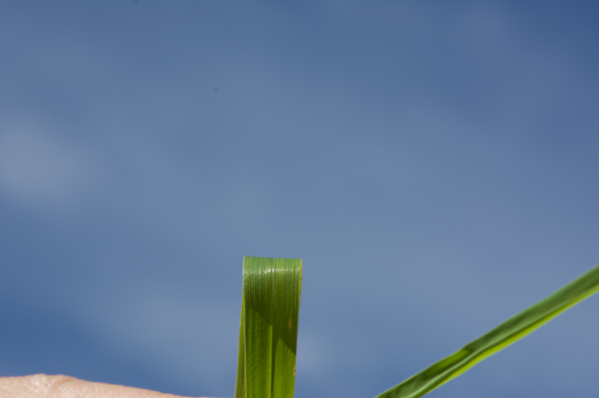
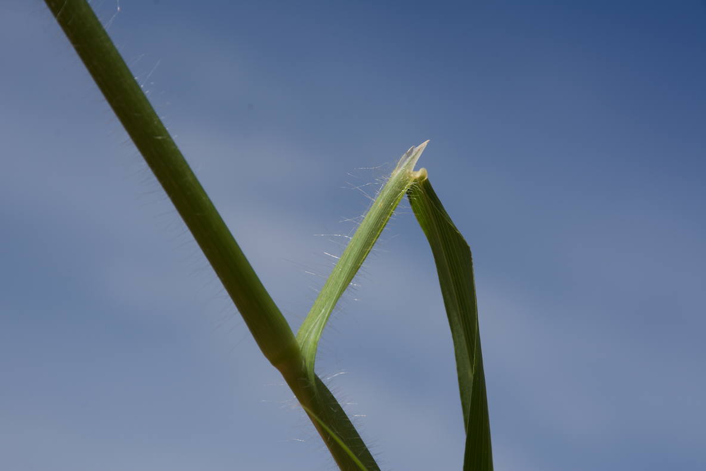
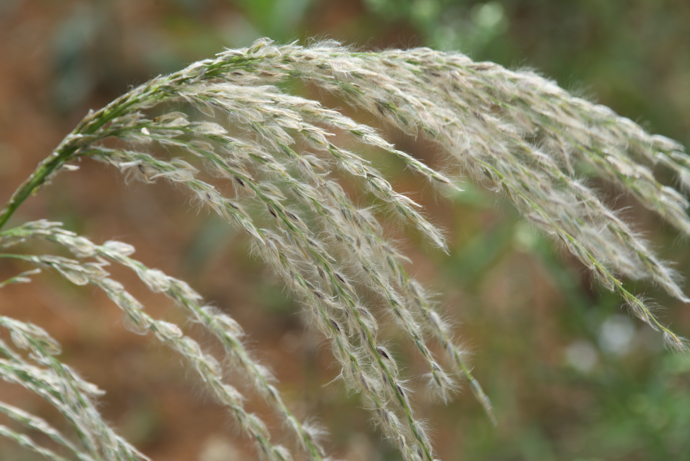
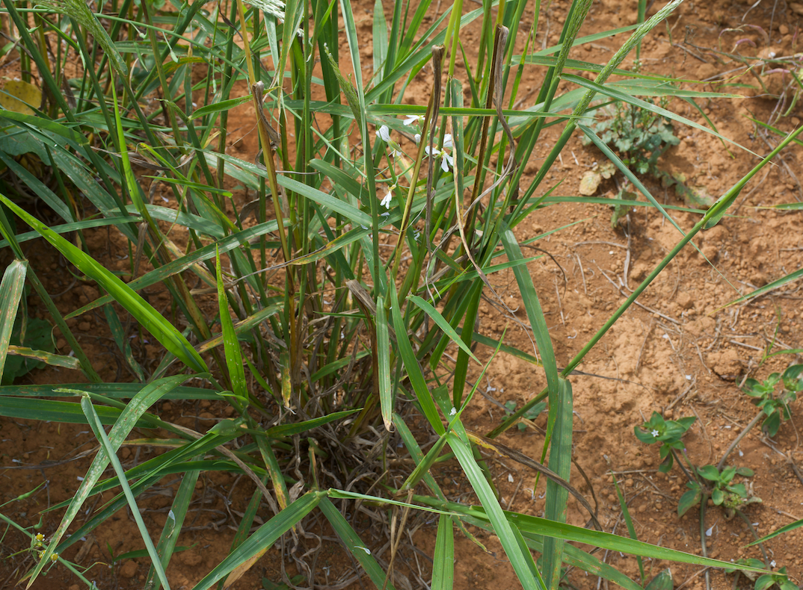
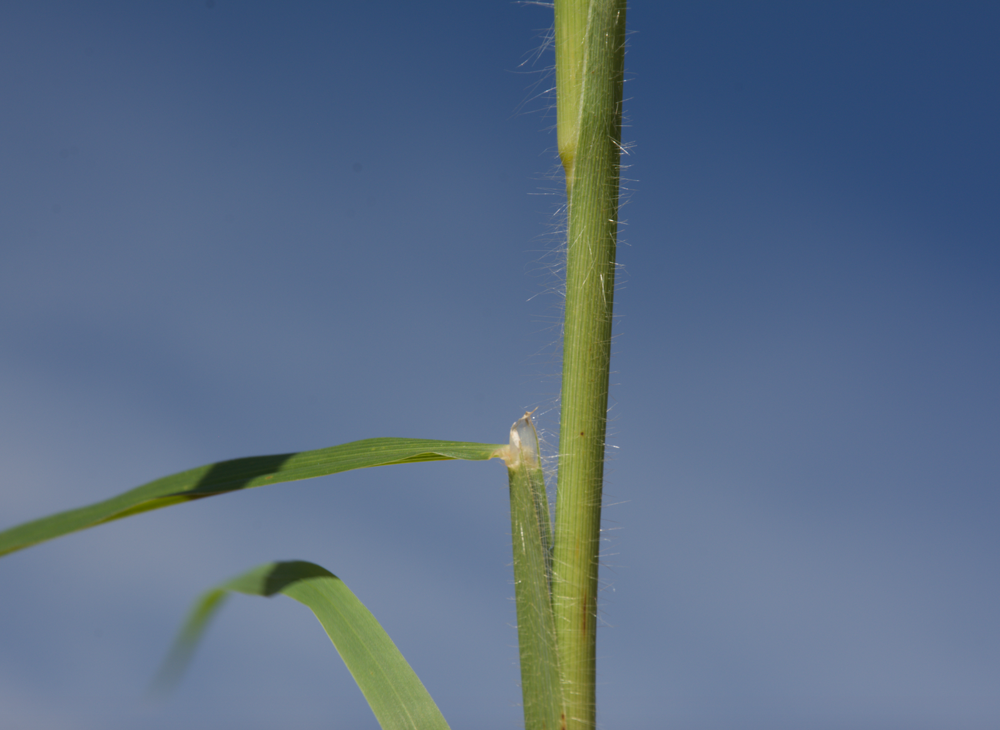
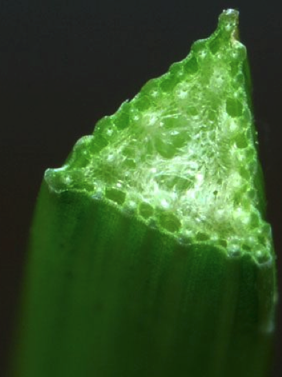

```{r setup, include=FALSE}
options(htmltools.dir.version = FALSE)
knitr::opts_chunk$set(
  echo = FALSE,
  fig.align = "center",
  message = FALSE,
  warning = FALSE,
  cache = TRUE
)

htmltools::tagList(rmarkdown::html_dependency_font_awesome()) #show twitter logo
```


class: inverse


## Poaceae

### Características

.pull-left[

- **Flores:** flores diminutas dispostas em espiguetas

- **Folhas:** em forma de tira, venação alternada, paralela, folhas; bainha e lâmina

- **Caules:** geralmente ocos (colmo), sólidos nos nós

- **Cultivado:** milho, cevada, sorgo em grão, aveia, trigo, centeio, milheto
]

.pull-right[
```{r echo=FALSE, out.width=250, fig.align='center'}
knitr::include_graphics("images/stem.png")
``` 


]

---

## ID de gramíneas: partes

```{r echo=FALSE, out.width=500, fig.align='center'}
knitr::include_graphics("images/grass_anatomy.png")
``` 


---

## ID de gramíneas: aurículas

```{r echo=FALSE, out.width=200, fig.align='center'}
knitr::include_graphics("images/auricles.png")
``` 


.pull-left[
```{r echo=FALSE, out.width=500, fig.align='center'}
knitr::include_graphics("images/no_auricles.png")
``` 
Aveia (*Avena sativa*) - sem aurículas
]


.pull-right[
```{r echo=FALSE, out.width=500, fig.align='center'}
knitr::include_graphics("images/auricles_2.png")
``` 
Cevada (*Hordeum vulgare*) - aurículas
]


---


## ID de gramíneas: aurículas


.pull-left[
```{r echo=FALSE, out.width=500, fig.align='center'}
knitr::include_graphics("images/no_auricles_2.png")
``` 
Aveia selvagem (*Avena fatua*) - sem aurículas
]


.pull-right[
```{r echo=FALSE, out.width=500, fig.align='center'}
knitr::include_graphics("images/auricles_3.png")
``` 
Grama-francesa (*Elymus repens*) - aurículas
]


---


## ID de gramíneas: lígulas


```{r echo=FALSE, out.width=600, fig.align='center'}
knitr::include_graphics("images/ligules.png")
``` 


---

## ID de gramíneas: lígulas

```{r echo=FALSE, out.width=600, fig.align='center'}
knitr::include_graphics("images/ligules.png")
``` 

---

## ID de gramíneas: lígulas

.pull-left[
```{r echo=FALSE, out.width=300, fig.align='center'}
knitr::include_graphics("https://www.backyardnature.net/n/14/140831pp.jpg")
``` 

```{r echo=FALSE, out.width=250, fig.align='center'}
knitr::include_graphics("https://weedid.missouri.edu/images/images_optimized/2222optimized.jpg")
``` 
]

.pull-right[
```{r echo=FALSE, out.width=600, fig.align='center'}
knitr::include_graphics("https://content.ces.ncsu.edu/media/images/large-crabgrass-11258-ligule2.jpg")
``` 

```{r echo=FALSE, out.width=600, fig.align='center'}
knitr::include_graphics("https://www.canr.msu.edu/pestid/uploads/images/Fall-panicum-ligule.jpg")
``` 

]


---


## ID de gramíneas: torção da lâmina

```{r echo=FALSE, out.width=500, fig.align='center'}
knitr::include_graphics("images/twist.png")
``` 


---

## Dúvidas em morfologia de gramíneas?


```{r echo=FALSE, out.width=500, fig.align='center'}
knitr::include_graphics("https://media.giphy.com/media/24RWVQlg1oRri/giphy.gif")
``` 

---


## *Cenchrus echinatus*

#### Nome comum: capim-carrapicho

.pull-left[

- **Ciclo de vida**: anual - ereta/prostrada

- **Lâmina:** 

- **Bainha:** folhas abertas

- **Lígula:** franja de pelos

- **Caules:** verdes com tonalidade marrom

- **Folha:** planas, macias a levemente pubescentes

- **Inflorescência:** espigueta espinhenta

]

.pull-right[
```{r echo=FALSE, out.width=250, fig.align='center'}
knitr::include_graphics("https://alchetron.com/cdn/cenchrus-echinatus-2d4b9ed8-9719-4686-8094-395bdfa77d1-resize-750.jpeg")
``` 


]

---

.pull-left[
```{r echo=FALSE, out.width=300, fig.align='center'}
knitr::include_graphics("https://www.soilcropandmore.info/crops/Grasses/Southern_Sandbur/tallo-y-hoja-vaina.jpg")
``` 

```{r echo=FALSE, out.width=300, fig.align='center'}
knitr::include_graphics("https://keyserver.lucidcentral.org/weeds/data/media/Images/cenchrus_echinatus/cenchrusechinatus11.jpg")
``` 
]

.pull-right[
```{r echo=FALSE, out.width=300, fig.align='center'}
knitr::include_graphics("https://www.alabamaplants.com/Grasses/Cenchrus_echinatus_ligule.jpg")
``` 

```{r echo=FALSE, out.width=220, fig.align='center'}
knitr::include_graphics("https://lh3.googleusercontent.com/proxy/j2DpkPvgSUMAvWfj778WRAdoO-ZVkb0WWP_MwmiYY4smPRcGOwJUBaxigbMAk-cr-u5tFXMmpeaDgaChv9kasrruLC7uUD4prp-IDTcq-XHycI57HWqzMi-gpfQoSMXTJ3RNYjwHqd9M9AV4F5k5mARv")
``` 
]


---


## *Cynodon dactylon*

#### Nome comum: grama-seda, capim-bermuda

.pull-left[

- **Ciclo de vida**: perene, herbácea, prostrada

- **Lâmina:** macia e pouco pubescente proximo a base

- **Aurículas:** Sem

- **Lígula:** franja pubescente 0.5 mm

- **Bainha:**  pubescente (1 a 3 mm) perto do colar apenas

- **Folha:** rolled in a bud - pubescente na regiaão do colar

- **Raiz:** rizoma e estolão
]

.pull-right[
```{r echo=FALSE, out.width=250, fig.align='center'}
knitr::include_graphics("https://weedid.missouri.edu/images/images_optimized/2233optimized.jpg")
``` 


]

---

.pull-left[
```{r echo=FALSE, out.width=300, fig.align='center'}
knitr::include_graphics("https://weedid.missouri.edu/images/images_optimized/2234optimized.jpg")
``` 

```{r echo=FALSE, out.width=250, fig.align='center'}
knitr::include_graphics("https://weedid.missouri.edu/images/images_optimized/2236optimized.jpg")
``` 

```{r echo=FALSE, out.width=220, fig.align='center'}
knitr::include_graphics("https://weedid.missouri.edu/images/images_optimized/2240optimized.jpg")
``` 
]

.pull-right[
```{r echo=FALSE, out.width=300, fig.align='center'}
knitr::include_graphics("https://weedid.missouri.edu/images/images_optimized/2238optimized.jpg")
``` 


]


---

## *Digitaria insularis*

#### Nome comum: capim amargoso

.pull-left[

- **Ciclo de vida:** perene - ereta

- **Folha:** glabras - com até 40 cm - 15 mm

- **Lígula:** 3-4 cm

- **Aurícolas:** ausentes

- **Bainha:** pubescente - membranosa

- **Inflorescência:** panícula

- **Reprodução:** Sementes, rizoma - rizomas são extremamente curtos e inchados 

- Nativa das Américas - incluindo Brasil

]

.pull-right[
```{r echo=FALSE, out.width=500, fig.align='center'}
knitr::include_graphics("images/amargoso_5.png")
``` 

```{r echo=FALSE, out.width=300, fig.align='center'}

``` 
- **Habitat:** 

]

---

.pull-left[
```{r echo=FALSE, out.width=600, fig.align='center'}

``` 

```{r echo=FALSE, out.width=600, fig.align='center'}

``` 
]

.pull-right[
```{r echo=FALSE, out.width=600, fig.align='center'}

``` 

```{r echo=FALSE, out.width=600, fig.align='center'}

``` 
]


---


## *Digitaria sanguinalis*

#### Nome comum: capim colchão

.pull-left[

- **Ciclo de vida**: Anual, prostrada

- **Lâmina:** desamente pubescente - (90 graus)

- **Lígula:** 1-2 cm, membranosa

- **Bainha:** desamente pubescente - (90 graus)

- **Folha:** com margem irregular

- **Plântulas:** Bainhas e lâminas geralmente densamente pubescente, com uma lígula membranosa denteada

]

.pull-right[
```{r echo=FALSE, out.width=300, fig.align='center'}
knitr::include_graphics("https://www.agrolink.com.br/upload/problemas/Eleusine_indica83.jpg")
``` 


]

---

.pull-left[
```{r echo=FALSE, out.width=500, fig.align='center'}
knitr::include_graphics("https://weedid.missouri.edu/images/images_optimized/2038optimized.jpg")
``` 

```{r echo=FALSE, out.width=500, fig.align='center'}
knitr::include_graphics("https://weedid.missouri.edu/images/images_optimized/2042optimized.jpg")
``` 
]

.pull-right[
```{r echo=FALSE, out.width=250, fig.align='center'}
knitr::include_graphics("https://weedid.missouri.edu/images/images_optimized/2043optimized.jpg")
``` 

```{r echo=FALSE, out.width=500, fig.align='center'}
knitr::include_graphics("https://weedid.missouri.edu/images/images_optimized/2046optimized.jpg")
``` 
]


---


## *Echinochloa crus-galli*

#### Nome comum: capim-arroz

.pull-left[

- **Ciclo de vida**: anual, herbácea

- **Plântula:** sem cabelos (glabro), aurículas e lígulas

- **Aurículas:** Sem

- **Lígula:** Sem

- **Bainha:** frequentemente tingidos de vermelho ou marrom na base

- **Folha:** Rolled in the shoot - nervura central branca distinta, pode ter pelos curtos nas bases das folhas

- **Raiz:** fribrosa
]

.pull-right[
```{r echo=FALSE, out.width=250, fig.align='center'}
knitr::include_graphics("https://weedid.missouri.edu/images/images_optimized/2220optimized.jpg")
``` 


]

---

.pull-left[
```{r echo=FALSE, out.width=350, fig.align='center'}
knitr::include_graphics("https://extension.umass.edu/landscape/sites/landscape/files/weeds/leaves/echcg9084w.jpg")
``` 

```{r echo=FALSE, out.width=350, fig.align='center'}
knitr::include_graphics("https://extension.umass.edu/landscape/sites/landscape/files/weeds/seedheads/echcg2881w.jpg")
``` 


]

.pull-right[
```{r echo=FALSE, out.width=300, fig.align='center'}
knitr::include_graphics("https://weedid.missouri.edu/images/images_optimized/2219optimized.jpg")
``` 

```{r echo=FALSE, out.width=220, fig.align='center'}
knitr::include_graphics("https://extension.umass.edu/landscape/sites/landscape/files/weeds/leaves/echcg8365w.jpg")
``` 
]


---


## *Echinochloa colona*

#### Nome comum: capim-arroz

.pull-left[

- **Ciclo de vida**: anual, herbácea

- **Plântula:** sem cabelos (glabro), aurículas e lígulas

- **Aurículas:** Sem

- **Lígula:** Sem

- **Bainha:** frequentemente tingidos de vermelho ou marrom na base

- **Folha:** Rolled in the shoot - nervura central branca distinta, pode ter pelos curtos nas bases das folhas

- **Raiz:** fribrosa
]

.pull-right[
```{r echo=FALSE, out.width=250, fig.align='center'}
knitr::include_graphics("https://aggieturf.tamu.edu/wp-content/uploads/2015/03/JR.SH2_.jpg")
``` 

```{r echo=FALSE, out.width=250, fig.align='center'}
knitr::include_graphics("https://www.clemson.edu/cafls/research/weeds/weed-id-bio/grasses-parent/grasslfsannual/jungle-rice-leafflower.jpg")
``` 

]

---

.pull-left[
```{r echo=FALSE, out.width=450, fig.align='center'}
knitr::include_graphics("https://aggieturf.tamu.edu/wp-content/uploads/2015/03/JR.Spikelets.jpg")
``` 

```{r echo=FALSE, out.width=450, fig.align='center'}
knitr::include_graphics("https://aggieturf.tamu.edu/wp-content/uploads/2015/03/JR.GH2_.jpg")
``` 


]

.pull-right[
```{r echo=FALSE, out.width=350, fig.align='center'}
knitr::include_graphics("http://www.fresnostate.edu/jcast/weedscience/images/Junglerice-web.jpg")
``` 

```{r echo=FALSE, out.width=350, fig.align='center'}
knitr::include_graphics("http://ipm.ucanr.edu/PMG/IMAGES/E/W-GM-ECOL-SG.002.jpg")
``` 
]


---

## *Sorghum halepense*

#### Nome comum: capim massambará

.pull-left[

- **Lâmina:** Linear, plana, nervura central proeminente (cor mais clara normalmente branca), geralmente sem pelos.

- **Lígula:** Membranosa, truncada, erose (ou seja, irregularmente entalhada na ponta ou margem; aparentando ser roída ou erodida).

- **Bainha:** aberta, redonda.

- **Rizomas:** rasteiros e grossos.

- **Habitat:** 

]

.pull-right[
```{r echo=FALSE, out.width=300, fig.align='center'}
knitr::include_graphics("https://weedid.missouri.edu/images/images_optimized/2060optimized.jpg")
``` 


]

---

.pull-left[
```{r echo=FALSE, out.width=500, fig.align='center'}
knitr::include_graphics("https://weedid.missouri.edu/images/images_optimized/2061optimized.jpg")
``` 

```{r echo=FALSE, out.width=500, fig.align='center'}
knitr::include_graphics("https://weedid.missouri.edu/images/images_optimized/2063optimized.jpg")
``` 
]

.pull-right[
```{r echo=FALSE, out.width=300, fig.align='center'}
knitr::include_graphics("https://weedid.missouri.edu/images/images_optimized/2059optimized.jpg")
``` 

```{r echo=FALSE, out.width=500, fig.align='center'}
knitr::include_graphics("https://secure.caes.uga.edu/extension/publications/files/html/B1513/images/mceclip3.png")
``` 
]

---


## *Lolium multiflorum*

#### Nome comum: azevem

.pull-left[
- **Ciclo de vida:** anual ou bianual, herbácea

- **Folha:** verde a verde escuro, sem pêlos, plana, superfície superior uniformemente nervurada, superfície inferior lisa e brilhante

- **Lígula:** branca, translúcida, mais curto do que largo

- **Aurículas:** pequena e curta

- **Habitat:** Clima temperado/frio

- Nativa do sul da Europa

]

.pull-right[
```{r echo=FALSE, out.width=450, fig.align='center'}
knitr::include_graphics("https://aggieturf.tamu.edu/wp-content/uploads/2015/04/ARG_2.jpg")
``` 


]

---

.pull-left[
```{r echo=FALSE, out.width=300, fig.align='center'}
knitr::include_graphics("https://soilcropandmore.info/crops/Grasses/Annual_ryegrass/Lolium_multiflorum_ligule.jpg")
``` 

```{r echo=FALSE, out.width=300, fig.align='center'}
knitr::include_graphics("https://content.ces.ncsu.edu/media/images/annual-ryegrass-auricle-2.jpg")
``` 
]

.pull-right[
```{r echo=FALSE, out.width=250, fig.align='center'}
knitr::include_graphics("https://plantevaernonline.dlbr.dk/cp/graphics/ImageDatabase/LOLMU-EAR-700.JPG")
``` 

```{r echo=FALSE, out.width=250, fig.align='center'}
knitr::include_graphics("https://plantevaernonline.dlbr.dk/cp/graphics/ImageDatabase/LOLMU-SEE-700.JPG")
``` 
]

---


## *Eleusine indica*

#### Nome comum: capim pé-de-galinha

.pull-left[

- **Ciclo de vida:** anual - prostrada

- **Folha:** glabras ou levemente pubescentes

- **Lígula:** pequena e membranosa

- **Bainha:** são achatados, lisos e mesmo em plântulas, muitas vezes são distintamente brancos a prateados na base

- **Inflorescências:** 2-13 espigas 


]

.pull-right[
```{r echo=FALSE, out.width=300, fig.align='center'}
knitr::include_graphics("https://turf.purdue.edu/wp-content/uploads/2013/07/IMG_3170.JPG")
``` 

```{r echo=FALSE, out.width=300, fig.align='center'}
knitr::include_graphics("https://weedid.missouri.edu/images/images_optimized/2092optimized.jpg")
``` 


]

---

.pull-left[
```{r echo=FALSE, out.width=250, fig.align='center'}
knitr::include_graphics("https://soilcropandmore.info/crops/Grasses/Goosegrass/Eleusine_indica_leaf_base.jpg")
``` 

```{r echo=FALSE, out.width=500, fig.align='center'}
knitr::include_graphics("https://turf.purdue.edu/wp-content/uploads/2013/07/DSC_4172.JPG")
``` 
]

.pull-right[
```{r echo=FALSE, out.width=500, fig.align='center'}
knitr::include_graphics("https://turf.purdue.edu/wp-content/uploads/2013/07/IMG_1576.JPG")
``` 

```{r echo=FALSE, out.width=500, fig.align='center'}
knitr::include_graphics("https://content.ces.ncsu.edu/media/images/goosegrass-11254-ligule.jpg")
``` 
]

---


## *Chloris elata* ou *Chloris polydactyla*

#### Nome comum: capim branco

.pull-left[


- **Ciclo de vida:** perene

- **Lígula:** 

- **Caule:** grablo

- **Inflorescência:** verticílio de espigas

- **Propagação:** sementes e rizomas

- **Habitat:** lavouras, estradas, pastagens e em pomares

]

.pull-right[
```{r echo=FALSE, out.width=300, fig.align='center'}
knitr::include_graphics("https://live.staticflickr.com/767/32496352856_3b68892c9e_b.jpg")
``` 


]

---

.pull-left[
```{r echo=FALSE, out.width=250, fig.align='center'}
knitr::include_graphics("https://www.agrolink.com.br/upload/problemas/Chloris%20polydactyla4.jpg")
``` 

```{r echo=FALSE, out.width=300, fig.align='center'}
knitr::include_graphics("https://www.agrolink.com.br/upload/problemas/Chloris%20polydactyla2.jpg")
``` 
]

.pull-right[
```{r echo=FALSE, out.width=300, fig.align='center'}
knitr::include_graphics("https://plants.usda.gov/gallery/standard/chpo10_002_shp.jpg")
``` 

```{r echo=FALSE, out.width=500, fig.align='center'}
knitr::include_graphics("https://plants.usda.gov/gallery/standard/chpo10_003_shp.jpg")
``` 
]


---


## *Urochloa decumbens*

#### Nome comum: capim-braquiária

.pull-left[

- **Ciclo de vida:** perene - decumbente

- **Folha:** Pubescente

- **Aurículas:** Ausente

- **Lígula:** ciliada

- **Bainha:** pubescente

- **Habitat:** estradas, lotes, áreas ribeirinhas, áreas pertubadas

]

.pull-right[
```{r echo=FALSE, out.width=300, fig.align='center'}
knitr::include_graphics("https://weeds.brisbane.qld.gov.au/sites/default/files/styles/large/public/images/brachiaria_decumbens9.jpg?itok=IRuJVxak")
``` 

```{r echo=FALSE, out.width=300, fig.align='center'}
knitr::include_graphics("https://weeds.brisbane.qld.gov.au/sites/default/files/styles/large/public/images/brachiaria_decumbens18.jpg?itok=OMvZESWE")
``` 


]

---

.pull-left[
```{r echo=FALSE, out.width=300, fig.align='center'}
knitr::include_graphics("https://upload.wikimedia.org/wikipedia/commons/8/8c/Urochloa_decumbens_ligule2_%287429388496%29.jpg")
``` 

```{r echo=FALSE, out.width=300, fig.align='center'}
knitr::include_graphics("https://keyserver.lucidcentral.org/weeds/data/media/Images/urochloa_decumbens/brachiariadecumbens1.jpg")
``` 
]

.pull-right[
```{r echo=FALSE, out.width=300, fig.align='center'}
knitr::include_graphics("https://weeds.brisbane.qld.gov.au/sites/default/files/styles/large/public/images/brachiaria_decumbens13.jpg?itok=oMZSQWg_")
``` 

```{r echo=FALSE, out.width=300, fig.align='center'}
knitr::include_graphics("images/decumbens.jpg")
``` 
]


---


class: inverse


## Cyperaceae

### Características

.pull-left[

- Monocotiledônea não gramínea.

- **Fruto:** pequena, noz de 1 semente Flores: pequena, unissexual, sépalas e pétalas frequentemente ausentes

- **Inflorescências:** frequentemente divididas em partes masculinas e femininas

- **Folhas:** lineares, semelhantes a grama com nervuras paralelas

- **Caules:** 3 lados, sem nós, sólidos (não ocos)
]

.pull-right[
```{r echo=FALSE, out.width=200, fig.align='center'}

``` 

```{r echo=FALSE, out.width=170, fig.align='center'}
knitr::include_graphics("https://turf.purdue.edu/wp-content/uploads/2014/06/Slide5.JPG")
```

]


---


## *Cyperus esculentus*

#### Nome comum: tiriricão

.pull-left[
**Ciclo de vida:** Planta perene, herbácea - 20 - 80 cm altura

**Caule:** forma de triângulo sólida e sem nós e parece cerosa

**Folhas:** mais basais, em 3 níveis, aglomeradas, verdes claras sem pelos

**Flores:** espiguetas, delgadas, florzinhas muito reduzidas, rachilla alada - amarelada

**Raízes:** raízes fibrosas e rizomas escamosos, alguns rizomas terminando em tubérculos duros 
]

.pull-right[
```{r echo=FALSE, out.width=300, fig.align='center'}
knitr::include_graphics("https://www.proturflawn.com/wp-content/uploads/2018/04/47000038@2x.jpg")
``` 

]

---

.pull-left[
```{r echo=FALSE, out.width=500, fig.align='center'}
knitr::include_graphics("https://turf.purdue.edu/wp-content/uploads/2014/06/nutlets%20Corey.jpg")
``` 

```{r echo=FALSE, out.width=500, fig.align='center'}
knitr::include_graphics("https://turf.purdue.edu/wp-content/uploads/2014/06/Slide6.JPG")
``` 
]

.pull-right[
```{r echo=FALSE, out.width=500, fig.align='center'}
knitr::include_graphics("https://turf.purdue.edu/wp-content/uploads/2014/06/Slide4.JPG")
``` 

```{r echo=FALSE, out.width=500, fig.align='center'}
knitr::include_graphics("https://turf.purdue.edu/wp-content/uploads/2014/06/aSquare.jpg")
``` 
]


---


## *Cyperus rotundus*

#### Nome comum: tiririca

.pull-left[

**Ciclo de vida:** Planta perene, herbácea - 7 - 40 cm altura

**Caule:** forma de triângulo sólida e sem nós e parece cerosa

**Folhas:** mais basais, em 3 níveis, aglomeradas, verdes claras sem pelos

**Flores:** espiguetas, delgadas - roxa-avermelhada

**Raízes:** raízes fibrosas e rizomas escamosos, alguns rizomas terminando em tubérculos duros 
]

.pull-right[
```{r echo=FALSE, out.width=300, fig.align='center'}
knitr::include_graphics("https://content.ces.ncsu.edu/media/images/purple-nutsedge-seedhead.jpg")
``` 

```{r echo=FALSE, out.width=300, fig.align='center'}
knitr::include_graphics("https://www.gannett-cdn.com/presto/2020/05/24/PTAL/e85e9243-f57b-40fd-b2d5-3b720752c51b-Purple_nutsedge_TD_5-15-20.jpg?width=660&height=496&fit=crop&format=pjpg&auto=webp")
``` 

]

---

.pull-left[
```{r echo=FALSE, out.width=500, fig.align='center'}
knitr::include_graphics("https://content.ces.ncsu.edu/media/images/purple-nutsedge-seedhead-3.jpg")
``` 

```{r echo=FALSE, out.width=500, fig.align='center'}
knitr::include_graphics("https://content.ces.ncsu.edu/media/images/purple-nutsedge-tuber-1.jpg")
``` 
]

.pull-right[
```{r echo=FALSE, out.width=500, fig.align='center'}
knitr::include_graphics("https://content.ces.ncsu.edu/media/images/purple-nutsedge-tuber-2.jpg")
``` 

```{r echo=FALSE, out.width=500, fig.align='center'}
knitr::include_graphics("https://content.ces.ncsu.edu/media/images/purple-nutsedge-tuber-3.jpg")
``` 
]


```{r echo=FALSE, out.width=170, fig.align='center'}
knitr::include_graphics("https://www.ctahr.hawaii.edu/defrankj/weed_id_website/images/color%20slides/broadleaf%20weeds/images/10%20cyperus%20rotundus%20tubers.jpg")
``` 


---


```{r echo=FALSE, out.width=470, fig.align='center'}
knitr::include_graphics("https://content.ces.ncsu.edu/media/images/purple-vs-yellow-nutsedge_qLQJrd9.jpg")
``` 

```{r echo=FALSE, out.width=470, fig.align='center'}
knitr::include_graphics("https://content.ces.ncsu.edu/media/images/purple-vs-yellow-nutsedge-2.jpg")
``` 

A *C.rotundus* produz tubérculos em cadeias conectadas por rizomas, enquanto a *C.esculentus* só produz tubérculos nas pontas dos rizomas.

