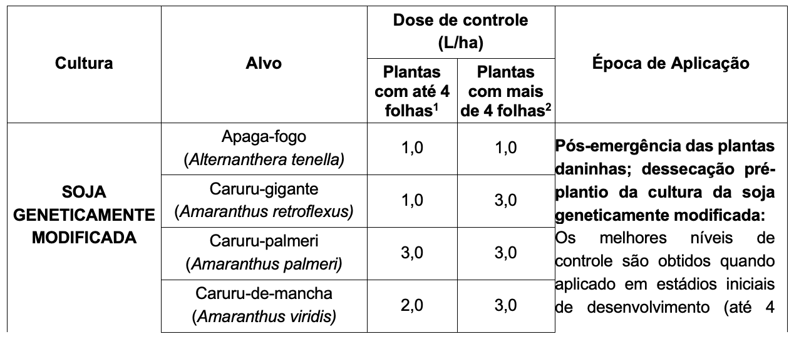
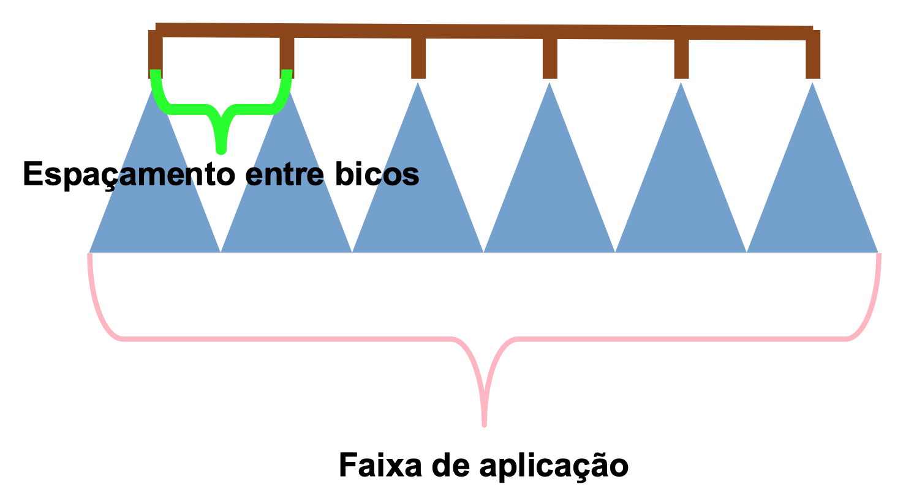

```{r setup, include=FALSE}
options(htmltools.dir.version = FALSE)
knitr::opts_chunk$set(
  echo = FALSE,
  fig.align = "center",
  message = FALSE,
  warning = FALSE,
  cache = TRUE
)

htmltools::tagList(rmarkdown::html_dependency_font_awesome()) #show twitter logo
```

## calibrar (v.) -

para definir um instrumento de forma que as leituras dele sejam absolutas e não relativas.

---

## Calibração

- Nós calibramos para garantir que este

```{r echo=FALSE, out.width=700, fig.align='center'}
knitr::include_graphics("https://images.unsplash.com/photo-1593463897552-69da7e8343eb?ixlib=rb-1.2.1&ixid=eyJhcHBfaWQiOjEyMDd9&auto=format&fit=crop&w=1350&q=80")
``` 


---

## Calibração

- Corresponda a isto

```{r echo=FALSE, out.width=700, fig.align='center'}

``` 


---

## Por que se preocupar em calibrar?
--

- Para maximizar o valor do pesticida
--


- Para minimizar danos à colheita
--


- Para garantir o uso da dose recomendada na bula


---


## Termos importantes

```{r echo=FALSE, out.width=700, fig.align='center'}

``` 


---

## Abreviações

- Abreviações para formulações secas

| Abbrev | Significado  | Exemplo |
|--------|--------------|---------|
| W, WP  | Pó molhável  |         |
| DF, WG | Grânulos dispersíveis em água |   Spider<sup>®</sup> 840WG      |
| G      | Granular     |         |
| P      | Pelotas      |         |


- Abreviações para formulações líquidas

| Abbrev | Significado               | Exemplo    |
|--------|---------------------------|------------|
| L, LF  | Fluido líquido            |            |
| SC     | Concentrado Solúvel       | Facero SC  |
| E, EC  | Concentrado Emulsificável | Sinerge EC |


---

## Bicos


---

## Bicos


---

## Bicos


---

## O Método de Fluxo Temporizado

- Selecione o tipo de bico com base em
    * Método de aplicação
    * Condições ambientais
    * Produto (pesticida)
    * Pressão do pulverizador

- Selecione a bico do bico (tamanho) com base em:
    * Vazão: Litros por minutos (LPM)
    * LPM baseado em: LPH, KMH, espaçamento dos bicos


---


- Se sabemos que:
    - A calda que vamos aplicar (Litros/ha)
    - A velocidade do pulverizador (Km/H)
    - O espaçamento entre bicos (cm)
    
- Então como calculamos a vazão de cada bico do pulverizador por minuto (L<sub>*P*</sub>M)?

$${LPM}=\frac{LPH * KPH * ESP}{60000}$$

---


$${LPM}=\frac{LPH * KPH * ESP}{60000}$$
De onde vem o valor 60000?


```{r echo=FALSE, out.width=400, fig.align='center'}
knitr::include_graphics("https://media.giphy.com/media/7TwPbkbwhIGx4PEAQt/giphy.gif")
``` 

---

# Fórmula

.center[

$$\frac{Litros}{ha} * \frac{Km}{hr} * \frac{cm}{1} * \frac{1hr}{60\,min} * \frac{1\,ha}{100000000\,cm^2} * \frac{100000\,cm}{1\,km} = \frac{L}{min}$$ 

<br><br><br>


$$\frac{Litros}{ha} * \frac{Km}{hr} * \frac{cm}{1} * \frac{1\,hr * 1\,ha * cm * cm}{60000 * min * cm^2 * km} = \frac{L}{min}$$

]


---

## Problema

Um pulverizador de lavoura de baixa pressão é equipado com 16 bicos espaçados em centros de 50 cm. O volume de entrega desejado é de 140 LPH. O pulverizador é cronometrado a 8 kph em uma passagem de calibração de 300 m.

Qual é a vazão da faixa de aplicação em litros / min (LPM)?

```{r echo=FALSE, out.width=300, fig.align='center'}
knitr::include_graphics("https://media.giphy.com/media/APqEbxBsVlkWSuFpth/giphy.gif")
``` 


---


## Etapa 1

### Descubra o LPM de cada bico

$${LPM}=\frac{LPH * KPH * ESP}{60000}$$
<br><br>

$${LPM}=\frac{140 * 8 * 50}{60000}$$

<br><br>

$${LPM}= 0.93 / bico$$
---


## Etapa 2

### Descubra a vazão da barra (LPM)

$$Vazão\,da\,barra = \frac{LPM}{bico} * \frac{bico}{barra}$$
<br><br>

$$Vazão\,da\,barra = \frac{0.93}{bico} * \frac{16\,bicos}{barra}$$
<br><br>

$$Vazão\,da\,barra = 14.88\,LPM$$


---


### Qual a vazão do bico em mL/min?


$$\frac{0.93\,L}{min} * \frac{1000\,mL}{1\,L} = \frac{930\,mL}{min}$$
### Qual a vazão do bico em gal/min?

$$\frac{0.93\,L}{min} * \frac{1\,gal}{3.785\,L} = \frac{0.24\,gal}{min}$$


---

## Pressão


$$\frac{V_1}{V_2} = \frac{\sqrt P_1}{\sqrt P_2}$$


---

## Alterando a pressão

Você sabe que o bico TeeJet 8002VS fornece 0,2 GPM quando a pressão está em 40 PSI. Se um agricultor precisa de um GPM de 0,18 usando este mesmo bico, a que pressão seu sistema deve estar?


$$\frac{V_1}{V_2} = \frac{\sqrt P_1}{\sqrt P_2}$$

$$\frac{0.2}{0.18} = \frac{\sqrt 40}{\sqrt P_2}$$
$$P_2 = 32.4\,PSI$$
---

#### Qual é a diferença entre este pulverizador de safra autopropelido...


```{r echo=FALSE, out.width=700, fig.align='center'}
knitr::include_graphics("https://images.unsplash.com/photo-1593463897552-69da7e8343eb?ixlib=rb-1.2.1&ixid=eyJhcHBfaWQiOjEyMDd9&auto=format&fit=crop&w=1350&q=80")
``` 


---

#### ... e este pulverizador de mochila?

```{r echo=FALSE, out.width=400, fig.align='center'}
knitr::include_graphics("images/spraying.png")
``` 

---


---

## Dúvidas?

```{r echo=FALSE, out.width=400, fig.align='center'}
knitr::include_graphics("https://www.ukcophumour.co.uk/wp-content/uploads/f2w/1526816_674334732588821_1244473478_n.jpg")
``` 
